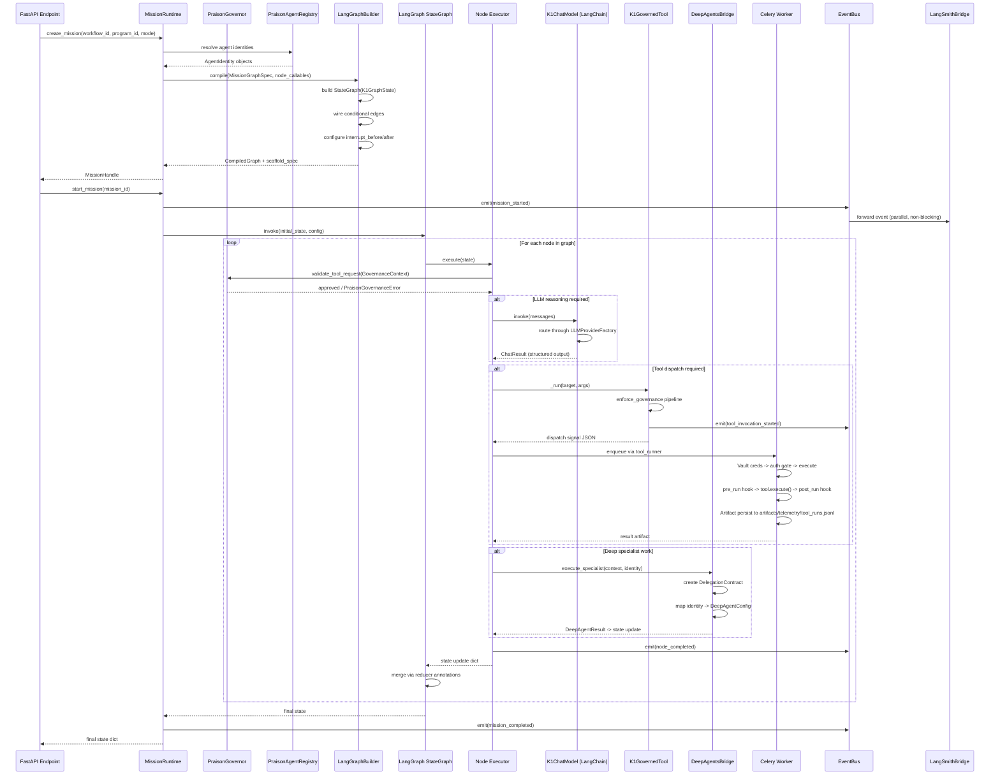
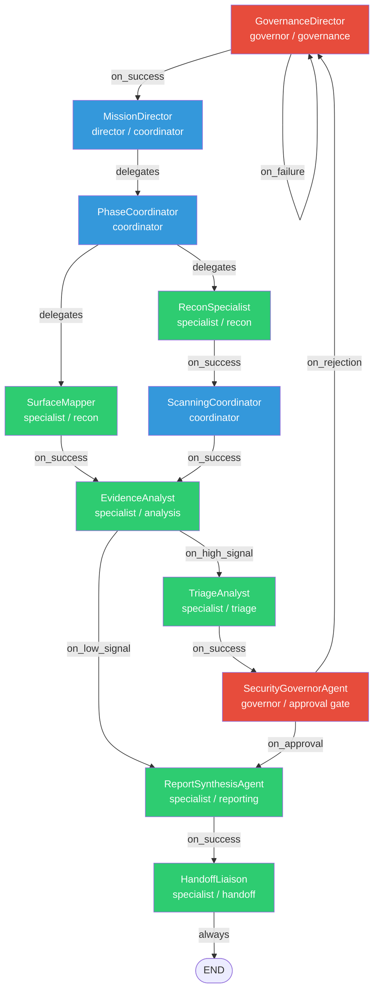
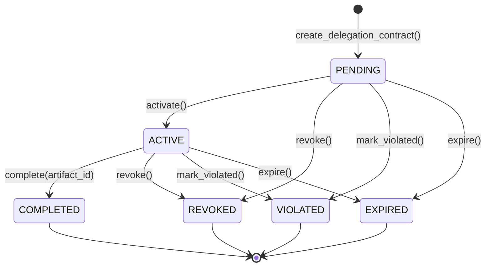
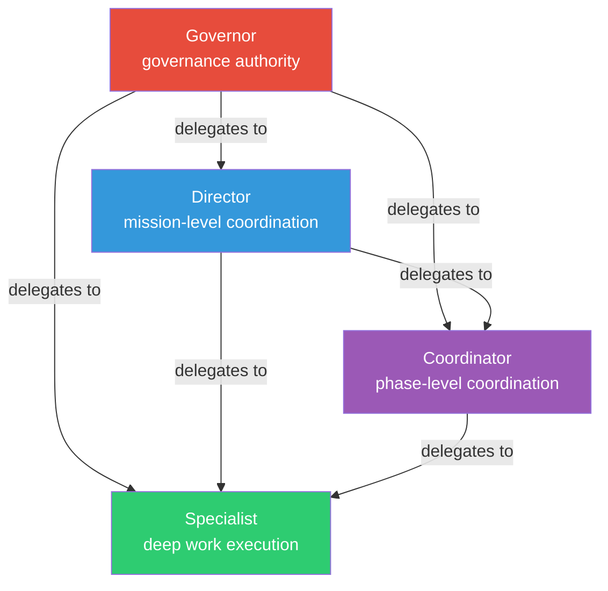
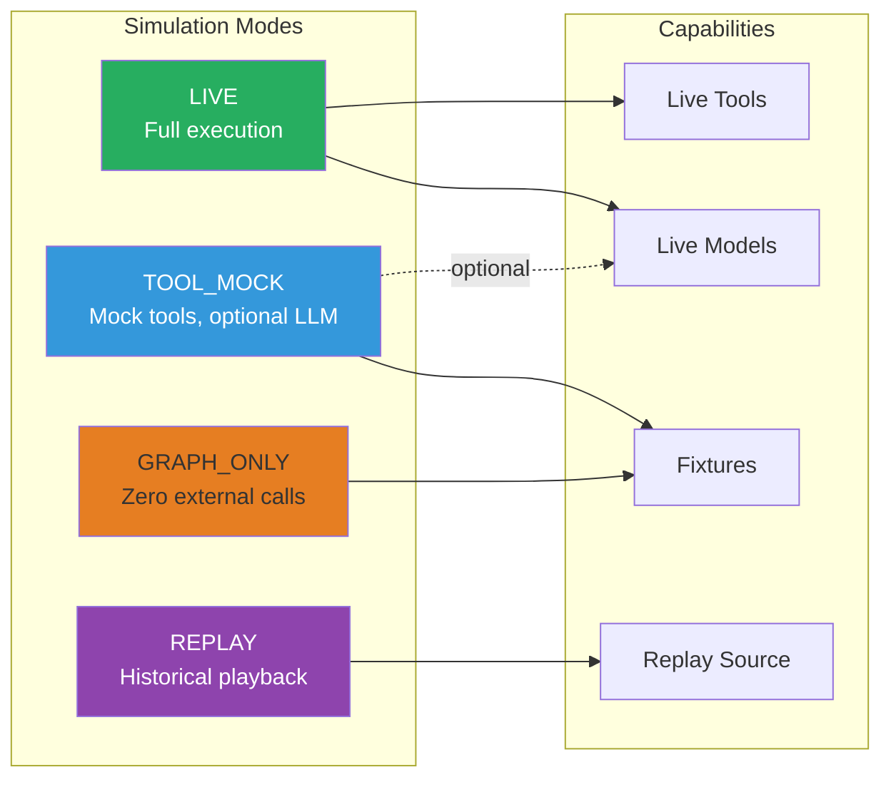
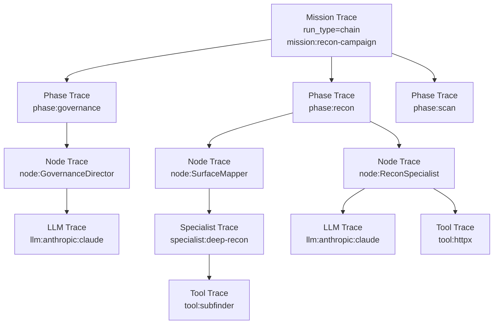

# Enterprise Developer Manual

This manual provides comprehensive guidance for developers working with the KaisonOne platform. It covers API usage, tool development, architectural insights, and integration guides to help extend and customize the platform.

## Table of Contents

1. [Platform Overview (Developer Perspective)](#platform-overview-developer-perspective)
    1.1. [Unified Tool Framework (Developer Details)](#unified-tool-framework-developer-details)
    1.2. [Program Discovery System (Developer Details)](#program-discovery-system-developer-details)
    1.3. [Neural RAG System (Developer Details)](#neural-rag-system-developer-details)
2. [API Usage Examples](#api-usage-examples)
    2.1. [Tool Operations](#tool-operations)
    2.2. [Program Operations](#program-operations)
    2.3. [Authentication APIs](#authentication-apis)
    2.4. [Mission Control APIs](#mission-control-apis)
    2.5. [Governance APIs](#governance-apis)
    2.6. [Artifacts APIs](#artifacts-apis)
    2.7. [Simulation APIs](#simulation-apis)
    2.8. [Intelligence APIs](#intelligence-apis)
    2.9. [Opportunities APIs](#opportunities-apis)
    2.10. [Reports APIs](#reports-apis)
    2.11. [System APIs](#system-apis)
    2.12. [Realtime APIs (WebSockets)](#realtime-apis-websockets)
3. [Architecture Overview](#architecture-overview)
    3.1. [Platform Overview (Architecture)](#platform-overview-architecture)
    3.2. [Layered Architecture Diagram](#layered-architecture-diagram)
    3.3. [Key Source Files (Architecture)](#key-source-files-architecture)
    3.4. [Control Flow: Mission Execution](#control-flow-mission-execution)
    3.5. [Mission Graph Topology](#mission-graph-topology)
    3.6. [State and Authority Boundaries (Developer)](#state-and-authority-boundaries-developer)
    3.7. [Tool Policy Bands (Developer)](#tool-policy-bands-developer)
    3.8. [Delegation Contract Lifecycle](#delegation-contract-lifecycle)
    3.9. [Agent Class Hierarchy](#agent-class-hierarchy)
    3.10. [Simulation Modes](#simulation-modes)
    3.11. [LangSmith Trace Hierarchy](#langsmith-trace-hierarchy)
    3.12. [Infrastructure Services](#infrastructure-services)
    3.13. [Execution Model](#execution-model)
    3.14. [Current Verified State](#current-verified-state)
4. [Tool Development Guide](#tool-development-guide)
    4.1. [Creating a New Tool](#creating-a-new-tool)
5. [Branding Customization (Frontend)](#branding-customization-frontend)
6. [Support and Documentation](#support-and-documentation)
    6.1. [Community & Support](#community--support)
7. [What's Next (Roadmap for Developers)](#whats-next-roadmap-for-developers)
8. [General Usage Information](#general-usage-information)
    8.1. [Unified Tool Framework (Developer Details)](#unified-tool-framework-developer-details)
    8.2. [Program Discovery System (Developer Details)](#program-discovery-system-developer-details)
    8.3. [Neural RAG System (Developer Details)](#neural-rag-system-developer-details)
9. [Integration Guides](#integration-guides)
    9.1. [CRLFuzz Agent Integration](#crlfuzz-agent-integration)
    9.2. [DALFox Integration Quick Start](#dalfox-integration-quick-start)
    9.3. [DALFox XSS Agent Integration](#dalfox-xss-agent-integration)
    9.4. [DNSX Integration Quick Start](#dnsx-integration-quick-start)
    9.5. [DNSX Resolver Agent Integration](#dnsx-resolver-agent-integration)
    9.6. [GAU Archive Agent Integration](#gau-archive-agent-integration)
    9.7. [GAU Integration Quick Start](#gau-integration-quick-start)
    9.8. [SSRFMap Agent Integration](#ssrfmap-agent-integration)
    9.9. [Waybackurls Archive Agent Integration](#waybackurls-archive-agent-integration)
    9.10. [Waybackurls Integration Quick Start](#waybackurls-integration-quick-start)
10. [Frontend Developer Documentation](#frontend-developer-documentation)
    10.1. [DASHBOARD README](#dashboard-readme)
    10.2. [Frontend Integration Guide](#frontend-integration-guide)
    10.3. [Kinetic Finish Polish](#kinetic-finish-polish)
    10.4. [Frontend README](#frontend-readme)
    10.5. [Structural Integrity Fixes](#structural-integrity-fixes)
    10.6. [DEV STACK RUN](#dev-stack-run)
    10.7. [DEV TESTING README](#dev-testing-readme)
    10.8. [HiL Gate Spec](#hil-gate-spec)
    10.9. [KEY INTAKE](#key-intake)
    10.10. [SCOPE ENFORCEMENT](#scope-enforcement)
    10.11. [THEHIVE BOOTSTRAP](#thehive-bootstrap)
    10.12. [VECTOR MEMORY](#vector-memory)
11. [Miscellaneous Developer-Relevant Information](#miscellaneous-developer-relevant-information)
    11.1. [Kai Benchmarks Overview](#kai-benchmarks-overview)
    11.2. [Kai Deterministic Benchmark Scenarios](#kai-deterministic-benchmark-scenarios)
    11.3. [Claude Integration Details](#claude-integration-details)
    11.4. [Deduplication Report (Developer Context)](#deduplication-report-developer-context)
    11.5. [Docker Compose Entry Points](#docker-compose-entry-points)
    11.6. [KAISON AI Sandbox](#kaison-ai-sandbox)
    11.7. [Hooks README](#hooks-readme)
    11.8. [Orchestration README](#orchestration-readme)
    11.9. [Prompts README](#prompts-readme)
    11.10. [Real Scan Data README](#real-scan-data-readme)
    11.11. [Skills README](#skills-readme)
    11.12. [Tools Engine README](#tools-engine-readme)
    11.13. [Tools Wrappers README](#tools-wrappers-readme)
12. [Extending the Platform](#extending-the-platform)
    12.1. [Local Setup](#local-setup)
        12.1.1. [Prerequisites](#prerequisites)
        12.1.2. [Installation](#installation)
        12.1.3. [Manual Development Mode](#manual-development-mode)
        12.1.4. [Running Tests](#running-tests)
        12.1.5. [Dev Auth](#dev-auth)
    12.2. [Adding a New Agent Persona](#adding-a-new-agent-persona)
        12.2.1. [Define the Agent](#define-the-agent)
        12.2.2. [Policy Constraints (Enforced at Load Time)](#policy-constraints-enforced-at-load-time)
        12.2.3. [Verification](#verification)
        12.2.4. [Where Identity Flows](#where-identity-flows)
    12.3. [Adding a New LangGraph Node](#adding-a-new-langgraph-node)
        12.3.1. [Define the NodeSpec](#define-the-nodespec)
        12.3.2. [Create the Node Executor](#create-the-node-executor)
        12.3.3. [Add Edges](#add-edges)
        12.3.4. [Conditional Routing](#conditional-routing)
        12.3.5. [Register the Callable](#register-the-callable)
    12.4. [Adding a New Governed Tool](#adding-a-new-governed-tool)
        12.4.1. [Define in Tool Registry](#define-in-tool-registry)
        12.4.2. [Safety Classification → Band Mapping](#safety-classification--band-mapping)
        12.4.3. [Add Tool Adapter (if needed)](#add-tool-adapter-if-needed)
        12.4.4. [LangChain Wrapper](#langchain-wrapper)
        12.4.5. [Grant Tool to Agents](#grant-tool-to-agents)
        12.4.6. [Manual-Only Backlog Entries (Custom Script Pending)](#manual-only-backlog-entries-custom-script-pending)
    12.5. [Adding a New Structured Schema](#adding-a-new-structured-schema)
        12.5.1. [Define the Schema](#define-the-schema)
        12.5.2. [Register in Schema Registry](#register-in-schema-registry)
        12.5.3. [Use with Reasoning Engine](#use-with-reasoning-engine)
        12.5.4. [Security Rules](#security-rules)
    12.6. [Adding a DeepAgents Specialist Role](#adding-a-deepagents-specialist-role)
        12.6.1. [Define Specialist Type](#define-specialist-type)
        12.6.2. [Create Agent Identity](#create-agent-identity)
        12.6.3. [Invocation via Bridge](#invocation-via-bridge)
        12.6.4. [Dual-Path Execution](#dual-path-execution)
        12.6.5. [Backend Policy](#backend-policy)
    12.7. [Adding a New Simulation Fixture](#adding-a-new-simulation-fixture)
        12.7.1. [Node Fixture](#node-fixture)
        12.7.2. [Tool Fixture](#tool-fixture)
        12.7.3. [Register Fixtures](#register-fixtures)
        12.7.4. [Scenario Packs](#scenario-packs)
        12.7.5. [Fixture Provenance](#fixture-provenance)
    12.8. [Adding a New Evaluation Dataset / Evaluator](#adding-a-new-evaluation-dataset--evaluator)
        12.8.1. [Create a Dataset Builder](#create-a-dataset-builder)
        12.8.2. [Create an Evaluator](#create-an-evaluator)
        12.8.3. [Register the Dataset](#register-the-dataset)
        12.8.4. [Naming Conventions](#naming-conventions)
    12.9. [Adding a New Telemetry Event](#adding-a-new-telemetry-event)
        12.9.1. [Add the Event Type](#add-the-event-type)
        12.9.2. [Create an Event Builder](#create-an-event-builder)
        12.9.3. [Emit from Node Executor](#emit-from-node-executor)
        12.9.4. [Event Structure](#event-structure)
        12.9.5. [Subscriber Flow](#subscriber-flow)
        12.9.6. [Simulation Events](#simulation-events)
    12.10. [Architecture Boundaries](#architecture-boundaries)
        12.10.1. [Authority Map](#authority-map)
        12.10.2. [Rules for Extension](#rules-for-extension)
        12.10.3. [Common Mistakes](#common-mistakes)
    12.11. [Development Rules](#development-rules)
        12.11.1. [Code Style](#code-style)
        12.11.2. [Test Conventions](#test-conventions)
    12.12. [Key Source Files](#key-source-files)

---

## 1. Platform Overview (Developer Perspective)

### 1.1. Unified Tool Framework (Developer Details)

A complete system for creating, managing, and orchestrating AI-powered tools with autonomy tiers and human-in-the-loop approval workflows. Developers can extend existing tools or create new ones using the provided framework.

**Key Features (Developer Focus):**
-   Tool schema generation for LLM function calling
-   Autonomy tier gating (TIER 0-3)
-   Built-in metrics and statistics
-   Streaming execution support
-   Background async execution
-   Tool result serialization and storage-ready

### 1.2. Program Discovery System (Developer Details)

Automated discovery and scraping of 50+ bug bounty programs with payout estimation. The system's extensible scraper architecture allows developers to add support for new platforms.

**Capabilities (Developer Focus):**
-   Async scraping with progress streaming
-   Scope management (allowed/excluded items)
-   Payout estimation by severity
-   Program filtering and matching
-   Real-time program matching for findings
-   Extensible scraper architecture

### 1.3. Neural RAG System (Developer Details)

Hybrid retrieval-augmented generation with OpenAI embeddings and local fallback. Developers can configure embedding providers and integrate new vector stores.

**Features (Developer Focus):**
-   OpenAI text-embedding-3-large (3072 dims) as primary
-   Local Sentence-Transformers (384 dims) as fallback
-   Automatic provider switching on failure
-   Cosine similarity search
-   Metadata-based filtering
-   Batch embedding operations
-   Production-ready for pgvector

---

## 2. API Usage Examples

This section details the various API endpoints available in the KaisonOne platform, categorized by function. All protected endpoints require `Authorization: Bearer <token>`.

### 2.1. Tool Operations

**List all tools:**
```bash
curl http://localhost:8000/api/v1/tools
```

**Get tool details:**
```bash
curl http://localhost:8000/api/v1/tools/finding_validator
```

**Execute a tool (with auto approval):**
```bash
curl -X POST http://localhost:8000/api/v1/tools/quick_classifier/execute 
  -H "Content-Type: application/json" 
  -d '{
    "finding_text": "SQL injection in user search"
  }'
```

**Execute tool requiring approval:**
```bash
curl -X POST http://localhost:8000/api/v1/tools/finding_validator/execute 
  -H "Content-Type: application/json" 
  -d '{
    "finding_title": "XSS in Comment Form",
    "finding_description": "User input not escaped",
    "asset_type": "web",
    "estimated_severity": "high"
  }'
# Returns: {"execution_id": "...", "status": "pending_approval"}

# Approve execution
curl -X POST http://localhost:8000/api/v1/tools/finding_validator/approve 
  ?execution_id=... 
  ?user_id=admin
```

**Execute tool workflow (chaining):**
```bash
curl -X POST http://localhost:8000/api/v1/tools/orchestrate 
  -H "Content-Type: application/json" 
  -d '{
    "steps": [
      {
        "tool_id": "quick_classifier",
        "params": {"finding_text": "RCE in API"}
      },
      {
        "tool_id": "vulnerability_analyzer",
        "params": {
          "vulnerability_type": "rce",
          "affected_technology": "Node.js API",
          "attack_description": "...",
          "exploitation_difficulty": "easy"
        }
      },
      {
        "tool_id": "program_matcher",
        "params": {
          "finding_title": "RCE in API",
          "finding_scope": "*.example.com",
          "severity": "critical"
        }
      }
    ]
  }'
```

### 2.2. Program Operations

**List programs:**
```bash
curl 'http://localhost:8000/api/v1/programs?limit=20&min_payout=1000'
```

**Get program details:**
```bash
curl http://localhost:8000/api/v1/programs/google_vrp_main
```

**Start scraping:**
```bash
curl -X POST http://localhost:8000/api/v1/programs/scrape/google_vrp

# Check status
curl http://localhost:8000/api/v1/programs/scrape-status/google_vrp_1706808123
```

**Stream scrape (Server-Sent Events):**
```bash
curl http://localhost:8000/api/v1/programs/scrape/stream/microsoft 
  --header "Accept: text/event-stream"
```

**Match programs to finding:**
```bash
curl 'http://localhost:8000/api/v1/programs/match?finding_title=RCE&finding_scope=api.company.com&severity=critical'
```

**Get statistics:**
```bash
curl http://localhost:8000/api/v1/programs/statistics
```

### 2.3. Authentication APIs

| Endpoint | Method | Purpose |
|---|---|---|
| `/auth/token` | `POST` | Username/password login (OAuth2 form) |
| `/auth/users/me` | `GET` | Current user + role + tenant context |

### 2.4. Mission Control APIs

| Endpoint | Method | Purpose |
|---|---|---|
| `/missions/` | `GET` | List tenant missions |
| `/missions/{id}` | `GET` | Mission runtime status |
| `/missions/{id}/graph` | `GET` | Mission graph + node state |
| `/missions/{id}/start` | `POST` | Start mission |
| `/missions/{id}/stop` | `POST` | Stop/pause mission |
| `/missions/{id}/replay` | `POST` | Replay mission |
| `/events/mission/{id}/timeline` | `GET` | Mission timeline events |

### 2.5. Governance APIs

| Endpoint | Method | Purpose |
|---|---|---|
| `/approvals/` | `GET` | List gates by status (`PENDING` default) |
| `/approvals/{id}` | `GET` | Approval gate detail |
| `/approvals/{id}/approve` | `POST` | Approve gate (`notes` query param optional) |
| `/approvals/{id}/reject` | `POST` | Reject gate (`notes` query param optional) |
| `/approvals/{id}/cancel` | `POST` | Cancel gate (`notes` query param optional) |

### 2.6. Artifacts APIs

| Endpoint | Method | Purpose |
|---|---|---|
| `/artifacts/mission/{id}` | `GET` | List mission artifacts |
| `/artifacts/{id}` | `GET` | Artifact metadata |
| `/artifacts/{id}/content` | `GET` | Artifact JSON/text/URI content |

### 2.7. Simulation APIs

| Endpoint | Method | Purpose |
|---|---|---|
| `/simulation/scenarios` | `GET` | Available scenario packs |
| `/simulation/run` | `POST` | Launch simulation mission |
| `/simulation/compare` | `POST` | Compare two simulation missions |

### 2.8. Intelligence APIs

| Endpoint | Method | Purpose |
|---|---|---|
| `/intel/memory` | `GET` | Search/filter intelligence memory |
| `/intel/memory/{id}` | `GET` | Memory detail |
| `/intel/memory/{id}/relationships` | `GET` | Graph edges for memory |
| `/intel/memory/stats` | `GET` | Memory + graph metrics |

Security notes:
- Non-admin users only see intelligence memory entries in their own `tenant_id`.
- Cross-tenant relationship edges are filtered for non-admin users.

### 2.9. Opportunities APIs

| Endpoint | Method | Purpose |
|---|---|---|
| `/opportunities` | `GET` | Filtered opportunity list |
| `/opportunities/ranked` | `GET` | Ranked opportunity list |
| `/opportunities/{id}` | `GET` | Opportunity detail |
| `/opportunities/actions/capabilities` | `GET` | Action availability contract (`approve/reject/execute`) |
| `/opportunities/{id}/expand` | `POST` | Generate ranked expansion candidates from validated memory signals |
| `/opportunities/{id}/approve` | `POST` | Governed approval transition |
| `/opportunities/{id}/reject` | `POST` | Governed rejection transition |
| `/opportunities/{id}/execute` | `POST` | Controlled execution that generates missions |

#### Opportunity lifecycle fields

Opportunity responses now include action-state fields:

- `status` (`proposed|approved|rejected|executing|completed|failed|cancelled`)
- `approval_state` (`pending|approved|rejected`)
- `approval_reason`
- `rejection_reason`
- `execution_metadata` (targets evaluated, blocked targets, mission lineage, runtime counts)
- `candidate_targets`
- `source_type`, `source_object_id`
- `expansion_candidates` (target-level similarity/duplicate/yield factors)
- `target_batches` (risk-banded grouped execution batches)
- `approved_targets`, `rejected_targets`
- `expansion_rationale`, `expansion_score`, `expected_report_quality`
- `recommended_execution_order`
- `linked_mission_count`, `linked_report_count`
- `decision_summary`, `chain_summary`
- `confidence_score`
- `estimated_yield`, `expected_yield`
- `duplicate_risk`
- `created_at`, `updated_at`, `created_by`

### 2.10. Reports APIs

| Endpoint | Method | Purpose |
|---|---|---|
| `/reports` | `GET` | List reports with optional filters (`severity`, `min_confidence`, `target`, `mission_id`, `opportunity_id`) |
| `/reports/{id}` | `GET` | Fetch a single submission-ready report |
| `/reports/generate` | `POST` | Deterministically generate + persist report from finding/chain/artifacts |
| `/reports/{id}/export` | `GET` | Download report in `markdown` or `json` format |
| `/reports/mission/{mission_id}` | `GET` | List reports linked to a mission |

#### Report object fields

- `report_id`
- `title`
- `vulnerability_type`
- `severity`
- `target`
- `summary`
- `reproduction_steps`
- `http_requests`
- `http_responses`
- `exploit_chain`
- `impact`
- `remediation`
- `references`
- `validation_evidence`
- `confidence_score`
- `quality_score`
- `duplicate_hash`
- `tenant_id`
- `mission_id`, `opportunity_id`, `finding_id`
- `artifact_uri`
- `rendered_markdown`

Security notes:
- Report list/get/export endpoints are tenant-scoped when JWT includes `tid`.
- Export filenames are sanitized server-side before `Content-Disposition` is set.

### 2.11. System APIs

| Endpoint | Method | Purpose |
|---|---|---|
| `/system/health` | `GET` | Basic health |
| `/system/status` | `GET` | Runtime/worker/system metrics |

### 2.12. Realtime APIs (WebSockets)

#### WebSocket

- Endpoint: `/ws?token=<jwt>`
- Client control messages:
  - `{"action":"subscribe","channel":"mission_events","mission_id":"..."}`
  - `{"action":"unsubscribe","channel":"mission_events","mission_id":"..."}`
  - `{"action":"subscribe","channel":"governance_events"}`
  - `{"action":"subscribe","channel":"artifact_events","mission_id":"..."}`
  - `{"action":"subscribe","channel":"simulation_events"}`
- Server envelope:
  - `{"type":"mission_event","data":{...normalized event...}}`

#### Recent catch-up API

| Endpoint | Method | Purpose |
|---|---|---|
| `/realtime/missions/{mission_id}/recent?limit=100` | `GET` | Return normalized recent mission events for reconnect/catch-up |
| `/events/broadcast` | `POST` | Admin-only mission-scoped manual broadcast (requires mission ownership) |

#### Normalized event fields

- `schema_version`
- `event_id`
- `event_type`
- `timestamp`
- `tenant_id`
- `mission_id`
- `workflow_id`
- `program_id`
- `node_id`
- `phase`
- `status`
- `summary`
- `detail`
- `artifact_id`
- `approval_id`
- `category`

---

## 3. Architecture Overview

This section provides a high-level overview of the Kai Platform's architecture from a developer's perspective, detailing its integrated layers, design doctrines, and key components.

### 3.1. Platform Overview (Architecture)

Kai is a multi-layer AI orchestration platform that coordinates autonomous security research missions under strict governance, scope enforcement, and human-in-the-loop (HIL) approval policies. The platform is organized into six integrated layers, each with a distinct responsibility boundary:

| Layer | Product | Responsibility |
|-------|---------|----------------|
| **Control Plane** | PraisonAI | Authority, governance, agent lifecycle, policy enforcement |
| **Execution Runtime** | LangGraph | Mission graph compilation, state management, checkpointing |
| **Model / Tools / Middleware** | LangChain | LLM abstraction, tool wrapping, structured output, middleware |
| **Deep Work Runtime** | DeepAgents | Specialist deep analysis, sandboxed execution, subagent delegation |
| **Observability** | LangSmith | Traces, spans, experiments, datasets, evaluations |
| **Safe Execution Overlay** | Simulation | Cross-cutting execution mode control (graph_only, tool_mock, replay) |

#### Design Doctrine

-   **Governance-first**: Every tool invocation, agent spawn, memory write, external call, and phase handoff passes through the PraisonAI governance layer before execution.
-   **Separation of authority and execution**: PraisonAI owns policy; LangGraph owns execution. Neither can operate alone.
-   **Simulation as overlay, not runtime**: Simulation mode operates within the existing stack by substituting execution behaviors, not by providing a second runtime.
-   **Observability is non-authoritative**: LangSmith receives telemetry but never controls execution. The internal EventBus and LangSmith operate as independent parallel planes.
-   **Fail-secure by default**: Unknown tool classifications default to band_2 (approval required). Unknown memory scopes are denied. Unsigned certificates are rejected. Test-mode auth bypass requires explicit opt-in.

### 3.2. Layered Architecture Diagram

```mermaid
graph TB
    subgraph "Layer 1: PraisonAI Control Plane"
        GOV[PraisonGovernor<br/>Sync fast-path + Async LLM review]
        REG[PraisonAgentRegistry<br/>Agent identity source of truth]
        AID[AgentIdentity<br/>Frozen dataclass]
        CON[DelegationContract<br/>Immutable state machine]
        POL[PraisonRuntimePolicy<br/>Deterministic policy arbiter]
        ADP[Adaptive Strategy<br/>Bounded autonomy + scoring]
        EVT[EventBus<br/>MissionEvent telemetry]
    end

    subgraph "Layer 2: LangGraph Execution Runtime"
        STA[K1GraphState<br/>TypedDict ~35 fields]
        MRT[MissionRuntime<br/>Mission lifecycle manager]
        BLD[PraisonLangGraphBuilder<br/>StateGraph compiler]
        TOP[PraisonTopology<br/>DAG structure definition]
        NOD[Node Executors<br/>Callable builders]
        CLU[ClusterRuntime<br/>Phase subgraph execution]
    end

    subgraph "Layer 3: LangChain Model / Tools / Middleware"
        CMF[K1ChatModel<br/>BaseChatModel adapter]
        CTR[K1GovernedTool<br/>Governed BaseTool wrapper]
        MID[K1MiddlewareStack<br/>Callbacks + context injection]
        SCH[Structured Output Schemas<br/>Pydantic v2 models]
        RSN[K1ReasoningEngine<br/>Node-local reasoning]
    end

    subgraph "Layer 4: DeepAgents Specialist Runtime"
        BRG[DeepAgentsBridge<br/>Identity + context mapping]
        BAK[DeepAgentsBackends<br/>Policy + sandbox restrictions]
        SBX[SandboxManager<br/>Isolated execution]
        ART[AgentRuntime<br/>Namespace-aware streaming]
    end

    subgraph "Layer 5: LangSmith Observability"
        LSB[LangSmithBridge<br/>Trace correlation + runs]
        RED[Redaction Layer<br/>Secrets / PII stripping]
        EXP[Evaluations<br/>Datasets + experiments]
    end

    subgraph "Layer 6: Simulation Overlay"
        SIM[SimulationController<br/>Mode routing + safety barriers]
        CFG[SimulationConfig<br/>Mode + fixture + event policy]
        FIX[FixtureRegistry<br/>Deterministic test data]
        REP[ReplayEngine<br/>Historical timeline reconstruction]
    end

    GOV -->|validates| MRT
    REG -->|provides identities| BLD
    AID -->|frozen personas| REG
    CON -->|enforces delegation| BRG
    POL -->|policy checks| GOV

    MRT -->|compiles graph| BLD
    BLD -->|topology from| TOP
    MRT -->|executes nodes| NOD
    NOD -->|invokes| CMF
    NOD -->|invokes| CTR
    NOD -->|delegates to| BRG

    CMF -->|routes through| CMF
    CTR -->|scope checks| CTR
    MID -->|wraps| CMF

    BRG -->|creates| CON
    BRG -->|executes| SBX

    EVT -->|parallel export| LSB
    LSB -->|redacts via| RED
    LSB -->|feeds| EXP

    SIM -->|overlays| NOD
    SIM -->|uses| FIX
    SIM -->|replays from| REP
    SIM -->|tags traces| LSB
```



### 3.3. Key Source Files (Architecture)

All source files reside under `apps/backend/src/core/` unless otherwise noted.

#### PraisonAI Control Plane

| File | Primary Class / Function | Purpose |
|------|-------------------------|---------|
| `praison_governor.py` | `PraisonGovernor` | Governance engine. Sync fast-path: `validate_tool_request()` (sub-ms, no LLM). Async LLM paths: `review_band2_action()`, `generate_interscan_report()`, `coordinate_phase_handoff()`. Uses `SecurityGovernorAgent`, `HandoffAgent`, `InterscanReportAgent`. Hook callbacks: `praison_safety_gate_hook`, `praison_agent_spawn_hook`, `praison_agent_handoff_hook`, `praison_agent_memory_write_hook`, `praison_agent_external_call_hook`. |
| `praison_registry.py` | `PraisonAgentRegistry` | Single source of truth for all agent personas. Loads from `orchestration/praison/agents.yaml`. Validates policy fields (`risk_profile`, `memory_scope`, `review_policy`, `agent_class`, `delegation_scope`, etc.). Thread-safe with double-check locking. Dispatches instantiation to framework adapters (`crewai`, `autogen`, `deepagents`, `langgraph`). |
| `praison_agent.py` | `AgentIdentity` | Frozen dataclass carrying all identity and policy fields. Lists coerced to tuples in `__post_init__`. Runtime-annotated copies produced via `with_runtime()`. Includes `resolve_litellm_string()` and `resolve_provider_enum()` for LLM routing. Defines `VALID_RISK_PROFILES`, `VALID_MEMORY_SCOPES`, `VALID_AGENT_CLASSES`, `VALID_DELEGATION_SCOPES`, `_CLASS_DELEGATION_AUTHORITY`, `_SCOPE_RANK`. |
| `praison_contracts.py` | `DelegationContract` | Frozen, immutable delegation contract. States: `PENDING` -> `ACTIVE` -> `COMPLETED` / `REVOKED` / `VIOLATED` / `EXPIRED`. State transitions return new instances via `dataclasses.replace()`. Enforces delegation authority, tool constraints (`allowed_tools`), peer target restrictions (`allowed_targets`). Empty tuple semantics: `()` means NO access (not permit-all). Bidirectional trust validation at contract creation. |
| `praison_runtime_policy.py` | `PraisonRuntimePolicy` | Centralized deterministic policy engine. Enforces delegation authority, interrupt policy, escalation policy, memory scope compliance, tool access within contracts. Single runtime arbiter -- no LLM calls. |
| `praison_adaptive.py` | | Adaptive bounded autonomy with strategy patches. Proposes, validates, and applies execution plan modifications within policy guardrails. |
| `praison_strategy_scoring.py` | | Deterministic scoring functions for strategy selection. Ranks tool profiles and prompt profiles based on historical performance data. |
| `praison_strategy_learning.py` | | Learning pipeline for strategy improvement. Produces knowledge lessons from phase outcomes. Enforces `_ALLOWED_LEARNING_FIELDS` to bound what the learning system can modify. |
| `praison_knowledge_base.py` | | Knowledge base for accumulated lessons from mission executions. |
| `praison_tool_profiles.py` | | Tool execution profiles. Parameterized configurations for tool invocations (timeouts, argument templates, retry policies). |
| `praison_profile_tracker.py` | | Prompt and tool profile tracking. Records which profiles were selected at each execution node. |
| `praison_execution_events.py` | `EventBus`, `MissionEvent` | Structured event telemetry. Frozen `MissionEvent` dataclass with full correlation context. `EventType` enum covering mission lifecycle, contract lifecycle, learning events. EventBus is protocol-based for simulation swappability. |
| `praison_artifacts.py` | | Artifact management for mission outputs. |

#### LangGraph Execution Runtime

| File | Primary Class / Function | Purpose |
|------|-------------------------|---------|
| `praison_state.py` | `K1GraphState` | `TypedDict` with ~35 fields. Accumulative fields use `Annotated[list, operator.add]` reducers (messages, artifacts, findings, policy_events, escalations, violations, node_history, etc.). Scalar fields use last-write-wins. `make_initial_state()` builds the genesis state. `merge_state()` provides canonical merge logic. `state_snapshot()` returns serializable audit summaries. `execution_mode` controls simulation behavior (`"live"`, `"graph_only"`, `"tool_mock"`, `"replay"`). |
| `praison_mission_runtime.py` | `MissionRuntime` | Top-level mission lifecycle manager. Methods: `create_mission()`, `start_mission()`, `resume_mission()`, `stop_mission()`, `cancel_mission()`, `approve_pending()`, `list_missions()`, `inspect_state()`, `get_status()`, `get_state()`. `MissionHandle` and `MissionStatus` dataclasses. Bridges PraisonAI authority, LangGraph execution, event telemetry, and adaptive execution. Supports LangGraph compiled execution and fallback topological execution. |
| `praison_langgraph_builder.py` | `PraisonLangGraphBuilder` | Compiles `MissionGraphSpec` into LangGraph `StateGraph`. The ONLY module that instantiates LangGraph objects. Uses `K1GraphState` as the typed state schema (ensuring accumulative reducers work). Wires conditional edges from `EdgeSpec` routing rules. Configures `interrupt_before` / `interrupt_after` for HIL gates. Attaches PostgreSQL checkpointer (falls back to `MemorySaver`). Compiles phase clusters as subgraphs. LangGraph is optional -- degrades to scaffold specs when not installed. |
| `praison_topology.py` | `PraisonTopology`, `NodeSpec`, `EdgeSpec`, `ClusterSpec`, `MissionGraphSpec` | DAG topology builder. Defines graph structure: nodes, edges with routing conditions (`EdgeCondition`: `ALWAYS`, `ON_SUCCESS`, `ON_FAILURE`, `ON_APPROVAL`, `ON_REJECTION`, `ON_ARTIFACT`, `ON_HIGH_SIGNAL`, `ON_LOW_SIGNAL`, `ON_PHASE_COMPLETE`), clusters, entry/exit nodes. `build_standard_bug_bounty()` generates the standard mission graph. `resolve_execution_order()` provides topological sort for fallback execution. |
| `praison_node_executors.py` | `build_standard_node_callables()` | Node callable builders for graph execution. Creates `{node_id: callable}` mappings consumed by LangGraph. Each callable receives and returns `K1GraphState` dicts. |
| `praison_cluster_runtime.py` | | Specialist cluster subgraph runtime. Manages phase cluster execution as bounded subgraphs within the parent mission graph. |

#### LangChain Layer

| File | Primary Class / Function | Purpose |
|------|-------------------------|---------|
| `langchain_model_factory.py` | `K1ChatModel`, `K1ModelFactory` | `K1ChatModel` extends LangChain `BaseChatModel`, delegating inference to Kai's `LLMProviderFactory` singleton. Preserves provider-routing, failover, cost tracking. Supports sync `_generate()` and async `_agenerate()`. `with_structured_output()` uses prompt-instruction strategy (PydanticOutputParser format injection). `K1ModelFactory` manages configured instances. |
| `langchain_tool_registry.py` | `K1GovernedTool`, `K1LangChainToolRegistry`, `K1ToolContext` | Wraps Kai `ToolCatalogEntry` objects as LangChain `BaseTool` with full governance enforcement per invocation. Governance pipeline: execution-mode fast-path -> allowed-tool-ids check -> safety band enforcement (band_3 always denied) -> scope validation -> telemetry emission -> dispatch signal. Does NOT execute tools inline -- returns structured dispatch signal for Celery worker pipeline. `K1ToolContext` is a frozen per-invocation governance context. Phase-to-category mapping drives `get_tools_for_phase()`. |
| `langchain_middleware.py` | `K1GovernanceCallbackHandler`, `K1ToolFilterMiddleware`, `K1ContextInjector`, `K1MiddlewareStack` | Governance-aware LangChain middleware. `K1GovernanceCallbackHandler` emits `MissionEvent` at every LLM/tool/chain boundary. `K1ToolFilterMiddleware` dynamically filters tool visibility by phase, authority, and band policy. `K1ContextInjector` prepends governance context into message sequences. `K1MiddlewareStack` composes all components into a reusable unit. |
| `langchain_schemas.py` | `SCHEMA_REGISTRY`, `SeverityLevel`, various Pydantic v2 models | Structured output schemas for LLM reasoning steps. All models use `ConfigDict(extra="forbid")` to reject prompt-injection via unexpected keys. Schema registry maps short names to classes. `validate_schema_output()` parses raw dicts. |
| `langchain_reasoning.py` | `K1ReasoningEngine` | Node-local reasoning primitives. Summarizes artifacts, classifies findings, generates evidence digests, ranks tools, produces structured outputs. Simulation-ready (returns deterministic fixtures in `tool_mock` mode). All calls correlated to mission/node via middleware callbacks. |

#### DeepAgents Layer

| File | Primary Class / Function | Purpose |
|------|-------------------------|---------|
| `praison_deepagents_bridge.py` | `DeepAgentsBridge`, `DeepAgentExecutionContext` | Canonical integration point. Maps `AgentIdentity` -> `DeepAgentConfig`, Kai execution context -> DeepAgent runtime context, `DeepAgentResult` -> `K1GraphState` updates, `DeepAgentResult` -> Kai artifacts. Creates `DelegationContract` instances for subagent delegation. Dual-path: uses official `deepagents` package when installed, falls back to Kai's native LLM invoke path. |
| `praison_deepagents_backends.py` | | Backend policy and sandbox restrictions for DeepAgent execution environments. |
| `praison_sandbox_manager.py` | | Sandbox manager for isolated specialist execution. Enforces execution boundaries. |
| `praison_agent_runtime.py` | | Agent runtime with namespace-aware streaming. Manages agent execution lifecycle within the DeepAgent framework. |

#### LangSmith Layer

| File | Primary Class / Function | Purpose |
|------|-------------------------|---------|
| `langsmith_integration.py` | `LangSmithBridge`, `LangSmithConfig`, `TraceCorrelation` | Bridge between Kai's mission runtime and LangSmith. Client lifecycle management with lazy init. Run hierarchy: mission -> phase -> node -> specialist -> LLM call. Trace sampling enforcement (`K1_LANGSMITH_SAMPLE_RATE`). Redaction pipeline coordination. EventBus subscriber for event forwarding. Context manager `trace_run()` for run lifecycle. Naming conventions: `mission_run_name()`, `phase_run_name()`, `node_run_name()`, `specialist_run_name()`, `llm_run_name()`, `tool_run_name()`. |
| `langsmith_redaction.py` | `redact_for_langsmith()` | Stateless redaction layer. Modes: `strict` (API keys, tokens, PII, target IPs, large payloads, raw tool outputs), `moderate` (API keys, tokens, credentials; allows target info), `none` (development only). Vault tokens, API keys, PGP private keys, and raw exploit payloads are never exported in strict mode. |
| `langsmith_evaluations.py` | `EvalResult`, dataset manager, experiment runner | Evaluation datasets populated from mission runs. Evaluation targets score structured outputs (triage, evidence, reports). A/B experiment comparisons for prompts, tools, and strategies. Dataset naming: `kai-{category}-{qualifier}`. Experiment naming: `kai-exp-{what}-{timestamp}`. |

#### Simulation Layer

| File | Primary Class / Function | Purpose |
|------|-------------------------|---------|
| `praison_simulation.py` | `SimulationController` / `SimulationRunner` | Central simulation control. Routes execution through `graph_only` / `tool_mock` / `replay` paths. Hard safety barriers: `assert_simulation_safe()` prevents live tool execution in simulation modes. `make_simulation_node_executor()` wraps node callables with simulation behavior. `SimulationRunner.run_simulation()` orchestrates full simulation lifecycle. `run_comparison()` runs multiple arms for A/B comparison. All simulation artifacts carry explicit provenance markers (`_simulation=True`). |
| `praison_simulation_config.py` | `SimulationConfig`, `SimulationMode` | Explicit simulation configuration. `SimulationMode` enum: `LIVE`, `GRAPH_ONLY`, `TOOL_MOCK`, `REPLAY`. Safety properties: `allows_live_tools` (only LIVE), `allows_live_models` (LIVE + TOOL_MOCK), `uses_fixtures` (GRAPH_ONLY + TOOL_MOCK), `uses_replay_source` (REPLAY). `FixtureStrictness`, `ArtifactPolicy`, `EventVerbosity` enums. |
| `praison_simulation_fixtures.py` | `FixtureRegistry`, `fixture_approval_decision()` | Deterministic test data for simulation modes. Fixture profiles and scenario packs. `fixture_approval_decision()` generates deterministic approval outcomes. |
| `praison_replay.py` | `ReplayEngine`, `load_replay_node_state()` | Reconstructs mission timelines from persisted JSONL events, LangGraph checkpoints, artifact lineage, and LangSmith traces. Never re-executes live tools or models. Marks all replayed outputs with `_replay=True`. |

### 3.4. Control Flow: Mission Execution



### 3.5. Mission Graph Topology

The standard bug bounty mission graph follows this structure:



**Legend**: Red = governance nodes (interrupt_before enabled). Blue = coordinator/director nodes. Green = specialist nodes.

### 3.6. State and Authority Boundaries (Developer)

This section outlines what the KaisonOne platform (Kai) owns authoritatively versus what each architectural layer owns, from a developer's perspective.

#### What Kai Owns (Authoritative System of Record)

-   **Mission state** -- `K1GraphState` with ~35 fields, managed by `MissionRuntime`. Accumulative fields use reducer annotations; scalar fields use last-write-wins.
-   **Governance policy** -- Scope enforcement (`scope_guardrails.py`, `authorization_gate.py`, `scope_resolver.py`), tool policy bands (0-3), HIL gate policy, agent lifecycle policy.
-   **Agent identities** -- `AgentIdentity` frozen dataclasses loaded from `agents.yaml` via `PraisonAgentRegistry`. No framework adapter defines agents independently.
-   **Delegation contracts** -- `DelegationContract` frozen dataclass with enforced state machine: `PENDING` -> `ACTIVE` -> `COMPLETED` / `REVOKED` / `VIOLATED` / `EXPIRED`.
-   **Artifacts** -- All persistent outputs written to `artifacts/` (workflows, runs, telemetry, tool results). Volume-mounted in Docker.
-   **Audit trail** -- `IntentionRecord`, `AuditEvent`, scope decision JSONL logs, event telemetry.
-   **LLM provider routing** -- `LLMProviderFactory` with Anthropic/OpenAI/Gemini/Ollama/Gemma/Qwen/OpenRouter implementations, automatic failover chain, cost tracking.

#### What Each Layer Owns

| Layer | Owns | Does NOT Own |
|-------|------|-------------|
| **PraisonAI** | Agent authority hierarchy (`governor` > `director` > `coordinator` > `specialist`). Governance validation (sync rule-based + async LLM review). Agent lifecycle hooks (spawn, handoff, memory write, external call). Memory scope enforcement (`session` < `phase` < `workflow` < `mission` < `persistent`). Delegation authority and bidirectional trust. | Graph execution order. State merging. Checkpoint persistence. |
| **LangGraph** | Graph compilation from `MissionGraphSpec`. State management via `K1GraphState` reducer annotations. Conditional edge routing. Checkpoint/resume via PostgreSQL or MemorySaver. Interrupt configuration for HIL gates. Subgraph compilation for phase clusters. | Agent identities. Governance policy. Tool authorization. Artifact persistence. |
| **LangChain** | Model abstraction via `K1ChatModel` -> `LLMProviderFactory`. Tool wrapping via `K1GovernedTool` with governance enforcement. Structured output via Pydantic schemas and `PydanticOutputParser`. Middleware callbacks for telemetry. Node-local reasoning primitives. | Mission-level state. Provider credentials. Tool execution (deferred to Celery). |
| **DeepAgents** | Specialist deep work execution. Sandbox isolation. Subagent delegation within contract boundaries. Namespace-aware streaming. | Governance policy. Contract creation authority (bridge creates contracts using Kai's rules). Identity definition. |
| **LangSmith** | Traces and spans with run hierarchy (mission -> phase -> node -> specialist -> LLM call). Evaluation datasets. A/B experiment comparison. Sampling rate enforcement. | Mission state. Governance decisions. Artifact storage. Policy enforcement. |
| **Simulation** | Execution mode routing (graph_only / tool_mock / replay). Safety barriers preventing live tool/model calls in simulation. Fixture registry for deterministic test data. Replay engine for historical timeline reconstruction. Provenance tagging on all simulation outputs. | Real execution. Governance policy. Agent identities. |

#### Independence Invariant

Both the EventBus and LangSmith receive execution events, but they **never depend on each other**:

-   `EventBus` is the internal telemetry plane. Subscribers include internal consumers (audit log, adaptive learning, GUI WebSocket push).
-   `LangSmithBridge` is the external observability plane. Receives events via its own EventBus subscriber callback but operates independently.
-   If LangSmith is unavailable (package not installed, API key missing, network failure), the EventBus and all internal systems continue to function without degradation.
-   If the EventBus is swapped (e.g., recording bus for simulation), LangSmith continues to function via its own trace lifecycle (`create_run` / `end_run`).

### 3.7. Tool Policy Bands (Developer)

Tool classification drives governance enforcement at every layer:

| Band | Classification | Governance | Autonomy |
|------|---------------|------------|----------|
| **Band 0** | `passive` / `safe` | Always autonomous | Passive collection, benign analysis. No scope risk. |
| **Band 1** | `active` | Autonomous within scope | Low-risk active checks. Scope validation enforced. |
| **Band 2** | `intrusive` | Approval required | State-modifying, alert-tripping actions. LLM risk assessment via `PraisonGovernor.review_band2_action()`. HIL approval gate before execution. Campaign context (workflow_id + program_id) required. |
| **Band 3** | `manual_only` | Never autonomous | Exploit-like, legally ambiguous. Hard-blocked at PraisonGovernor sync path. Hard-blocked at LangChain tool registry. Requires direct operator invocation with explicit override. |

Enforcement points (in execution order):

1.  **PraisonGovernor** `validate_tool_request()` -- sync fast-path, sub-millisecond. Band 3 hard block. Band 2 context requirement.
2.  **K1GovernedTool** `_enforce_governance()` -- LangChain layer. Band 3 unconditionally denied. Scope validation via `scope_validator()`.
3.  **Celery Worker** `run_tool_task` -- queue routing: Band 0-1 -> `tools` queue, Band 2+ -> `intrusive` queue. Vault credential fetch. Authorization gate enforcement.

Unknown tool classifications default to `band_2` (approval required), following the deny-unknown security principle.

### 3.8. Delegation Contract Lifecycle



Contract creation validation:

1.  **Class authority**: `governor` -> `director` / `coordinator` / `specialist`. `director` -> `coordinator` / `specialist`. `coordinator` -> `specialist`. `specialist` -> (cannot delegate).
2.  **Delegation scope**: `delegation_scope != "none"` required.
3.  **Bidirectional trust**: If delegator has a non-empty `allowed_peer_targets`, the delegate must be listed.
4.  **Tool subset**: If `allowed_tools` is explicitly provided, it must be a subset of the delegate's declared `allowed_tools`.
5.  **Empty-list semantics**: `allowed_tools=()` means NO tools permitted (not permit-all). The factory always explicitly sets tools from the delegate's declared list.

### 3.9. Agent Class Hierarchy



| Class | Delegation Scope | Memory Scope | Typical Roles |
|-------|-----------------|--------------|---------------|
| `governor` | `phase` / `global` | `mission` / `persistent` | `GovernanceDirector`, `SecurityGovernorAgent` |
| `director` | `phase` / `global` | `workflow` / `mission` | `MissionDirector` |
| `coordinator` | `local` / `phase` | `phase` / `workflow` | `PhaseCoordinator`, `ScanningCoordinator` |
| `specialist` | `none` (cannot delegate) | `session` / `phase` | `SurfaceMapper`, `ReconSpecialist`, `EvidenceAnalyst`, `TriageAnalyst`, `ReportSynthesisAgent`, `HandoffLiaison` |

### 3.10. Simulation Modes



| Mode | Live Tools | Live Models | Fixtures | Replay | Use Case |
|------|-----------|-------------|----------|--------|----------|
| `live` | Yes | Yes | No | No | Production mission execution |
| `graph_only` | **No** | **No** | Yes | No | Topology validation, CI tests, cost-free dry runs |
| `tool_mock` | **No** | Optional | Yes | No | Agent reasoning validation with mock tool outputs |
| `replay` | **No** | **No** | Fallback | Yes | Post-mortem analysis, regression testing |

Safety invariants enforced by `assert_simulation_safe()`:

- `graph_only` must not allow live tools OR live models.
- `tool_mock` must not allow live tools.
- `replay` must not allow live tools.
- No simulation mode can accidentally escalate to live tool execution.
- All simulation artifacts carry `_simulation=True` provenance markers.

### 3.11. LangSmith Trace Hierarchy



Every trace carries Kai correlation metadata (`kai_mission_id`, `kai_workflow_id`, `kai_program_id`, `kai_phase`, `kai_node_id`, `kai_agent_id`, `kai_execution_mode`) and tags (`mission:*`, `phase:*`, `mode:*`, `specialist:*`).

Redaction is applied before any data is sent to LangSmith:

-   **Strict mode** (default): API keys, tokens, credentials, target IPs/domains, large payloads (>10KB), raw tool outputs, PII patterns -- all redacted.
-   **Moderate mode**: API keys, tokens, credentials redacted. Target info and truncated tool outputs allowed.
-   **None mode**: No redaction. Development/local only.

### 3.12. Infrastructure Services

This section details the various infrastructure services that compose the KaisonOne platform, along with their purpose and underlying technologies.

#### Service Overview

| Service | Port | Purpose | Technology |
|---------|------|---------|------------|
| `backend` | 8080 | FastAPI API server | Python 3.11, Uvicorn |
| `frontend` | 5173 | Vite React dev server (proxies to backend) | React 18, TypeScript, MUI 7 |
| `worker` | -- | Celery worker (Go + Python tools installed) | Celery, Redis broker |
| `postgres` | 5432 | Primary database (user: k1) | PostgreSQL 16, SQLAlchemy async (asyncpg) |
| `redis` | 6379 | Cache + Celery message broker | Redis |
| `vault` | 8200 | Secret management (dev mode) | HashiCorp Vault |
| `mailhog` | 8025 | Email testing UI | MailHog |

#### Middleware Stack (order matters)

```
CORS -> RateLimit -> CSRF -> CorrelationId -> SecurityHeaders
```

#### Database

-   PostgreSQL 16 via SQLAlchemy async with asyncpg driver, pool_size=20.
-   Migrations managed by Alembic.
-   `get_db()` async dependency provides request-scoped sessions.

#### Multi-Provider AI

-   Providers: Anthropic Claude, OpenAI, Gemini, Ollama, Gemma, Qwen, OpenRouter.
-   Configuration: `config/providers/*.yaml`, `config/registry/routing_matrix.yaml`.
-   Primary provider from `K1_PRIMARY_LLM_PROVIDER` env. Fallback chain from `K1_FALLBACK_LLM_PROVIDERS`.
-   Unified `LLMResponse` dataclass with cost tracking.
-   LangChain integration routes through `K1ChatModel` -> `LLMProviderFactory`.
-   PraisonAI agents route through LiteLLM with `resolve_litellm_string()`.

#### Tool Execution Pipeline

```
API -> tool_runner.enqueue() -> scope/cert validation
    -> Celery task queued to Redis (queue by autonomy tier)
    -> Worker: Vault creds -> auth gate -> pre_run hook -> tool.execute() -> post_run hook
    -> Artifact persist to artifacts/telemetry/tool_runs.jsonl
    -> Result returned async via task ID
```

### 3.13. Execution Model

This section outlines the execution model of the KaisonOne platform, covering job states, workflow states, mission states, and the intention contract.

#### Job States

```
CREATED -> QUEUED -> RUNNING -> WAITING_APPROVAL -> COMPLETED
                                      |
                            BLOCKED | FAILED | SKIPPED | CANCELED
```

One campaign = DAG of phase-jobs with pause/resume semantics. Approval blocks ONLY the dependent branch. Sibling branches continue execution.

#### Workflow States (Hunt)

```
SELECTED -> SCOPING -> CREDENTIAL_SETUP -> RECON -> SCANNING -> TRIAGE -> HIL_REVIEW -> SUBMITTED -> CLOSED
```

#### Mission States

```
created -> running -> completed
                  |-> paused (stop_mission)
                  |-> failed
                  |-> cancelled (cancel_mission, terminal)
```

#### Intention Contract

Every major action captures: initiator, declared intention, intended goal, risk posture change, scope/policy compatibility result, and human approval requirement flag.

### 3.14. Current Verified State

-   **604 passed, 1 skipped, 0 failures** across the full test suite.
-   All 6 layers implemented and tested.
-   Self-contained tests (no external services required) cover scope guardrails, tool registry catalog, workflow engine, tool adapters, submission export adapters, PraisonAI governance, agent registry, contracts, topology, LangGraph builder, mission runtime, LangChain model factory, tool registry, middleware, schemas, reasoning, LangSmith integration, redaction, evaluations, simulation, fixtures, replay, and the full E2E integration chain.

---

## 4. Tool Development Guide

### 4.1. Creating a New Tool

```python
from src.core.tools import (
    BaseTool,
    ToolCategory,
    ToolParameter,
    ToolResult,
    ToolStatus,
    ToolAutonomyTier,
    register_tool,
)

class MyCustomTool(BaseTool):
    def __init__(self):
        parameters = [
            ToolParameter(
                name="input_param",
                type="string",
                description="Input parameter",
                required=True,
            ),
        ]

        super().__init__(
            id="my_custom_tool",
            name="My Custom Tool",
            description="Does something useful",
            category=ToolCategory.ANALYSIS,  # Pick appropriate category
            autonomy_tier=ToolAutonomyTier.TIER_2_APPROVE,  # Or TIER_0_AUTO
            parameters=parameters,
            version="1.0.0",
        )

    def execute(self, **kwargs) -> ToolResult:
        import time
        start_time = time.time()

        try:
            # Validate inputs
            is_valid, error = self.validate_parameters(**kwargs)
            if not is_valid:
                return ToolResult(
                    tool_id=self.id,
                    status=ToolStatus.FAILED,
                    output=None,
                    error=error,
                    execution_time_ms=(time.time() - start_time) * 1000,
                )

            # Your business logic here
            result = my_logic(kwargs.get("input_param"))

            # Record execution
            self.record_execution(...)

            return ToolResult(
                tool_id=self.id,
                status=ToolStatus.COMPLETED,
                output=result,
                execution_time_ms=(time.time() - start_time) * 1000,
            )

        except Exception as e:
            return ToolResult(
                tool_id=self.id,
                status=ToolStatus.FAILED,
                output=None,
                error=str(e),
                execution_time_ms=(time.time() - start_time) * 1000,
            )

# Register the tool
register_tool(MyCustomTool())
```

---

## 5. Branding Customization (Frontend)

### TypeScript Constants (`branding.ts`):
```typescript
import { COLORS, UI, COMPONENT_STYLES } from '@/theme/branding'

// Use in components
const buttonStyle = COMPONENT_STYLES.button.primary
const primaryColor = COLORS.primary.main
```

**CSS Variables (`branding.css`):**
```css
/* Use in CSS */
button {
  background-color: var(--color-primary-main);
  color: var(--color-primary-contrast);
  padding: var(--spacing-md);
  border-radius: var(--border-radius-medium);
}
```

---

## 6. Support and Documentation

### 6.1. Community & Support
- GitHub Issues: Report bugs and request features
- Contributing: Follow the development guide

---

## 7. What's Next (Roadmap for Developers)

### 7.1. Phase 7d: DAG Orchestration (In Progress)
- Parallel task execution with dependencies
- Conditional branching
- Workflow composition
- Error recovery and retry logic

### 7.2. Phase 7e: Intelligent Agent Routing (Planned)
- Task classification engine
- Dynamic agent selection
- Confidence-based escalation
- Self-adaptive routing

### 7.3. Phase 7f: Advanced Detection (Planned)
- Fuzzing module
- Pattern detection
- Code analysis
- Full LangSmith integration
- Comprehensive documentation

---

## 8. General Usage Information

This section consolidates general usage information that is relevant to developers across the KaisonOne platform.

### 8.1. Unified Tool Framework (Developer Details)

The Unified Tool Framework provides a structured approach for creating, managing, and orchestrating AI-powered tools. For developers, this means understanding the tool schema generation, autonomy tier gating, and how to leverage features like streaming execution and background async operations. The framework is designed for extensibility and provides mechanisms for metrics, statistics, and result serialization.

### 8.2. Program Discovery System (Developer Details)

The Program Discovery System automates the identification and scraping of bug bounty programs. Developers interested in extending this system can focus on the extensible scraper architecture to add support for new platforms or customize existing scraping logic. Understanding scope management and real-time program matching is also crucial for developers building on this system.

### 8.3. Neural RAG System (Developer Details)

Hybrid retrieval-augmented generation with OpenAI embeddings and local fallback. Developers can configure embedding providers and integrate new vector stores.

**Features (Developer Focus):**
-   OpenAI text-embedding-3-large (3072 dims) as primary
-   Local Sentence-Transformers (384 dims) as fallback
-   Automatic provider switching on failure
-   Cosine similarity search
-   Metadata-based filtering
-   Batch embedding operations
-   Production-ready for pgvector

---

## 9. Integration Guides

This section provides quick start guides and integration details for various backend tools and agents.

### 9.1. CRLFuzz Agent Integration

**Status:** ✅ Production Ready | **Tests:** 41 passing | **Deployment:** ~5 minutes

#### Prerequisites

```bash
# Install crlfuzz binary
go install -v github.com/dwisiswant0/crlfuzz@latest

# Verify
crlfuzz -h

# Python: Pydantic v2
pip install pydantic>=2.0,<3.0
```

#### Integration Steps

1.  **Copy Files**
    ```bash
    mkdir -p apps/backend/src/agents/tools/crlfuzz
    cp agent_enhanced.py → agent.py
    cp schemas.py → schemas.py
    ```

2.  **Verify Imports**
    ```python
    python3 -c "from apps.backend.src.agents.tools.crlfuzz.agent import CrlfuzzAgent; print('✓')"
    ```

3.  **Run Tests**
    ```bash
    pytest tests/test_crlfuzz_agent.py -v
    # Expected: 41 passed
    ```

4.  **Wire Tool Registry**
    ```yaml
    - name: crlfuzz
      agent_class: CrlfuzzAgent
      category: vulnerability_assessment
      execution_mode: native
      binary_path: crlfuzz
      timeout_seconds: 600
      safety_classification: active
    ```

5.  **Wire V-RAD**
    ```python
    agent = CrlfuzzAgent()
    agent.register_telemetry_hook(v_rad_service.push_metric)
    ```

6.  **Deploy**
    ```bash
    docker-compose restart backend
    ```

#### Usage Examples

##### Standard Mode
```python
from apps.backend.src.agents.tools.crlfuzz.agent import CrlfuzzAgent

agent = CrlfuzzAgent()
result = agent.execute("http://example.com/api?url=FUZZ")

# Filter findings
signal, noise = agent.filter_noise(result)

# Critical findings
for finding in signal:
    if finding.is_critical:
        print(f"CRITICAL CRLF: {finding.target_url}")
        print(f"  - Exploit: {finding.exploit_vector.value}")
        print(f"  - Risk: {finding.risk_level}")
```

##### Response Splitting Detection
```python
result = agent.execute(
    "http://example.com/api?url=FUZZ",
    options={"timeout_seconds": 900}
)

# Find response splitting vulns
splits = [f for f in result["findings"]
          if f.exploit_vector == ExploitVector.RESPONSE_SPLITTING]
```

##### Custom Payloads
```python
result = agent.execute(
    "http://example.com/api?url=FUZZ",
    options={"payload": "/custom/crlfuzz_payloads.txt"}
)
```

##### Deep Scan
```python
result = agent.execute(
    "http://example.com/api?url=FUZZ",
    options={
        "deep_scan": True,
        "threads": 20,
    }
)
```

##### With SNL Proxy
```python
result = agent.execute(
    "http://example.com/api?url=FUZZ",
    options={
        "proxy": "socks5://10.0.0.1:9050",
        "timeout_seconds": 900,
    }
)
```

#### Troubleshooting

**Issue:** crlfuzz: command not found
```bash
go install -v github.com/dwisiswant0/crlfuzz@latest
export PATH=$PATH:$(go env GOPATH)/bin
```

**Issue:** Pydantic validation error
```bash
pip install --upgrade "pydantic>=2.0,<3.0"
```

**Issue:** ImportError on CrlfuzzAgent
```bash
ls apps/backend/src/agents/tools/crlfuzz/
# Verify: agent.py, agent_enhanced.py, schemas.py, __init__.py
```

**Issue:** Timeout on large sites
```python
result = agent.execute(
    "http://example.com/api?url=FUZZ",
    options={"timeout_seconds": 1200}  # 20 minutes
)
```

**Issue:** Proxy connection fails
```bash
# Verify proxy is working
curl -x socks5://10.0.0.1:9050 http://example.com
```

#### Performance Tuning

| Config | Speed | Memory | Use |
|--------|-------|--------|-----|
| Standard | ~2-5 min | ~50 MB | Default |
| Multi-threaded (20) | ~1-2 min | ~75 MB | Large scope |
| Deep scan | ~5-10 min | ~100 MB | Thorough testing |
| With custom payloads | ~2-5 min | ~60 MB | Specialized targets |

#### Automatic Session Hijacking Follow-up

CrlfuzzAgent automatically creates follow-up tasks:

```python
# When confirmed with session hijacking risk:
if finding.session_hijacking_risk and finding.can_inject_headers:
    # Automatically queued for Session Hijacking audit
    print(f"Follow-up task created: Session Hijacking audit for {finding.target_url}")
```

#### Production Checklist

- [ ] crlfuzz binary installed: `which crlfuzz`
- [ ] Tests passing: `pytest tests/test_crlfuzz_agent.py -v`
- [ ] Tool registry entry added
- [ ] V-RAD telemetry configured
- [ ] SNL proxy settings verified
- [ ] BaseToolAgent inheritance confirmed
- [ ] Timeout adequate for target scope (600s default)
- [ ] Custom payload file (K1-curated) available

---

### 9.2. DALFox Integration Quick Start

Quick start guide for integrating DALFox.

### 9.3. DALFox XSS Agent Integration

Integration details for the DALFox XSS agent.

### 9.4. DNSX Integration Quick Start

Quick start guide for integrating DNSX.

### 9.5. DNSX Resolver Agent Integration

Integration details for the DNSX Resolver agent.

### 9.6. GAU Archive Agent Integration

Integration details for the GAU Archive agent.

### 9.7. GAU Integration Quick Start

Quick start guide for integrating GAU.

### 9.8. SSRFMap Agent Integration

Integration details for the SSRFMap agent.

### 9.9. Waybackurls Archive Agent Integration

Integration details for the Waybackurls Archive agent.

### 9.10. Waybackurls Integration Quick Start

Quick start guide for integrating Waybackurls.

---

## 10. Frontend Developer Documentation

This section contains documentation relevant to frontend development, including dashboard specifics, integration guides, and testing procedures.

### 10.1. DASHBOARD README

Overview and setup instructions for the frontend dashboard.

### 10.2. Frontend Integration Guide

Guide for integrating various components and services within the frontend.

### 10.3. Kinetic Finish Polish

Notes and guidelines for applying final polish and performance optimizations to the frontend.

### 10.4. Frontend README

General README for the frontend application.

### 10.5. Structural Integrity Fixes

Documentation on past structural integrity fixes in the frontend.

### 10.6. DEV STACK RUN

Instructions for running the development stack.

### 10.7. DEV TESTING README

README specifically for development testing procedures.

### 10.8. HiL Gate Spec

Specifications for Human-in-the-Loop gates from a frontend perspective.

### 10.9. KEY INTAKE

Documentation on key intake mechanisms within the frontend.

### 10.10. SCOPE ENFORCEMENT

Frontend aspects of scope enforcement.

### 10.11. THEHIVE BOOTSTRAP

Bootstrap procedures related to TheHive integration.

### 10.12. VECTOR MEMORY

Frontend documentation related to vector memory implementation.

---

## 11. Miscellaneous Developer-Relevant Information

This section contains other relevant documentation for developers.

### 11.1. Kai Benchmarks Overview

Deterministic benchmark suite for validating platform claims.

#### Rules
- No live network scanning.
- Use offline fixtures from `tests/fixtures/benchmarks`.
- Benchmark outputs are reproducible and CI-gated.

#### Commands
- Validate claims schema and fixture coverage:
  - `python3 scripts/validate_claims.py`
- Run deterministic benchmark evaluation:
  - `python3 scripts/run_benchmarks.py --verify-claims`

Output artifact:
- `artifacts/benchmarks/latest.json`

### 11.2. Kai Deterministic Benchmark Scenarios

All scenarios in this directory must use offline deterministic fixtures.
No external network calls or live scanning is permitted.

Source fixtures:
- `tests/fixtures/benchmarks/*.json`

Metrics computed by runner:
- coverage = discovered_assets / total_assets
- precision = true_positives / reported_positives
- recall = true_positives / ground_truth
- runtime_seconds = total_execution_time
- cost_usd = llm_cost + api_cost
- error_rate = failed_runs / total_runs
- retry_rate = retries / total_runs

### 11.3. Claude Integration Details

Guidance for Claude Code working on KAISON AI.

#### Platform
**KAISON AI** — Autonomous bug bounty hunting platform with 51 specialist tool agents, 7 crew orchestration agents, 11 CrewAI crews, 2 AutoGen2 validation crews, LangGraph mission runtime, and governance-first architecture.

**Current SHA**: v1.0.0-community (commit: 8598660)

#### Quick Start
```bash
./k1 start          # Build and launch all services
./k1 stop           # Stop all services
./k1 restart        # Stop then start
./k1 setup          # Configuration wizard
./k1 logs           # Tail container logs
```

#### Testing
```bash
pytest tests/ -q --ignore=tests/integration --ignore=tests/test_simulation_mode.py
pytest tests/test_foo.py                    # Single file
pytest tests/test_foo.py::test_bar          # Single test
```

#### Frontend Development
```bash
cd apps/frontend
npm run dev         # Vite dev server on :5173
npm run build       # Production build
```

#### Backend API
```bash
python3 -m uvicorn apps.backend.src.main:app --host 0.0.0.0 --port 8080 --reload
```

#### Architecture Summary
**Backend** (`apps/backend/src/`): FastAPI with 70+ routers, SQLAlchemy ORM, Celery workers, multi-provider LLM routing (Anthropic/OpenAI/Gemini/Ollama).
**Frontend** (`apps/frontend/src/`): React 18 + TypeScript + MUI 7 with Zustand stores, 13 routes, real-time WebSocket updates.
**Database**: PostgreSQL 16 with asyncpg, Alembic migrations.
**Orchestration**: LangGraph pipeline using Kahn's algorithm, GeminiOrchestrator (5-tier routing), MidnightOrchestrator (API quota management).
**Tool Agents**: 51 agents across 9 phases (recon, fingerprinting, discovery, OSINT, dark web, secrets, vuln scanning, API testing, aggregation).
**Crew Agents**: 7 orchestration crews + 11 CrewAI crews + 2 AutoGen2 validation crews (Hunter vs Skeptic).
**Security**: httpOnly sessions, CSRF protection, Vault secrets, scope validation before every active phase, Band 0/1/2/3 authorization gates.

#### Key Files
- `apps/backend/src/main.py` — FastAPI entry point
- `apps/backend/src/core/kai_orchestrator.py` — Scope enforcement
- `apps/backend/src/core/praison_mission_runtime.py` — Mission DAG execution
- `apps/backend/src/core/crew_yaml_runner.py` — Crew YAML executor
- `apps/frontend/src/App.tsx` — React router configuration
- `crews/crew_registry.yaml` — Crew mapping to hunt phases
- `docs/architecture/` — Architecture documentation

#### Commands Reference
| Command | Purpose |
|---------|---------|
| `./bootstrap.sh` | First-time setup (deps, migrations, tools) |
| `./k1 start` | Start all services (Docker Compose) |
| `./k1 stop` | Stop all services |
| `pytest tests/ -q` | Run core tests |
| `npm run build` (frontend) | Production build |
| `black . && ruff check .` | Format and lint Python |

#### Code Style
- **Python**: black (100 char), ruff, isort (black profile), mypy
- **Frontend**: TypeScript strict mode, MUI components, Zustand stores
- **pytest**: pythonpath is `apps/backend/src` — imports resolve from there
- All imports resolve from `apps/backend/src` in tests

#### Development Rules
- Read existing code before modifying architecture
- Never claim features are implemented without proof from code
- Use Celery workers for tool execution (never direct API calls)
- Preserve public interfaces when practical
- Write docs before major rewrites
- Surface uncertainty explicitly

#### Database
**PostgreSQL 16** via SQLAlchemy async (asyncpg, pool_size=20).
**Migrations**: Alembic in `alembic/versions/`.
**Connection**: `get_db()` dependency injection in routers.

#### Multi-Provider LLM
Providers configured in `config/providers/*.yaml` and `config/registry/routing_matrix.yaml`.
Primary: `K1_PRIMARY_LLM_PROVIDER` env
Fallback: `K1_FALLBACK_LLM_PROVIDERS` env
Supported: Anthropic, OpenAI, Gemini, Ollama, Gemma, Qwen, OpenRouter.

#### Services (Docker Compose)
| Service | Port | Purpose |
|---------|------|---------|
| backend | 8080 | FastAPI API |
| frontend | 5173 | Vite dev (or 8081 prod) |
| worker | — | Celery worker |
| postgres | 5432 | Database |
| redis | 6379 | Cache + broker |
| vault | 8200 | Secrets |

#### Governance
- **Band 0**: Passive tools (auto-approved)
- **Band 1**: Active probing (auto-approved)
- **Band 2**: Intrusive scanning (approval required)
- **Band 3**: Exploitation (blocked)
Scope validation: deny-by-default → explicit deny → CIDR → allowlist.
Approval gates use LangGraph interrupts with human-in-the-loop Band 2 enforcement.

### 11.4. Deduplication Report (Developer Context)

Context for developers regarding deduplication reports.

### 11.5. Docker Compose Entry Points

Compose entry points currently live at repository root:

- `docker-compose.dev.yml`
- `docker-compose.prod.yml`
- `docker-compose.monitoring.yml`

This directory is reserved for future container build contexts and runtime manifests.

### 11.6. KAISON AI Sandbox

Isolated Docker container for payload execution.

#### Isolation Properties

- --network=none (no network access)
- --read-only root filesystem
- --tmpfs /workspace (64MB, no host access)
- --memory 256m (hard memory limit)
- --cpus 0.5 (CPU limit)
- --pids-limit 64 (process count limit)
- --cap-drop ALL (all capabilities removed)
- --no-new-privileges
- --user sandbox (non-root)
- Seccomp profile (restricted syscalls)
- Container destroyed after every execution

#### Build

    docker build -t kaison-sandbox:latest .

#### Test

    docker run --rm 
      --network none 
      --memory 256m 
      --read-only 
      --tmpfs /workspace:size=64m 
      --cap-drop ALL 
      --no-new-privileges 
      --user sandbox 
      kaison-sandbox:latest 
      /bin/bash -c "echo 'isolation verified'"

#### Environment Variables

KAISON_SANDBOX_IMAGE — override image name
  default: kaison-sandbox:latest

### 11.7. Hooks README

Documentation on implementing and using various hooks.

### 11.8. Orchestration README

Developer insights into orchestration mechanisms.

### 11.9. Prompts README

Details on prompt structures and usage for agents.

### 11.10. Real Scan Data README

Information about real scan data for development and testing.

### 11.11. Skills README

Overview of skill definitions and development.

### 11.12. Tools Engine README

Developer-centric documentation for the tools engine.

### 11.13. Tools Wrappers README

Details on creating and using tool wrappers.

---

## 12. Extending the Platform

This section provides comprehensive guidance on extending the KaisonOne platform by adding new capabilities, including agent personas, LangGraph nodes, governed tools, structured schemas, DeepAgents specialist roles, simulation fixtures, evaluation datasets, and telemetry events.

### 12.1. Local Setup

This subsection details the prerequisites and steps for setting up a local development environment.

#### 12.1.1. Prerequisites

-   **Python 3.11+** — `python3 --version`
-   **Node.js 18+** and npm — `node --version`
-   **Docker Engine + Compose plugin** — for PostgreSQL and Redis — `docker compose version`
-   At least one LLM API key (`ANTHROPIC_API_KEY` or `OPENAI_API_KEY`)

On Ubuntu/Debian, `bootstrap.sh` installs system packages (curl, git, pango/cairo libs, build-essential) and all Python/Node deps automatically.

#### 12.1.2. Installation

```bash
git clone https://github.com/mrmsoc09/Kai.git
cd Kai

./bootstrap.sh    # installs all deps, creates .env, runs migrations, verifies tools
nano .env         # set ANTHROPIC_API_KEY, JWT_SECRET_KEY, K1_DEV_TOKEN
./k1-start        # start backend (8080) + celery worker + operator UI (8081)
```

Stop services:

```bash
./k1-stop
```

Full-stack Docker orchestration (legacy) remains available via `./k1 start`.

#### 12.1.3. Manual Development Mode

```bash
# API Server (with reload)
python3 -m uvicorn apps.backend.src.main:app --host 0.0.0.0 --port 8080 --reload

# Celery Worker
celery -A apps.backend.src.worker.celery_app worker -Q tools,intrusive -l info

# Frontend
cd ui && npm run dev
```

#### 12.1.4. Running Tests

```bash
# Self-contained tests (no external services)
python -m pytest tests/test_scope_guardrails.py tests/test_tool_registry_catalog.py 
  tests/test_bugbounty_workflow_engine.py tests/test_tool_adapters_bugbounty.py -q

# Full suite (requires PostgreSQL, Redis, Vault)
pytest

# Quality checks
black --check --line-length 100 .
ruff check .
mypy .
isort --check-only --profile black .
```

#### 12.1.5. Dev Auth

```bash
curl -sS -X POST http://localhost:8080/auth/login 
  -H "Content-Type: application/json" 
  -d "{"token":"$K1_DEV_TOKEN"}"
```

Use the returned `access_token` as `Authorization: Bearer <token>`.

---

### 12.2. Adding a New Agent Persona

Agent personas are defined in `orchestration/praison/agents.yaml` — the single source of truth consumed by `PraisonAgentRegistry`.

#### 12.2.1. Define the Agent

Add a new entry under the `agents:` key:

```yaml
agents:
  MyNewSpecialist:
    persona: "Descriptive Role Name"
    description: >
      What this agent does, what expertise it brings,
      and when it is activated in the mission graph.
    system_prompt: >
      You are K1's [role] — [expertise background].
      [Behavioral constraints]. [Output expectations].
    allowed_tools:
      - tool_id_1
      - tool_id_2
    risk_profile: standard       # governance | analysis | orchestration | recon | reporting | standard
    llm_pin: anthropic           # optional: per-agent provider override
    memory_scope: session        # session | phase | workflow | mission | persistent
    review_policy: standard      # strict | moderate | standard
    agent_class: specialist       # governor | director | coordinator | specialist
    delegation_scope: none       # none | phase | global (specialists MUST be "none")
    allowed_peer_targets: []     # agent_ids this agent can hand off to
    handoff_policy: coordinator_visible
    interrupt_policy: none       # none | before_sensitive_tools | before_phase_exit
    escalation_policy: hil_for_band2
```

#### 12.2.2. Policy Constraints (Enforced at Load Time)

These rules are validated by `PraisonAgentRegistry.validate_agent_policy()`:

| Rule | Enforcement |
|------|-------------|
| `persona`, `description`, `system_prompt` required | `ValueError` if missing |
| `specialist` agents must have `delegation_scope: none` | `ValueError` if violated |
| `governor` agents must have `delegation_scope != none` | `ValueError` if violated |
| `allowed_tools` must be a list | `ValueError` if wrong type |
| All policy fields must be from valid sets | `ValueError` with allowed values listed |

#### 12.2.3. Verification

The registry auto-loads on startup. Verify:

```python
from apps.backend.src.core.praison_registry import get_agent_registry

registry = get_agent_registry()
identity = registry.get_agent("MyNewSpecialist")
assert identity.agent_class == "specialist"
assert identity.delegation_scope == "none"
```

#### 12.2.4. Where Identity Flows

```
agents.yaml
  → PraisonAgentRegistry.load_agents()
    → AgentIdentity (frozen dataclass)
      → Framework adapters (crewai_adapter, langgraph_adapter, deepagents_adapter)
      → PraisonGovernor (governance validation)
      → MissionRuntime (graph compilation)
```

**Source files**:
- `orchestration/praison/agents.yaml` — definition
- `apps/backend/src/core/praison_agent.py` — `AgentIdentity` model
- `apps/backend/src/core/praison_registry.py` — `PraisonAgentRegistry`

---

### 12.3. Adding a New LangGraph Node

Nodes are the execution units in the mission DAG. Each node wraps an agent callable with event emission, governance checks, and error handling.

#### 12.3.1. Define the NodeSpec

In `apps/backend/src/core/praison_topology.py`, add to your topology builder:

```python
NodeSpec(
    node_id="MyNewNode",
    agent_id="MyNewSpecialist",       # must exist in agents.yaml
    node_type="agent",                 # governance | coordinator | reporter | agent
    cluster_id="recon_cluster",        # cluster membership (if any)
    agent_class="specialist",
    risk_profile="standard",
    review_policy="standard",
    memory_scope="session",
    allowed_tools=["subfinder", "dnsx"],
    interrupt_before=False,            # True = pause before execution
    interrupt_after=False,             # True = pause after execution
    is_entry=False,
    is_exit=False,
)
```

#### 12.3.2. Create the Node Executor

In `apps/backend/src/core/praison_node_executors.py`:

```python
def make_my_new_node_executor(
    agent_callable: Callable | None = None,
) -> Callable[[dict[str, Any]], dict[str, Any]]:
    """Node executor for MyNewNode."""
    return make_node_executor(
        node_id="MyNewNode",
        agent_callable=agent_callable,
        node_type="agent",
    )
```

The `make_node_executor` wrapper automatically provides:
- `node_entered` / `node_completed` / `node_failed` event emission
- Execution mode check (`graph_only` returns stub data)
- State update construction with `node_history` tracking
- Error accumulation in `errors` list

#### 12.3.3. Add Edges

In your topology builder, define edges connecting the new node:

```python
EdgeSpec(
    source="PhaseCoordinator",
    target="MyNewNode",
    condition=EdgeCondition.ON_SUCCESS,
)
EdgeSpec(
    source="MyNewNode",
    target="EvidenceAnalyst",
    condition=EdgeCondition.ON_ARTIFACT,
)
```

#### 12.3.4. Conditional Routing

For conditional edges, the LangGraph builder uses routing functions based on state fields:

| State Field | Routing Pattern |
|-------------|----------------|
| `governance_decision` | `approved` → continue, `blocked` → terminal |
| `last_artifact_type` | Route to different analysis nodes |
| `phase_complete` | Exit cluster, advance to next phase |

#### 12.3.5. Register the Callable

In `MissionRuntime.create_mission()`, the topology's node specs are mapped to callables via `node_callables`:

```python
node_callables = {
    "MyNewNode": make_my_new_node_executor(my_agent_callable),
    # ... other nodes
}
```

**Source files**:
- `apps/backend/src/core/praison_topology.py` — `NodeSpec`, `EdgeSpec`, `MissionGraphSpec`
- `apps/backend/src/core/praison_node_executors.py` — executor factories
- `apps/backend/src/core/praison_langgraph_builder.py` — graph compilation

---

### 12.4. Adding a New Governed Tool

Tools execute in Celery workers, never in the API process. Every tool call passes through the governance pipeline.

#### 12.4.1. Define in Tool Registry

Add to `tools/registry/tool_registry.yaml`:

```yaml
  - name: my_new_tool
    category: recon_asset_discovery    # determines phase availability
    execution_mode: native             # native | docker | python
    binary_path: my_new_tool
    install_verification_cmd: ["my_new_tool", "--version"]
    input_schema: {"target": "domain"}
    output_schema: {"results": "list[json]"}
    timeout_seconds: 300
    retry_policy: {max_attempts: 1, backoff_seconds: 0}
    safety_classification: passive     # passive | active | intrusive | manual_only
    tags: ["recon"]
    dependencies: []
    api_keys_required: []              # credentials fetched from Vault
    enabled_by_default: true
```

#### 12.4.2. Safety Classification → Band Mapping

| Classification | Band | Behavior |
|---------------|------|----------|
| `passive` | Band 0 | Always allowed |
| `active` | Band 1 | Allowed within scope |
| `intrusive` | Band 2 | Requires operator approval |
| `manual_only` | Band 3 | **Unconditionally denied** |

#### 12.4.3. Add Tool Adapter (if needed)

If the tool requires custom input/output parsing, add an adapter in `apps/backend/src/core/tool_adapters_bugbounty.py`:

```python
class MyNewToolAdapter(BaseTool):
    tool_name = "my_new_tool"

    def _run_once(self, target: str, params: dict) -> dict:
        cmd = [self.binary_path, "-d", target]
        result = subprocess.run(cmd, capture_output=True, timeout=self.timeout)
        # Parse stdout (enforce 25 MB cap)
        return {"results": self._parse_output(result.stdout)}
```

#### 12.4.4. LangChain Wrapper

The tool is automatically wrapped as a `K1GovernedTool` by `K1LangChainToolRegistry`:

```python
registry = K1LangChainToolRegistry()
tools = registry.get_tools_for_phase("recon")  # includes your new tool
```

The governance pipeline runs on every call:
1. Execution-mode fast-path (simulation → fixture/stub)
2. Allowed-tool-ids allowlist check
3. Safety band enforcement (Band 3 always denied)
4. Scope validation
5. Telemetry emission
6. Dispatch signal (real execution via Celery)

#### 12.4.5. Grant Tool to Agents

Add the tool name to an agent's `allowed_tools` in `agents.yaml`:

```yaml
  MyNewSpecialist:
    allowed_tools:
      - my_new_tool
```

**Source files**:
- `tools/registry/tool_registry.yaml` — tool definitions
- `apps/backend/src/core/tool_registry_catalog.py` — `ToolCatalogEntry`, `get_tool_catalog()`
- `apps/backend/src/core/tool_adapters_bugbounty.py` — custom adapters
- `apps/backend/src/core/langchain_tool_registry.py` — `K1GovernedTool`, `K1LangChainToolRegistry`

#### 12.4.6. Manual-Only Backlog Entries (Custom Script Pending)

For tools that are intentionally cataloged before wrappers exist:

- set `safety_classification: manual_only`
- set `enabled_by_default: false`
- use `execution_mode: optional` with empty `binary_path` (`""`)
- set dependency markers like `wrapper_pending`, `custom_script_required`, and any required credentials

This keeps tooling discoverable for planning/training while preventing autonomous execution.

---

### 12.5. Adding a New Structured Schema

Structured output schemas control LLM response format with Pydantic v2 validation.

#### 12.5.1. Define the Schema

In `apps/backend/src/core/langchain_schemas.py`:

```python
class MyAnalysisResult(BaseModel):
    """Structured output for my analysis step."""

    model_config = ConfigDict(extra="forbid")  # REQUIRED: rejects undeclared fields

    category: str = Field(description="Classification category")
    confidence: float = Field(ge=0.0, le=1.0, description="Confidence score")
    evidence: list[str] = Field(description="Supporting evidence items")
    recommendation: str = Field(description="Recommended next action")
```

#### 12.5.2. Register in Schema Registry

Add to `SCHEMA_REGISTRY` at the bottom of the file:

```python
SCHEMA_REGISTRY["my_analysis"] = MyAnalysisResult
```

#### 12.5.3. Use with Reasoning Engine

```python
from apps.backend.src.core.langchain_reasoning import K1ReasoningEngine

engine = K1ReasoningEngine(model_factory=factory)
result = await engine.structured_call(
    schema=MyAnalysisResult,
    prompt="Analyze the following evidence...",
    context={"findings": findings},
)
```

#### 12.5.4. Security Rules

-   **Always** use `ConfigDict(extra="forbid")` — prevents prompt injection via unexpected keys
-   Use Pydantic field constraints (`ge`, `le`, `min_length`) instead of custom validators
-   All fields must have `Field(description=...)` for LLM schema introspection

**Source file**: `apps/backend/src/core/langchain_schemas.py`

---

### 12.6. Adding a DeepAgents Specialist Role

Specialists handle deep analysis tasks with bounded iteration and optional subagent delegation.

#### 12.6.1. Define Specialist Type

In `apps/backend/src/core/praison_deepagents_bridge.py`, add to the specialist type registry:

```python
SPECIALIST_TYPES = {
    # ... existing types
    "my_analyst": {
        "max_iterations": 15,
        "max_subagents": 1,
        "max_tokens": 40_000,
    },
}
```

#### 12.6.2. Create Agent Identity

Add the specialist to `agents.yaml` (see Section 2). The specialist type maps to the `description` field's intent — the bridge uses the specialist type string from the calling context.

#### 12.6.3. Invocation via Bridge

```python
from apps.backend.src.core.praison_deepagents_bridge import DeepAgentsBridge

bridge = DeepAgentsBridge()
result = bridge.execute_specialist(
    identity=registry.get_agent("MyNewSpecialist"),
    task="Analyze the following evidence bundle...",
    context={"findings": findings, "artifacts": artifacts},
    specialist_type="my_analyst",
)
# result: DeepAgentResult → converted to K1GraphState update
```

#### 12.6.4. Dual-Path Execution

-   **With `deepagents` installed**: Uses real compiled graph with iteration bounds
-   **Without `deepagents`**: Uses Kai's native LLM invoke path
-   Both produce the same `DeepAgentResult` type

#### 12.6.5. Backend Policy

Specialists execute within sandbox restrictions:

| Backend | Storage | Cleanup | Use Case |
|---------|---------|---------|----------|
| `EPHEMERAL` | In-memory | Immediate | Default, always safe |
| `SCRATCH` | Temp filesystem | Auto on TTL | Intermediate artifacts |
| `DURABLE` | Persistent FS | No auto | Requires explicit enable |

**Source files**:
- `apps/backend/src/core/praison_deepagents_bridge.py` — `DeepAgentsBridge`
- `apps/backend/src/core/praison_deepagents_backends.py` — backend policy
- `apps/backend/src/core/praison_sandbox_manager.py` — sandbox isolation

---

### 12.7. Adding a New Simulation Fixture

Fixtures provide deterministic test data for `graph_only` and `tool_mock` execution modes.

#### 12.7.1. Node Fixture

In `apps/backend/src/core/praison_simulation_fixtures.py`:

```python
def _fixture_my_new_node(
    profile: str,
    scenario_pack: str,
    seed: int | None,
) -> dict[str, Any]:
    """Fixture for MyNewNode output."""
    provenance = FixtureProvenance(
        fixture_id=_make_fixture_id(seed, "node", "MyNewNode"),
        fixture_type="node_output",
        profile=profile,
        scenario_pack=scenario_pack,
        node_id="MyNewNode",
        deterministic_seed=seed,
    )

    base = {
        "active_node": "MyNewNode",
        "node_history": [{"node_id": "MyNewNode", "status": "completed"}],
        "_fixture_provenance": provenance.to_dict(),
    }

    if scenario_pack == "high_signal":
        base["findings"] = [{"severity": "high", "confidence": 0.9}]
    else:
        base["findings"] = [{"severity": "info", "confidence": 0.5}]

    return base
```

#### 12.7.2. Tool Fixture

```python
def _fixture_tool_my_new_tool(
    profile: str,
    scenario_pack: str,
    seed: int | None,
) -> dict[str, Any]:
    """Mock result for my_new_tool."""
    provenance = FixtureProvenance(
        fixture_id=_make_fixture_id(seed, "tool", "my_new_tool"),
        fixture_type="tool_result",
        profile=profile,
        tool_name="my_new_tool",
        deterministic_seed=seed,
    )
    return {
        "tool_name": "my_new_tool",
        "status": "success",
        "output": {"results": [{"finding": "test-data"}]},
        "_fixture_provenance": provenance.to_dict(),
    }
```

#### 12.7.3. Register Fixtures

Add to the `FixtureRegistry` dispatch:

```python
_NODE_FIXTURE_MAP["MyNewNode"] = _fixture_my_new_node
_TOOL_FIXTURE_MAP["my_new_tool"] = _fixture_tool_my_new_tool
```

#### 12.7.4. Scenario Packs

Scenario packs modify fixture behavior by name. Existing packs:

| Scenario | Effect |
|----------|--------|
| `default` | Standard low-signal results |
| `high_signal` | Critical/high severity findings |
| `noisy_false_positive` | Many results, mostly info/low |
| `approval_heavy` | Multiple approval gates triggered |
| `blocked_mission` | Governance admission block |

Your fixture should check `scenario_pack` and vary output accordingly.

#### 12.7.5. Fixture Provenance

Every fixture **must** include `_fixture_provenance` metadata via `FixtureProvenance`. This is how simulation artifacts are distinguished from live data.

**Source file**: `apps/backend/src/core/praison_simulation_fixtures.py`

---

### 12.8. Adding a New Evaluation Dataset / Evaluator

LangSmith evaluations measure the quality of agent outputs.

#### 12.8.1. Create a Dataset Builder

In `apps/backend/src/core/langsmith_evaluations.py`:

```python
def build_my_analysis_example(
    analysis_output: dict[str, Any],
    reference: dict[str, Any],
) -> dict[str, Any]:
    """Build a LangSmith dataset example from analysis output."""
    return {
        "inputs": {
            "evidence": analysis_output.get("evidence", []),
            "context": analysis_output.get("context", ""),
        },
        "outputs": {
            "category": analysis_output.get("category", ""),
            "confidence": analysis_output.get("confidence", 0.0),
        },
        "reference": reference,
    }
```

#### 12.8.2. Create an Evaluator

```python
def my_analysis_accuracy_evaluator(
    run_output: dict[str, Any],
    reference: dict[str, Any],
) -> list[EvalResult]:
    """Evaluate analysis accuracy against reference data."""
    results = []

    # Category match
    cat_match = run_output.get("category") == reference.get("expected_category")
    results.append(EvalResult(
        key="category_accuracy",
        score=1.0 if cat_match else 0.0,
        comment=f"Category: {run_output.get('category')} vs expected: {reference.get('expected_category')}",
    ))

    # Confidence calibration
    conf = run_output.get("confidence", 0.0)
    expected_conf = reference.get("expected_confidence", 0.5)
    calibration = 1.0 - abs(conf - expected_conf)
    results.append(EvalResult(
        key="confidence_calibration",
        score=max(0.0, calibration),
    ))

    return results
```

#### 12.8.3. Register the Dataset

Use `K1DatasetManager` to create and populate:

```python
manager = K1DatasetManager(bridge=langsmith_bridge)
manager.ensure_dataset("kai-my-analysis-accuracy")
manager.add_example(
    dataset_name="kai-my-analysis-accuracy",
    example=build_my_analysis_example(output, reference),
)
```

#### 12.8.4. Naming Conventions

| Type | Pattern | Example |
|------|---------|---------|
| Dataset | `kai-{category}-{qualifier}` | `kai-my-analysis-accuracy` |
| Experiment | `kai-exp-{what}-{timestamp}` | `kai-exp-analysis-v2-20260318` |

**Source file**: `apps/backend/src/core/langsmith_evaluations.py`

---

### 12.9. Adding a New Telemetry Event

Events are emitted at every execution boundary and flow to EventBus subscribers (WebSocket, JSONL, LangSmith).

#### 12.9.1. Add the Event Type

In `apps/backend/src/core/praison_execution_events.py`:

```python
class EventType(str, Enum):
    # ... existing types
    MY_NEW_EVENT = "my_new_event"
```

#### 12.9.2. Create an Event Builder

```python
def my_new_event(
    mission_id: str,
    workflow_id: str,
    program_id: str,
    node_id: str,
    phase: str,
    detail: dict[str, Any],
) -> MissionEvent:
    """Build a my_new_event MissionEvent."""
    return MissionEvent(
        event_type=EventType.MY_NEW_EVENT,
        mission_id=mission_id,
        workflow_id=workflow_id,
        program_id=program_id,
        node_id=node_id,
        phase=phase,
        detail=detail,
    )
```

#### 12.9.3. Emit from Node Executor

```python
emit(my_new_event(
    mission_id=state["mission_id"],
    workflow_id=state["workflow_id"],
    program_id=state["program_id"],
    node_id="MyNewNode",
    phase=state.get("phase", ""),
    detail={"key": "value"},
))
```

#### 12.9.4. Event Structure

Every `MissionEvent` carries:

| Field | Source |
|-------|--------|
| `event_id` | Auto-generated UUID |
| `event_type` | Your `EventType` enum value |
| `timestamp` | ISO 8601 UTC |
| `mission_id` | From graph state |
| `workflow_id` | From graph state |
| `program_id` | From graph state |
| `node_id` | Current node |
| `phase` | Current phase |
| `detail` | Arbitrary dict (your event data) |

#### 12.9.5. Subscriber Flow

Events are delivered to all registered subscribers:

```
emit(event)
  → EventBus.publish()
    → WebSocket subscriber (real-time UI)
    → JSONL subscriber (artifacts/telemetry/mission_events.jsonl)
    → LangSmith subscriber (trace spans)
```

#### 12.9.6. Simulation Events

If your event is simulation-specific, add it to the `SIMULATION_EVENT_TYPES` frozenset in `praison_simulation.py` so it is correctly tagged in LangSmith traces.

**Source file**: `apps/backend/src/core/praison_execution_events.py`

---

### 12.10. Architecture Boundaries

When extending Kai, respect these layer boundaries:

#### 12.10.1. Authority Map

| Concern | Authoritative Layer | Source |
|---------|-------------------|--------|
| Agent identities | PraisonAI registry | `praison_registry.py` |
| Governance policy | PraisonGovernor | `praison_governor.py` |
| Mission state | K1GraphState | `praison_state.py` |
| Graph execution | LangGraph / MissionRuntime | `praison_mission_runtime.py` |
| Model abstraction | LangChain / K1ChatModel | `langchain_model_factory.py` |
| Tool wrapping | LangChain / K1GovernedTool | `langchain_tool_registry.py` |
| Specialist deep work | DeepAgents / Bridge | `praison_deepagents_bridge.py` |
| Observability | LangSmith / Bridge | `langsmith_integration.py` |
| Simulation overlay | SimulationController | `praison_simulation.py` |

#### 12.10.2. Rules for Extension

1.  **Never bypass governance**. All tool calls go through `K1GovernedTool` or the Celery worker pipeline. Direct tool execution in the API process is forbidden.

2.  **Never define agents outside `agents.yaml`**. All framework adapters derive from `PraisonAgentRegistry`. If an adapter creates agents independently, it is a bug.

3.  **Never mutate `AgentIdentity`**. It is a frozen dataclass. Use `identity.with_runtime()` to produce annotated copies.

4.  **Never mutate `DelegationContract`**. Contracts are frozen. State transitions create new records.

5.  **LangSmith is read-only**. It receives events but never drives execution. EventBus and LangSmith subscribers must never depend on each other.

6.  **Simulation never escalates to live**. `graph_only` = zero live calls. `tool_mock` = fixture data only. No execution mode can accidentally produce live effects.

7.  **Secrets stay in Vault**. Credentials are fetched by the Celery worker at execution time. Never pass credentials through graph state, LLM context, or sandbox environments.

8.  **Use accumulative reducers correctly**. Fields using `Annotated[list, operator.add]` (like `findings`, `artifacts`, `errors`) are append-only. Return new items only — the reducer handles concatenation.

#### 12.10.3. Common Mistakes

| Mistake | Consequence | Fix |
|---------|-------------|-----|
| Adding tools directly to an agent without `agents.yaml` | Tool calls bypass governance | Add to `allowed_tools` in agents.yaml |
| Returning full list in an accumulative field | Duplicated entries in state | Return only new items |
| Calling LLM directly instead of through `K1ChatModel` | Bypasses provider routing and cost tracking | Use `K1ModelFactory` or `K1ReasoningEngine` |
| Writing simulation fixtures without provenance | Cannot distinguish simulation from live data | Always include `FixtureProvenance` |
| Emitting events without correlation IDs | Broken trace hierarchy in LangSmith | Always include `mission_id`, `workflow_id`, `program_id` |

---

### 12.11. Development Rules

-   **Database first**: Canonical execution state lives in PostgreSQL, not memory-only structures.
-   **Audit everything**: Emit events for significant state transitions via EventBus.
-   **Immutability**: Prefer frozen dataclasses for internal state transfer.
-   **No module-level side effects**: No `mkdir` or file creation at import time.
-   **Modern type hints**: `dict[str, Any]` not `Dict[str, Any]`, `list[str]` not `List[str]`.
-   **`from __future__ import annotations`** at the top of every new file.

#### 12.11.1. Code Style

```bash
# Formatting
black --line-length 100 .
isort --profile black .

# Linting
ruff check .
mypy .
```

#### 12.11.2. Test Conventions

-   `pytest` pythonpath is `apps/backend/src` — imports resolve from there
-   Self-contained tests should not require external services
-   Use `tool_mock` execution mode for tests that exercise the graph
-   Test file naming: `tests/test_{module_name}.py`

---

### 12.12. Key Source Files

| File | Purpose |
|------|---------|
| `orchestration/praison/agents.yaml` | Agent persona definitions |
| `tools/registry/tool_registry.yaml` | Tool catalog |
| `apps/backend/src/core/praison_agent.py` | `AgentIdentity` frozen dataclass |
| `apps/backend/src/core/praison_registry.py` | `PraisonAgentRegistry` |
| `apps/backend/src/core/praison_governor.py` | `PraisonGovernor` governance engine |
| `apps/backend/src/core/praison_topology.py` | `NodeSpec`, `EdgeSpec`, `MissionGraphSpec` |
| `apps/backend/src/core/praison_node_executors.py` | Node executor factories |
| `apps/backend/src/core/praison_langgraph_builder.py` | `PraisonLangGraphBuilder` |
| `apps/backend/src/core/praison_state.py` | `K1GraphState`, `merge_state()` |
| `apps/backend/src/core/praison_mission_runtime.py` | `MissionRuntime` lifecycle manager |
| `apps/backend/src/core/langchain_model_factory.py` | `K1ChatModel`, `K1ModelFactory` |
| `apps/backend/src/core/langchain_tool_registry.py` | `K1GovernedTool`, `K1LangChainToolRegistry` |
| `apps/backend/src/core/langchain_schemas.py` | Structured output Pydantic models |
| `apps/backend/src/core/langchain_reasoning.py` | `K1ReasoningEngine` |
| `apps/backend/src/core/praison_deepagents_bridge.py` | `DeepAgentsBridge` |
| `apps/backend/src/core/praison_simulation.py` | `SimulationController` |
| `apps/backend/src/core/praison_simulation_fixtures.py` | `FixtureRegistry` |
| `apps/backend/src/core/praison_execution_events.py` | `MissionEvent`, `EventBus` |
| `apps/backend/src/core/langsmith_integration.py` | `LangSmithBridge` |
| `apps/backend/src/core/langsmith_evaluations.py` | Evaluators, datasets |