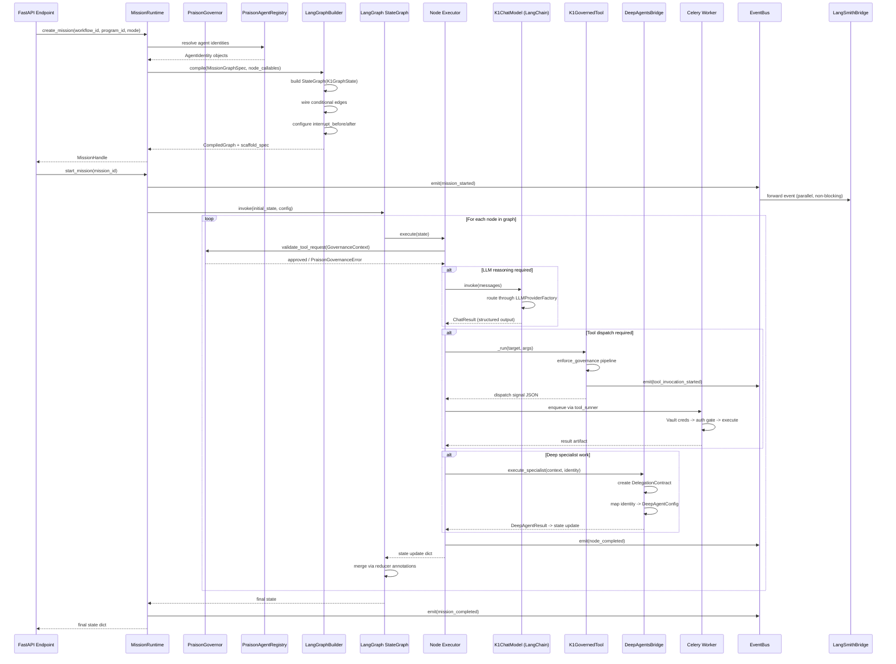
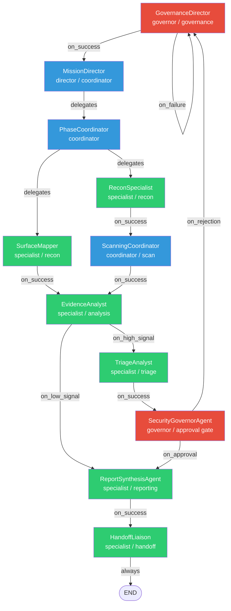
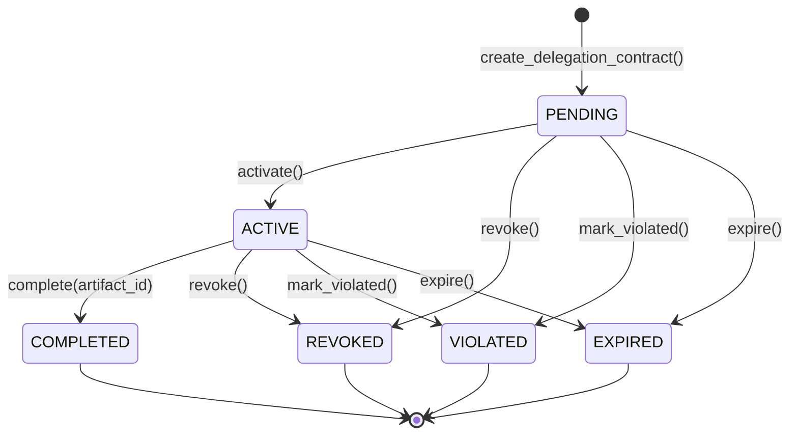
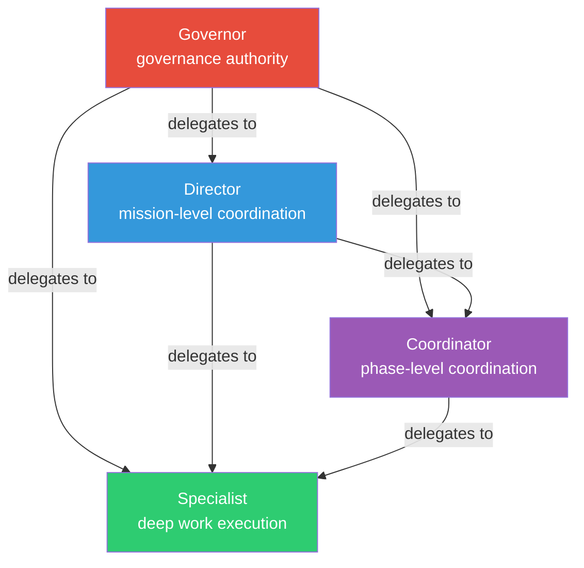
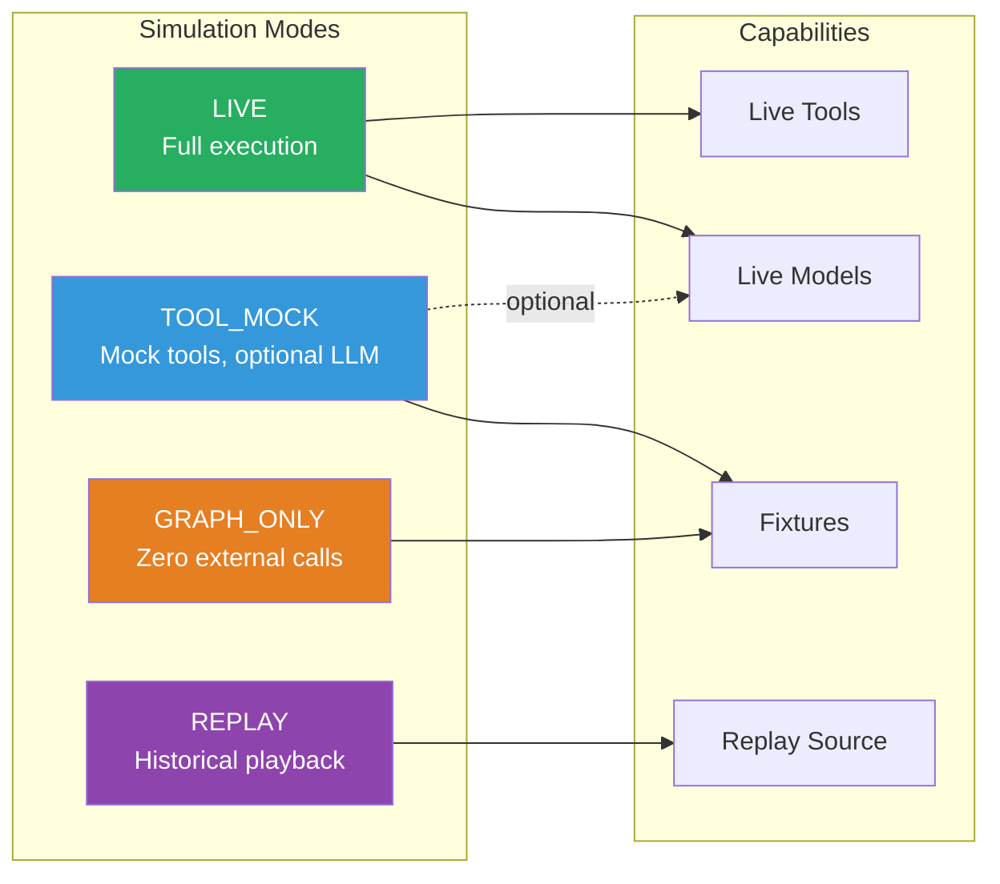
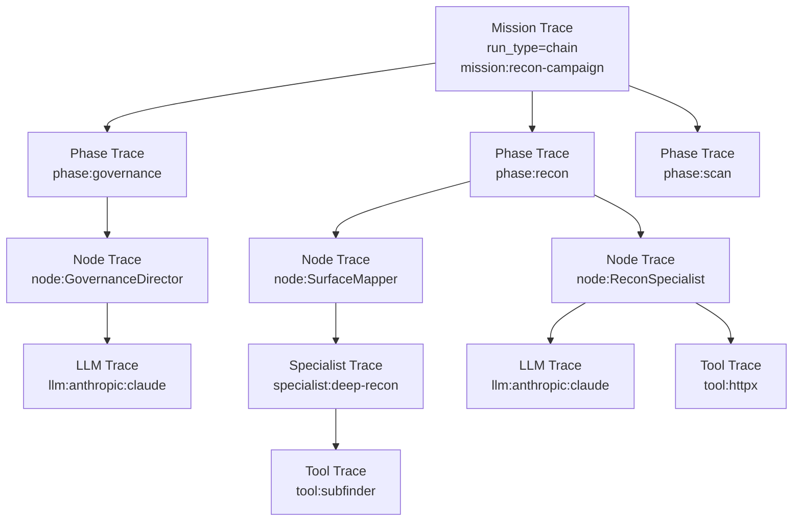

# Kai Platform Architecture

> Governance-first enterprise autonomous mission orchestration for authorized security research.

This document is the central architecture reference for Kai (K1). It describes the six integrated layers that compose the platform, their source files, data flow, authority boundaries, and infrastructure services.

---

## 1. Platform Overview

Kai is a multi-layer AI orchestration platform that coordinates autonomous security research missions under strict governance, scope enforcement, and human-in-the-loop (HIL) approval policies. The platform is organized into six integrated layers, each with a distinct responsibility boundary:

| Layer | Product | Responsibility |
|-------|---------|----------------|
| **Control Plane** | PraisonAI | Authority, governance, agent lifecycle, policy enforcement |
| **Execution Runtime** | LangGraph | Mission graph compilation, state management, checkpointing |
| **Model / Tools / Middleware** | LangChain | LLM abstraction, tool wrapping, structured output, middleware |
| **Deep Work Runtime** | DeepAgents | Specialist deep analysis, sandboxed execution, subagent delegation |
| **Observability** | LangSmith | Traces, spans, experiments, datasets, evaluations |
| **Safe Execution Overlay** | Simulation | Cross-cutting execution mode control (graph_only, tool_mock, replay) |

### Design Doctrine

- **Governance-first**: Every tool invocation, agent spawn, memory write, external call, and phase handoff passes through the PraisonAI governance layer before execution.
- **Separation of authority and execution**: PraisonAI owns policy; LangGraph owns execution. Neither can operate alone.
- **Simulation as overlay, not runtime**: Simulation mode operates within the existing stack by substituting execution behaviors, not by providing a second runtime.
- **Observability is non-authoritative**: LangSmith receives telemetry but never controls execution. The internal EventBus and LangSmith operate as independent parallel planes.
- **Fail-secure by default**: Unknown tool classifications default to band_2 (approval required). Unknown memory scopes are denied. Unsigned certificates are rejected. Test-mode auth bypass requires explicit opt-in.

---

## 2. Layered Architecture

```mermaid
graph TB
    subgraph "Layer 1: PraisonAI Control Plane"
        GOV[PraisonGovernor<br/>Sync fast-path + Async LLM review]
        REG[PraisonAgentRegistry<br/>Agent identity source of truth]
        AID[AgentIdentity<br/>Frozen dataclass]
        CON[DelegationContract<br/>Immutable state machine]
        POL[PraisonRuntimePolicy<br/>Deterministic policy arbiter]
        ADP[Adaptive Strategy<br/>Bounded autonomy + scoring]
        EVT[EventBus<br/>MissionEvent telemetry]
    end

    subgraph "Layer 2: LangGraph Execution Runtime"
        STA[K1GraphState<br/>TypedDict ~35 fields]
        MRT[MissionRuntime<br/>Mission lifecycle manager]
        BLD[PraisonLangGraphBuilder<br/>StateGraph compiler]
        TOP[PraisonTopology<br/>DAG structure definition]
        NOD[Node Executors<br/>Callable builders]
        CLU[ClusterRuntime<br/>Phase subgraph execution]
    end

    subgraph "Layer 3: LangChain Model / Tools / Middleware"
        CMF[K1ChatModel<br/>BaseChatModel adapter]
        CTR[K1GovernedTool<br/>Governed BaseTool wrapper]
        MID[K1MiddlewareStack<br/>Callbacks + context injection]
        SCH[Structured Output Schemas<br/>Pydantic v2 models]
        RSN[K1ReasoningEngine<br/>Node-local reasoning]
    end

    subgraph "Layer 4: DeepAgents Specialist Runtime"
        BRG[DeepAgentsBridge<br/>Identity + context mapping]
        BAK[DeepAgentsBackends<br/>Policy + sandbox restrictions]
        SBX[SandboxManager<br/>Isolated execution]
        ART[AgentRuntime<br/>Namespace-aware streaming]
    end

    subgraph "Layer 5: LangSmith Observability"
        LSB[LangSmithBridge<br/>Trace correlation + runs]
        RED[Redaction Layer<br/>Secrets / PII stripping]
        EXP[Evaluations<br/>Datasets + experiments]
    end

    subgraph "Layer 6: Simulation Overlay"
        SIM[SimulationController<br/>Mode routing + safety barriers]
        CFG[SimulationConfig<br/>Mode + fixture + event policy]
        FIX[FixtureRegistry<br/>Deterministic test data]
        REP[ReplayEngine<br/>Historical timeline reconstruction]
    end

    GOV -->|validates| MRT
    REG -->|provides identities| BLD
    AID -->|frozen personas| REG
    CON -->|enforces delegation| BRG
    POL -->|policy checks| GOV

    MRT -->|compiles graph| BLD
    BLD -->|topology from| TOP
    MRT -->|executes nodes| NOD
    NOD -->|invokes| CMF
    NOD -->|invokes| CTR
    NOD -->|delegates to| BRG

    CMF -->|routes through| CMF
    CTR -->|scope checks| CTR
    MID -->|wraps| CMF

    BRG -->|creates| CON
    BRG -->|executes| SBX

    EVT -->|parallel export| LSB
    LSB -->|redacts via| RED
    LSB -->|feeds| EXP

    SIM -->|overlays| NOD
    SIM -->|uses| FIX
    SIM -->|replays from| REP
    SIM -->|tags traces| LSB
```



---

## 3. Key Source Files

All source files reside under `apps/backend/src/core/` unless otherwise noted.

### 3.1 PraisonAI Control Plane

| File | Primary Class / Function | Purpose |
|------|-------------------------|---------|
| `praison_governor.py` | `PraisonGovernor` | Governance engine. Sync fast-path: `validate_tool_request()` (sub-ms, no LLM). Async LLM paths: `review_band2_action()`, `generate_interscan_report()`, `coordinate_phase_handoff()`. Uses `SecurityGovernorAgent`, `HandoffAgent`, `InterscanReportAgent`. Hook callbacks: `praison_safety_gate_hook`, `praison_agent_spawn_hook`, `praison_agent_handoff_hook`, `praison_agent_memory_write_hook`, `praison_agent_external_call_hook`. |
| `praison_registry.py` | `PraisonAgentRegistry` | Single source of truth for all agent personas. Loads from `orchestration/praison/agents.yaml`. Validates policy fields (`risk_profile`, `memory_scope`, `review_policy`, `agent_class`, `delegation_scope`, etc.). Thread-safe with double-check locking. Dispatches instantiation to framework adapters (`crewai`, `autogen`, `deepagents`, `langgraph`). |
| `praison_agent.py` | `AgentIdentity` | Frozen dataclass carrying all identity and policy fields. Lists coerced to tuples in `__post_init__`. Runtime-annotated copies produced via `with_runtime()`. Includes `resolve_litellm_string()` and `resolve_provider_enum()` for LLM routing. Defines `VALID_RISK_PROFILES`, `VALID_MEMORY_SCOPES`, `VALID_AGENT_CLASSES`, `VALID_DELEGATION_SCOPES`, `_CLASS_DELEGATION_AUTHORITY`, `_SCOPE_RANK`. |
| `praison_contracts.py` | `DelegationContract` | Frozen, immutable delegation contract. States: `PENDING` -> `ACTIVE` -> `COMPLETED` / `REVOKED` / `VIOLATED` / `EXPIRED`. State transitions return new instances via `dataclasses.replace()`. Enforces delegation authority, tool constraints (`allowed_tools`), peer target restrictions (`allowed_targets`). Empty tuple semantics: `()` means NO access (not permit-all). Bidirectional trust validation at contract creation. |
| `praison_runtime_policy.py` | `PraisonRuntimePolicy` | Centralized deterministic policy engine. Enforces delegation authority, interrupt policy, escalation policy, memory scope compliance, tool access within contracts. Single runtime arbiter -- no LLM calls. |
| `praison_adaptive.py` | | Adaptive bounded autonomy with strategy patches. Proposes, validates, and applies execution plan modifications within policy guardrails. |
| `praison_strategy_scoring.py` | | Deterministic scoring functions for strategy selection. Ranks tool profiles and prompt profiles based on historical performance data. |
| `praison_strategy_learning.py` | | Learning pipeline for strategy improvement. Produces knowledge lessons from phase outcomes. Enforces `_ALLOWED_LEARNING_FIELDS` to bound what the learning system can modify. |
| `praison_knowledge_base.py` | | Knowledge base for accumulated lessons from mission executions. |
| `praison_tool_profiles.py` | | Tool execution profiles. Parameterized configurations for tool invocations (timeouts, argument templates, retry policies). |
| `praison_profile_tracker.py` | | Prompt and tool profile tracking. Records which profiles were selected at each execution node. |
| `praison_execution_events.py` | `EventBus`, `MissionEvent` | Structured event telemetry. Frozen `MissionEvent` dataclass with full correlation context. `EventType` enum covering mission lifecycle, contract lifecycle, learning events. EventBus is protocol-based for simulation swappability. |
| `praison_artifacts.py` | | Artifact management for mission outputs. |

### 3.2 LangGraph Execution Runtime

| File | Primary Class / Function | Purpose |
|------|-------------------------|---------|
| `praison_state.py` | `K1GraphState` | `TypedDict` with ~35 fields. Accumulative fields use `Annotated[list, operator.add]` reducers (messages, artifacts, findings, policy_events, escalations, violations, node_history, etc.). Scalar fields use last-write-wins. `make_initial_state()` builds the genesis state. `merge_state()` provides canonical merge logic. `state_snapshot()` returns serializable audit summaries. `execution_mode` controls simulation behavior (`"live"`, `"graph_only"`, `"tool_mock"`, `"replay"`). |
| `praison_mission_runtime.py` | `MissionRuntime` | Top-level mission lifecycle manager. Methods: `create_mission()`, `start_mission()`, `resume_mission()`, `stop_mission()`, `cancel_mission()`, `approve_pending()`, `list_missions()`, `inspect_state()`, `get_status()`, `get_state()`. `MissionHandle` and `MissionStatus` dataclasses. Bridges PraisonAI authority, LangGraph execution, event telemetry, and adaptive execution. Supports LangGraph compiled execution and fallback topological execution. |
| `praison_langgraph_builder.py` | `PraisonLangGraphBuilder` | Compiles `MissionGraphSpec` into LangGraph `StateGraph`. The ONLY module that instantiates LangGraph objects. Uses `K1GraphState` as the typed state schema (ensuring accumulative reducers work). Wires conditional edges from `EdgeSpec` routing rules. Configures `interrupt_before` / `interrupt_after` for HIL gates. Attaches PostgreSQL checkpointer (falls back to `MemorySaver`). Compiles phase clusters as subgraphs. LangGraph is optional -- degrades to scaffold specs when not installed. |
| `praison_topology.py` | `PraisonTopology`, `NodeSpec`, `EdgeSpec`, `ClusterSpec`, `MissionGraphSpec` | DAG topology builder. Defines graph structure: nodes, edges with routing conditions (`EdgeCondition`: `ALWAYS`, `ON_SUCCESS`, `ON_FAILURE`, `ON_APPROVAL`, `ON_REJECTION`, `ON_ARTIFACT`, `ON_HIGH_SIGNAL`, `ON_LOW_SIGNAL`, `ON_PHASE_COMPLETE`), clusters, entry/exit nodes. `build_standard_bug_bounty()` generates the standard mission graph. `resolve_execution_order()` provides topological sort for fallback execution. |
| `praison_node_executors.py` | `build_standard_node_callables()` | Node callable builders for graph execution. Creates `{node_id: callable}` mappings consumed by LangGraph. Each callable receives and returns `K1GraphState` dicts. |
| `praison_cluster_runtime.py` | | Specialist cluster subgraph runtime. Manages phase cluster execution as bounded subgraphs within the parent mission graph. |

### 3.3 LangChain Layer

| File | Primary Class / Function | Purpose |
|------|-------------------------|---------|
| `langchain_model_factory.py` | `K1ChatModel`, `K1ModelFactory` | `K1ChatModel` extends LangChain `BaseChatModel`, delegating inference to Kai's `LLMProviderFactory` singleton. Preserves provider-routing, failover, cost tracking. Supports sync `_generate()` and async `_agenerate()`. `with_structured_output()` uses prompt-instruction strategy (PydanticOutputParser format injection). `K1ModelFactory` manages configured instances. |
| `langchain_tool_registry.py` | `K1GovernedTool`, `K1LangChainToolRegistry`, `K1ToolContext` | Wraps Kai `ToolCatalogEntry` objects as LangChain `BaseTool` with full governance enforcement per invocation. Governance pipeline: execution-mode fast-path -> allowed-tool-ids check -> safety band enforcement (band_3 always denied) -> scope validation -> telemetry emission -> dispatch signal. Does NOT execute tools inline -- returns structured dispatch signal for Celery worker pipeline. `K1ToolContext` is a frozen per-invocation governance context. Phase-to-category mapping drives `get_tools_for_phase()`. |
| `langchain_middleware.py` | `K1GovernanceCallbackHandler`, `K1ToolFilterMiddleware`, `K1ContextInjector`, `K1MiddlewareStack` | Governance-aware LangChain middleware. `K1GovernanceCallbackHandler` emits `MissionEvent` at every LLM/tool/chain boundary. `K1ToolFilterMiddleware` dynamically filters tool visibility by phase, authority, and band policy. `K1ContextInjector` prepends governance context into message sequences. `K1MiddlewareStack` composes all components into a reusable unit. |
| `langchain_schemas.py` | `SCHEMA_REGISTRY`, `SeverityLevel`, various Pydantic v2 models | Structured output schemas for LLM reasoning steps. All models use `ConfigDict(extra="forbid")` to reject prompt-injection via unexpected keys. Schema registry maps short names to classes. `validate_schema_output()` parses raw dicts. |
| `langchain_reasoning.py` | `K1ReasoningEngine` | Node-local reasoning primitives. Summarizes artifacts, classifies findings, generates evidence digests, ranks tools, produces structured outputs. Simulation-ready (returns deterministic fixtures in `tool_mock` mode). All calls correlated to mission/node via middleware callbacks. |

### 3.4 DeepAgents Layer

| File | Primary Class / Function | Purpose |
|------|-------------------------|---------|
| `praison_deepagents_bridge.py` | `DeepAgentsBridge`, `DeepAgentExecutionContext` | Canonical integration point. Maps `AgentIdentity` -> `DeepAgentConfig`, Kai execution context -> DeepAgent runtime context, `DeepAgentResult` -> `K1GraphState` updates, `DeepAgentResult` -> Kai artifacts. Creates `DelegationContract` instances for subagent delegation. Dual-path: uses official `deepagents` package when installed, falls back to Kai's native LLM invoke path. |
| `praison_deepagents_backends.py` | | Backend policy and sandbox restrictions for DeepAgent execution environments. |
| `praison_sandbox_manager.py` | | Sandbox manager for isolated specialist execution. Enforces execution boundaries. |
| `praison_agent_runtime.py` | | Agent runtime with namespace-aware streaming. Manages agent execution lifecycle within the DeepAgent framework. |

### 3.5 LangSmith Layer

| File | Primary Class / Function | Purpose |
|------|-------------------------|---------|
| `langsmith_integration.py` | `LangSmithBridge`, `LangSmithConfig`, `TraceCorrelation` | Bridge between Kai's mission runtime and LangSmith. Client lifecycle management with lazy init. Run hierarchy: mission -> phase -> node -> specialist -> LLM call. Trace sampling enforcement (`K1_LANGSMITH_SAMPLE_RATE`). Redaction pipeline coordination. EventBus subscriber for event forwarding. Context manager `trace_run()` for run lifecycle. Naming conventions: `mission_run_name()`, `phase_run_name()`, `node_run_name()`, `specialist_run_name()`, `llm_run_name()`, `tool_run_name()`. |
| `langsmith_redaction.py` | `redact_for_langsmith()` | Stateless redaction layer. Modes: `strict` (API keys, tokens, PII, target IPs, large payloads, raw tool outputs), `moderate` (API keys, tokens, credentials; allows target info), `none` (development only). Vault tokens, API keys, PGP private keys, and raw exploit payloads are never exported in strict mode. |
| `langsmith_evaluations.py` | `EvalResult`, dataset manager, experiment runner | Evaluation datasets populated from mission runs. Evaluation targets score structured outputs (triage, evidence, reports). A/B experiment comparisons for prompts, tools, and strategies. Dataset naming: `kai-{category}-{qualifier}`. Experiment naming: `kai-exp-{what}-{timestamp}`. |

### 3.6 Simulation Layer

| File | Primary Class / Function | Purpose |
|------|-------------------------|---------|
| `praison_simulation.py` | `SimulationController` / `SimulationRunner` | Central simulation control. Routes execution through `graph_only` / `tool_mock` / `replay` paths. Hard safety barriers: `assert_simulation_safe()` prevents live tool execution in simulation modes. `make_simulation_node_executor()` wraps node callables with simulation behavior. `SimulationRunner.run_simulation()` orchestrates full simulation lifecycle. `run_comparison()` runs multiple arms for A/B comparison. All simulation artifacts carry explicit provenance markers (`_simulation=True`). |
| `praison_simulation_config.py` | `SimulationConfig`, `SimulationMode` | Explicit simulation configuration. `SimulationMode` enum: `LIVE`, `GRAPH_ONLY`, `TOOL_MOCK`, `REPLAY`. Safety properties: `allows_live_tools` (only LIVE), `allows_live_models` (LIVE + TOOL_MOCK), `uses_fixtures` (GRAPH_ONLY + TOOL_MOCK), `uses_replay_source` (REPLAY). `FixtureStrictness`, `ArtifactPolicy`, `EventVerbosity` enums. |
| `praison_simulation_fixtures.py` | `FixtureRegistry`, `fixture_approval_decision()` | Deterministic test data for simulation modes. Fixture profiles and scenario packs. `fixture_approval_decision()` generates deterministic approval outcomes. |
| `praison_replay.py` | `ReplayEngine`, `load_replay_node_state()` | Reconstructs mission timelines from persisted JSONL events, LangGraph checkpoints, artifact lineage, and LangSmith traces. Never re-executes live tools or models. Marks all replayed outputs with `_replay=True`. |

---

## 4. Control Flow: Mission Execution



---

## 5. Mission Graph Topology

The standard bug bounty mission graph follows this structure:



**Legend**: Red = governance nodes (interrupt_before enabled). Blue = coordinator/director nodes. Green = specialist nodes.

---

## 6. State and Authority Boundaries

### 6.1 What Kai Owns

Kai is the authoritative system of record for:

- **Mission state** -- `K1GraphState` with ~35 fields, managed by `MissionRuntime`. Accumulative fields use reducer annotations; scalar fields use last-write-wins.
- **Governance policy** -- Scope enforcement (`scope_guardrails.py`, `authorization_gate.py`, `scope_resolver.py`), tool policy bands (0-3), HIL gate policy, agent lifecycle policy.
- **Agent identities** -- `AgentIdentity` frozen dataclasses loaded from `agents.yaml` via `PraisonAgentRegistry`. No framework adapter defines agents independently.
- **Delegation contracts** -- `DelegationContract` frozen dataclass with enforced state machine: `PENDING` -> `ACTIVE` -> `COMPLETED` / `REVOKED` / `VIOLATED` / `EXPIRED`.
- **Artifacts** -- All persistent outputs written to `artifacts/` (workflows, runs, telemetry, tool results). Volume-mounted in Docker.
- **Audit trail** -- `IntentionRecord`, `AuditEvent`, scope decision JSONL logs, event telemetry.
- **LLM provider routing** -- `LLMProviderFactory` with Anthropic/OpenAI/Gemini/Ollama/Gemma/Qwen/OpenRouter implementations, automatic failover chain, cost tracking.

### 6.2 What Each Layer Owns

| Layer | Owns | Does NOT Own |
|-------|------|-------------|
| **PraisonAI** | Agent authority hierarchy (`governor` > `director` > `coordinator` > `specialist`). Governance validation (sync rule-based + async LLM review). Agent lifecycle hooks (spawn, handoff, memory write, external call). Memory scope enforcement (`session` < `phase` < `workflow` < `mission` < `persistent`). Delegation authority and bidirectional trust. | Graph execution order. State merging. Checkpoint persistence. |
| **LangGraph** | Graph compilation from `MissionGraphSpec`. State management via `K1GraphState` reducer annotations. Conditional edge routing. Checkpoint/resume via PostgreSQL or MemorySaver. Interrupt configuration for HIL gates. Subgraph compilation for phase clusters. | Agent identities. Governance policy. Tool authorization. Artifact persistence. |
| **LangChain** | Model abstraction via `K1ChatModel` -> `LLMProviderFactory`. Tool wrapping via `K1GovernedTool` with governance enforcement. Structured output via Pydantic schemas and `PydanticOutputParser`. Middleware callbacks for telemetry. Node-local reasoning primitives. | Mission-level state. Provider credentials. Tool execution (deferred to Celery). |
| **DeepAgents** | Specialist deep work execution. Sandbox isolation. Subagent delegation within contract boundaries. Namespace-aware streaming. | Governance policy. Contract creation authority (bridge creates contracts using Kai's rules). Identity definition. |
| **LangSmith** | Traces and spans with run hierarchy (mission -> phase -> node -> specialist -> LLM call). Evaluation datasets. A/B experiment comparison. Sampling rate enforcement. | Mission state. Governance decisions. Artifact storage. Policy enforcement. |
| **Simulation** | Execution mode routing (graph_only / tool_mock / replay). Safety barriers preventing live tool/model calls in simulation. Fixture registry for deterministic test data. Replay engine for historical timeline reconstruction. Provenance tagging on all simulation outputs. | Real execution. Governance policy. Agent identities. |

### 6.3 Independence Invariant

Both the EventBus and LangSmith receive execution events, but they **never depend on each other**:

- `EventBus` is the internal telemetry plane. Subscribers include internal consumers (audit log, adaptive learning, GUI WebSocket push).
- `LangSmithBridge` is the external observability plane. Receives events via its own EventBus subscriber callback but operates independently.
- If LangSmith is unavailable (package not installed, API key missing, network failure), the EventBus and all internal systems continue to function without degradation.
- If the EventBus is swapped (e.g., recording bus for simulation), LangSmith continues to function via its own trace lifecycle (`create_run` / `end_run`).

---

## 7. Tool Policy Bands

Tool classification drives governance enforcement at every layer:

| Band | Classification | Governance | Autonomy |
|------|---------------|------------|----------|
| **Band 0** | `passive` / `safe` | Always autonomous | Passive collection, benign analysis. No scope risk. |
| **Band 1** | `active` | Autonomous within scope | Low-risk active checks. Scope validation enforced. |
| **Band 2** | `intrusive` | Approval required | State-modifying, alert-tripping actions. LLM risk assessment via `PraisonGovernor.review_band2_action()`. HIL approval gate before execution. Campaign context (workflow_id + program_id) required. |
| **Band 3** | `manual_only` | Never autonomous | Exploit-like, legally ambiguous. Hard-blocked at PraisonGovernor sync path. Hard-blocked at LangChain tool registry. Requires direct operator invocation with explicit override. |

Enforcement points (in execution order):

1. **PraisonGovernor** `validate_tool_request()` -- sync fast-path, sub-millisecond. Band 3 hard block. Band 2 context requirement.
2. **K1GovernedTool** `_enforce_governance()` -- LangChain layer. Band 3 unconditionally denied. Scope validation via `scope_validator()`.
3. **Celery Worker** `run_tool_task` -- queue routing: Band 0-1 -> `tools` queue, Band 2+ -> `intrusive` queue. Vault credential fetch. Authorization gate enforcement.

Unknown tool classifications default to `band_2` (approval required), following the deny-unknown security principle.

---

## 8. Delegation Contract Lifecycle



Contract creation validation:

1. **Class authority**: `governor` -> `director` / `coordinator` / `specialist`. `director` -> `coordinator` / `specialist`. `coordinator` -> `specialist`. `specialist` -> (cannot delegate).
2. **Delegation scope**: `delegation_scope != "none"` required.
3. **Bidirectional trust**: If delegator has a non-empty `allowed_peer_targets`, the delegate must be listed.
4. **Tool subset**: If `allowed_tools` is explicitly provided, it must be a subset of the delegate's declared `allowed_tools`.
5. **Empty-list semantics**: `allowed_tools=()` means NO tools permitted (not permit-all). The factory always explicitly sets tools from the delegate's declared list.

---

## 9. Agent Class Hierarchy



| Class | Delegation Scope | Memory Scope | Typical Roles |
|-------|-----------------|--------------|---------------|
| `governor` | `phase` / `global` | `mission` / `persistent` | `GovernanceDirector`, `SecurityGovernorAgent` |
| `director` | `phase` / `global` | `workflow` / `mission` | `MissionDirector` |
| `coordinator` | `local` / `phase` | `phase` / `workflow` | `PhaseCoordinator`, `ScanningCoordinator` |
| `specialist` | `none` (cannot delegate) | `session` / `phase` | `SurfaceMapper`, `ReconSpecialist`, `EvidenceAnalyst`, `TriageAnalyst`, `ReportSynthesisAgent`, `HandoffLiaison` |

---

## 10. Simulation Modes



| Mode | Live Tools | Live Models | Fixtures | Replay | Use Case |
|------|-----------|-------------|----------|--------|----------|
| `live` | Yes | Yes | No | No | Production mission execution |
| `graph_only` | **No** | **No** | Yes | No | Topology validation, CI tests, cost-free dry runs |
| `tool_mock` | **No** | Optional | Yes | No | Agent reasoning validation with mock tool outputs |
| `replay` | **No** | **No** | Fallback | Yes | Post-mortem analysis, regression testing |

Safety invariants enforced by `assert_simulation_safe()`:

- `graph_only` must not allow live tools OR live models.
- `tool_mock` must not allow live tools.
- `replay` must not allow live tools.
- No simulation mode can accidentally escalate to live tool execution.
- All simulation artifacts carry `_simulation=True` provenance markers.

---

## 11. LangSmith Trace Hierarchy



Every trace carries Kai correlation metadata (`kai_mission_id`, `kai_workflow_id`, `kai_program_id`, `kai_phase`, `kai_node_id`, `kai_agent_id`, `kai_execution_mode`) and tags (`mission:*`, `phase:*`, `mode:*`, `specialist:*`).

Redaction is applied before any data is sent to LangSmith:

- **Strict mode** (default): API keys, tokens, credentials, target IPs/domains, large payloads (>10KB), raw tool outputs, PII patterns -- all redacted.
- **Moderate mode**: API keys, tokens, credentials redacted. Target info and truncated tool outputs allowed.
- **None mode**: No redaction. Development/local only.

---

## 12. Infrastructure Services

| Service | Port | Purpose | Technology |
|---------|------|---------|------------|
| `backend` | 8080 | FastAPI API server | Python 3.11, Uvicorn |
| `frontend` | 5173 | Vite React dev server (proxies to backend) | React 18, TypeScript, MUI 7 |
| `worker` | -- | Celery worker (Go + Python tools installed) | Celery, Redis broker |
| `postgres` | 5432 | Primary database (user: k1) | PostgreSQL 16, SQLAlchemy async (asyncpg) |
| `redis` | 6379 | Cache + Celery message broker | Redis |
| `vault` | 8200 | Secret management (dev mode) | HashiCorp Vault |
| `mailhog` | 8025 | Email testing UI | MailHog |

### Middleware Stack (order matters)

```
CORS -> RateLimit -> CSRF -> CorrelationId -> SecurityHeaders
```

### Database

- PostgreSQL 16 via SQLAlchemy async with asyncpg driver, pool_size=20.
- Migrations managed by Alembic.
- `get_db()` async dependency provides request-scoped sessions.

### Multi-Provider AI

- Providers: Anthropic Claude, OpenAI, Gemini, Ollama, Gemma, Qwen, OpenRouter.
- Configuration: `config/providers/*.yaml`, `config/registry/routing_matrix.yaml`.
- Primary provider from `K1_PRIMARY_LLM_PROVIDER` env. Fallback chain from `K1_FALLBACK_LLM_PROVIDERS`.
- Unified `LLMResponse` dataclass with cost tracking.
- LangChain integration routes through `K1ChatModel` -> `LLMProviderFactory`.
- PraisonAI agents route through LiteLLM with `resolve_litellm_string()`.

### Tool Execution Pipeline

```
API -> tool_runner.enqueue() -> scope/cert validation
    -> Celery task queued to Redis (queue by autonomy tier)
    -> Worker: Vault creds -> auth gate -> pre_run hook -> tool.execute() -> post_run hook
    -> Artifact persist to artifacts/telemetry/tool_runs.jsonl
    -> Result returned async via task ID
```

---

## 13. Execution Model

### Job States

```
CREATED -> QUEUED -> RUNNING -> WAITING_APPROVAL -> COMPLETED
                                      |
                            BLOCKED | FAILED | SKIPPED | CANCELED
```

One campaign = DAG of phase-jobs with pause/resume semantics. Approval blocks ONLY the dependent branch. Sibling branches continue execution.

### Workflow States (Hunt)

```
SELECTED -> SCOPING -> CREDENTIAL_SETUP -> RECON -> SCANNING -> TRIAGE -> HIL_REVIEW -> SUBMITTED -> CLOSED
```

### Mission States

```
created -> running -> completed
                  |-> paused (stop_mission)
                  |-> failed
                  |-> cancelled (cancel_mission, terminal)
```

### Intention Contract

Every major action captures: initiator, declared intention, intended goal, risk posture change, scope/policy compatibility result, and human approval requirement flag.

---

## 14. Current Verified State

- **604 passed, 1 skipped, 0 failures** across the full test suite.
- All 6 layers implemented and tested.
- Self-contained tests (no external services required) cover scope guardrails, tool registry catalog, workflow engine, tool adapters, submission export adapters, PraisonAI governance, agent registry, contracts, topology, LangGraph builder, mission runtime, LangChain model factory, tool registry, middleware, schemas, reasoning, LangSmith integration, redaction, evaluations, simulation, fixtures, replay, and the full E2E integration chain.
