# KAI — Bug Bounty Hunt Workflow

Hypothetical hunt against `target.com` on HackerOne.  
All phase transitions, tool calls, and intelligence hooks reflect actual platform code.

```mermaid
flowchart TD
    %% ── Styles ──────────────────────────────────────────────────────────
    classDef hunter    fill:#1a3a2a,stroke:#3d7a50,color:#a8f0c0,font-weight:bold
    classDef phase     fill:#0d2035,stroke:#2a6098,color:#7fc8f8,font-weight:bold
    classDef tool      fill:#1a1a2e,stroke:#4a4a8a,color:#c0c0f8,font-size:11px
    classDef intel     fill:#2a1a35,stroke:#7a4a8a,color:#d8a8f8
    classDef gate      fill:#35200a,stroke:#a06020,color:#f8c878,font-weight:bold
    classDef llm       fill:#0a2a2a,stroke:#2a8a7a,color:#7af8e8
    classDef output    fill:#1a2a1a,stroke:#4a8a4a,color:#a8e8a8
    classDef decision  fill:#2a1a1a,stroke:#8a2a2a,color:#f8a8a8
    classDef ai        fill:#1a1a35,stroke:#5050b0,color:#a0a0ff

    %% ═══════════════════════════════════════════════════════════════════
    %% MISSION SETUP
    %% ═══════════════════════════════════════════════════════════════════
    A([👤 Analyst Creates Hunt Program]):::hunter
    A --> B[Define Scope\ntarget.com / *.target.com\nOut-of-scope: staging.target.com]:::phase
    B --> C{Scope Guardrail\nValidation}:::decision
    C -->|Deny-by-default check\nCIDR + allowlist + denylist| D[✅ Scope Approved\nBand 0 & 1 Auto-Authorized]:::gate
    C -->|Target in denylist\nor no allowlist match| ERR([🚫 Hunt Blocked]):::decision

    D --> INTEL_START[Intelligence Platforms\nOn Mission Start]:::intel
    INTEL_START --> W1[Wazuh: Authenticate\n+ baseline host anomaly]:::intel
    INTEL_START --> H1[TheHive: Create\nmission case]:::intel

    %% ═══════════════════════════════════════════════════════════════════
    %% LLM ROUTING
    %% ═══════════════════════════════════════════════════════════════════
    LLM[5-Tier LLM Router\nGeminiOrchestrator]:::llm
    LLM_T1[T1: gemini-2.5-flash\nAgentic execution]:::llm
    LLM_T2[T2: gemini-2.5-flash-lite\nHigh-volume recon]:::llm
    LLM_T3[T3: gemini-2.5-pro\nReport & CVE triage]:::llm
    LLM_T4[T4: gemma4:7b via Ollama\nRouting & classification]:::llm
    LLM_T5[T5: qwen2.5:7b\nOffline emergency fallback]:::llm
    LLM --> LLM_T1 & LLM_T2 & LLM_T3 & LLM_T4 & LLM_T5

    %% ═══════════════════════════════════════════════════════════════════
    %% PHASE 1 — RECON  (Band 0 — Passive)
    %% ═══════════════════════════════════════════════════════════════════
    D --> P1[⬡ PHASE 1: RECONNAISSANCE\nBand 0 — Passive Only]:::phase

    P1 --> P1_CREW[CrewAI: primary_recon_crew\n+ certificate_intel_crew\n+ dns_intelligence_crew]:::ai
    P1_CREW --> P1_TOOLS

    subgraph P1_TOOLS [Phase 1 Tool Agents]
        direction LR
        T_subfinder[subfinder\nassetfinder\nfindomain\nchaos]:::tool
        T_amass[amass\ndnsvalidator\ndnsx]:::tool
        T_cert[certspotter\ncrtsh\nshodan]:::tool
        T_archive[gau\nwaybackurls]:::tool
    end

    P1_TOOLS --> P1_MISP[MISP: Pre-check IOCs\nfor discovered subdomains]:::intel
    P1_TOOLS --> P1_OUT[(Subdomains List\nDNS Records\nCertificate History)]:::output

    %% ═══════════════════════════════════════════════════════════════════
    %% PHASE 2 — FINGERPRINTING  (Band 0 → Band 1)
    %% ═══════════════════════════════════════════════════════════════════
    P1_OUT --> P2[⬡ PHASE 2: FINGERPRINTING\nBand 0→1 — Light Active]:::phase

    subgraph P2_TOOLS [Phase 2 Tool Agents]
        direction LR
        T_nmap[nmap\nmassscan\nnaabu]:::tool
        T_whatweb[whatweb\nwebanalyze\nhttpx]:::tool
        T_sslyze[sslyze\ntestssl\nwaf00f]:::tool
        T_eyewitness[eyewitness\ngowitness]:::tool
    end

    P2 --> P2_TOOLS
    P2_TOOLS --> P2_OUT[(Port Map\nTech Stack\nWAF Detected\nScreenshots)]:::output

    %% ═══════════════════════════════════════════════════════════════════
    %% PHASE 3 — CONTENT DISCOVERY  (Band 1)
    %% ═══════════════════════════════════════════════════════════════════
    P2_OUT --> P3[⬡ PHASE 3: CONTENT DISCOVERY\nBand 1 — Active Probing]:::phase

    P3 --> WLM[WordlistManager\nSecLists selection\nphase=discovery\ntech_stack from Phase 2]:::ai
    WLM --> WLG[WordlistGenerator\nContext words from domain\n+ SecLists dir-medium\n+ Mutations]:::ai

    subgraph P3_TOOLS [Phase 3 Tool Agents]
        direction LR
        T_ffuf[ffuf\nferoxbuster\ndirsearch]:::tool
        T_kite[kiterunner\narjun]:::tool
        T_param[paramspider\ngf]:::tool
    end

    WLG --> P3_TOOLS
    P3_TOOLS --> P3_OUT[(Discovered Paths\nAPI Endpoints\nParameters\nBackup Files)]:::output

    %% ═══════════════════════════════════════════════════════════════════
    %% PHASE 4 — OSINT  (Band 0 — Passive)
    %% ═══════════════════════════════════════════════════════════════════
    P2_OUT --> P4[⬡ PHASE 4: OSINT\nBand 0 — Passive External]:::phase

    P4 --> P4_CREW[CrewAI: organization_intel_crew]:::ai
    subgraph P4_TOOLS [Phase 4 Tool Agents]
        direction LR
        T_gitleaks[gitleaks\ntrufflehog\ngitrob\ngithound]:::tool
        T_sherlock[sherlock\nsocialscan\nwhatsmyname]:::tool
        T_dehashed[dehashed\nfullhunt]:::tool
        T_darkweb[torbot\nahmia-client\ndarksearch]:::tool
        T_spiderfoot[spiderfoot\nphoneinfoga]:::tool
    end

    P4_CREW --> P4_TOOLS
    P4_TOOLS --> P4_MISP[MISP: Enrich discovered\nIOCs + leaked creds]:::intel
    P4_TOOLS --> P4_OUT[(Leaked Creds\nGit Secrets\nSocial Profiles\nDark Web Mentions)]:::output

    %% ═══════════════════════════════════════════════════════════════════
    %% PHASE 5 — VULNERABILITY SCANNING  (Band 1)
    %% ═══════════════════════════════════════════════════════════════════
    P3_OUT & P4_OUT --> P5[⬡ PHASE 5: VULNERABILITY SCANNING\nBand 1 — Active Scanning]:::phase

    P5 --> P5_CREW[CrewAI: primary_vuln_crew\n+ business_logic_crew]:::ai
    subgraph P5_TOOLS [Phase 5 Tool Agents]
        direction LR
        T_nuclei[nuclei\n-t cves/\n-t exposures/\n-t misconfigs/]:::tool
        T_nikto[nikto\nwpscan\njoomscan]:::tool
        T_sqlmap[sqlmap\ncommix]:::tool
        T_dalfox[dalfox\nxssstrike]:::tool
        T_ssrf[gopherus\nssrfmap]:::tool
        T_lfi[lfi scanner\ndotdotpwn]:::tool
    end

    P5_CREW --> P5_TOOLS
    P5_TOOLS --> P5_CORTEX[Cortex: Auto-analyze\nobservables from findings]:::intel
    P5_TOOLS --> P5_WAZUH[Wazuh: Alert on\nabnormal host response]:::intel

    %% ═══════════════════════════════════════════════════════════════════
    %% PHASE 6 — API TESTING  (Band 1)
    %% ═══════════════════════════════════════════════════════════════════
    P3_OUT --> P6[⬡ PHASE 6: API TESTING\nBand 1 — Active API Probing]:::phase

    P6 --> P6_CREW[CrewAI: rest_api_crew\n+ graphql_specialist_crew]:::ai
    subgraph P6_TOOLS [Phase 6 Tool Agents]
        direction LR
        T_swagger[swagger-inspector\nkiterunner]:::tool
        T_gql[clairvoyance\ngraphql-cop]:::tool
        T_jwt[jwt-tool\npentagi]:::tool
        T_rate[rate-limit-tester\nwscat]:::tool
        T_corsy[corsy\npostman-cli]:::tool
    end

    P6_CREW --> P6_TOOLS
    P6_TOOLS --> P6_OUT[(API Schema\nAuth Bypass Attempts\nJWT Weaknesses\nCORS Issues)]:::output

    %% ═══════════════════════════════════════════════════════════════════
    %% FINDING DISCOVERED — Intelligence Hook
    %% ═══════════════════════════════════════════════════════════════════
    P5_TOOLS & P6_TOOLS --> FINDING{Finding\nDiscovered?}:::decision

    FINDING -->|Low / Medium\nBand 1| AUTO_ENRICH[Auto-Enrich Pipeline]:::intel
    AUTO_ENRICH --> MISP_ENR[MISP IOC Lookup\nCached 1hr]:::intel
    AUTO_ENRICH --> CORTEX_AN[Cortex Analyzer\nVirusTotal / Shodan]:::intel
    AUTO_ENRICH --> WAZUH_AL[Wazuh Host Alert\nCorrelation]:::intel

    FINDING -->|High / Critical\nBand 2 Required| BAND2[🔐 BAND 2 GATE\nRequires Human Approval]:::gate
    BAND2 --> HIL[HiL Approval Interface\nAnalyst reviews finding\n+ FP detector score]:::gate
    HIL -->|Approved| THEHIVE[TheHive: Create Case\nSeverity: High/Critical]:::intel
    HIL -->|Rejected / False Positive| FP_MARK[Mark False Positive\nAudit Trail Written]:::output
    THEHIVE --> SHUFFLE[Shuffle SOAR:\nEscalation Workflow\nTriggered]:::intel

    %% AutoGen Validation
    AUTO_ENRICH & THEHIVE --> AUTOGEN[AutoGen2 Validation\nHunter vs Skeptic debate\nSeverity consensus]:::ai

    %% ═══════════════════════════════════════════════════════════════════
    %% PHASE 7 — EXPLOITATION VALIDATION  (Band 2 — Approval Required)
    %% ═══════════════════════════════════════════════════════════════════
    HIL -->|Approved for PoC| P7[⬡ PHASE 7: EXPLOIT VALIDATION\nBand 2 — Human Approved Only]:::phase

    subgraph P7_TOOLS [Phase 7 Tool Agents]
        direction LR
        T_metasploit[metasploit\ncheck-only mode]:::tool
        T_sqlmap2[sqlmap\n--technique=BEUSTQ]:::tool
        T_vision[Vision Validation\nScreenshot PoC\nGemini 1.5 Pro Vision]:::ai
    end

    P7 --> P7_TOOLS
    P7_TOOLS --> P7_OUT[(Verified PoC\nCVSS Score\nEvidence Screenshots\nReproduction Steps)]:::output

    %% ═══════════════════════════════════════════════════════════════════
    %% PHASE 8 — AGGREGATION
    %% ═══════════════════════════════════════════════════════════════════
    P7_OUT & AUTO_ENRICH --> P8[⬡ PHASE 8: AGGREGATION\nBand 0 — Post-processing]:::phase

    P8 --> NOVELTY[Novelty Dedupe Engine\nFingerprint-based dedup\nCross-mission correlation]:::ai
    NOVELTY --> SEVERITY[CVSS Scoring\n+ EPSS enrichment\nfrom NVD]:::ai
    SEVERITY --> P8_OUT[(Deduplicated Findings\nSeverity Ranked\nEvidence Signed\nArtifacts in GCS)]:::output

    %% ═══════════════════════════════════════════════════════════════════
    %% PHASE 9 — REPORTING & SUBMISSION
    %% ═══════════════════════════════════════════════════════════════════
    P8_OUT --> P9[⬡ PHASE 9: REPORTING\nBand 0 — Output Generation]:::phase

    P9 --> LLM_T3_RPT[gemini-2.5-pro\nReport Intelligence Engine\nNarrative + remediation]:::llm
    LLM_T3_RPT --> REPORTS[(PDF/HTML Report\nExecutive Summary\nTechnical Detail\nHackerOne-ready markdown)]:::output

    REPORTS --> SUBMIT{Submission\nChannel}:::decision
    SUBMIT -->|HackerOne / Bugcrowd| PLATFORM[Platform Submission\nVia API or export]:::output
    SUBMIT -->|Internal Program| DEFECT[DefectDojo\nFaraday Integration]:::output
    SUBMIT -->|Enterprise Client| JIRA[Jira / Slack\nNotification + ticket]:::output

    %% ═══════════════════════════════════════════════════════════════════
    %% BIGQUERY — Analytics sink (runs throughout)
    %% ═══════════════════════════════════════════════════════════════════
    BQ[(BigQuery\nkai_analytics\nscan_events\nfindings\nllm_usage\ntool_executions)]:::output

    P1_OUT & P2_OUT & P8_OUT & REPORTS -.->|async telemetry| BQ

    %% ═══════════════════════════════════════════════════════════════════
    %% Mission Complete hook
    %% ═══════════════════════════════════════════════════════════════════
    REPORTS --> MISSION_DONE[Mission Complete\nIntelligence Hook]:::intel
    MISSION_DONE --> W_FINAL[Wazuh: Final\nanomaly sweep]:::intel
    MISSION_DONE --> SH_FINAL[Shuffle: mission_complete\nworkflow triggered]:::intel
    MISSION_DONE --> LANGSMITH[LangSmith: End\nmission trace\nSpan closed]:::llm
```



---

## Phase Summary

| Phase | Band | Auto / Manual | Key Tools | Intelligence |
|-------|------|--------------|-----------|-------------|
| 1 — Recon | 0 | Auto | subfinder, amass, dnsx, gau | MISP IOC pre-check |
| 2 — Fingerprinting | 0→1 | Auto | nmap, whatweb, sslyze, eyewitness | — |
| 3 — Content Discovery | 1 | Auto | ffuf, feroxbuster, kiterunner | SecLists + WordlistGenerator |
| 4 — OSINT | 0 | Auto | gitleaks, sherlock, dehashed, torbot | MISP enrichment |
| 5 — Vuln Scanning | 1 | Auto | nuclei, sqlmap, dalfox, gopherus | Cortex analyzers + Wazuh |
| 6 — API Testing | 1 | Auto | clairvoyance, jwt-tool, swagger-inspector | — |
| 7 — Exploit Validation | **2** | **Human Approved** | metasploit (check-only), Vision PoC | TheHive case + Shuffle escalation |
| 8 — Aggregation | 0 | Auto | Novelty dedupe, CVSS/EPSS, artifact signing | — |
| 9 — Reporting | 0 | Auto | gemini-2.5-pro, Report Intelligence Engine | BigQuery telemetry |

## Authorization Gates

```
Band 0 ──── Passive tools       ──── Auto-approved always
Band 1 ──── Active probing      ──── Auto-approved within scope
Band 2 ──── Intrusive / PoC     ──── Human-in-the-loop REQUIRED
Band 3 ──── Exploitation        ──── BLOCKED — never executed
```
