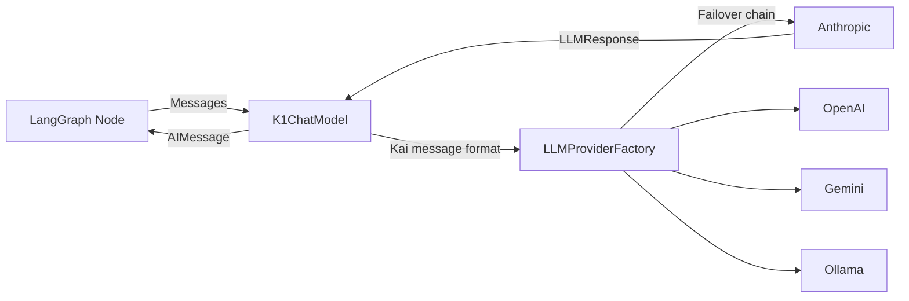
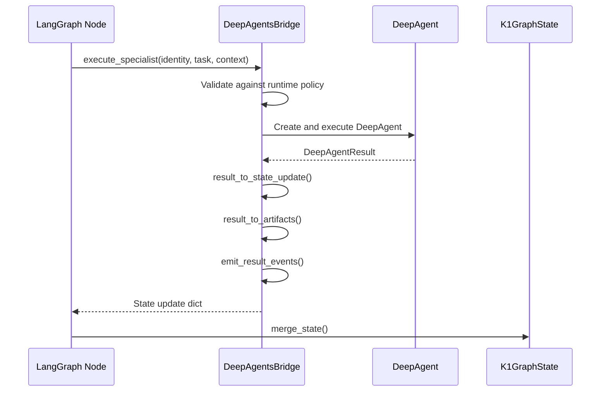
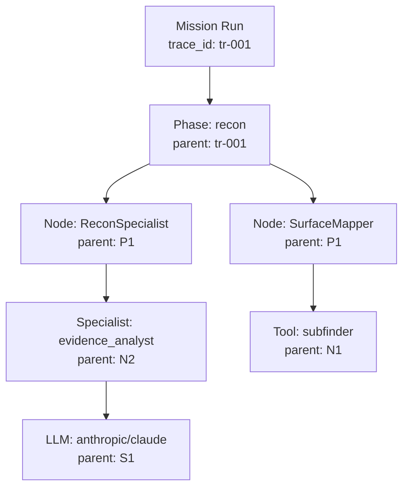
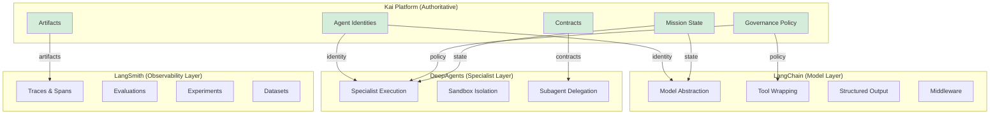

# LangChain / DeepAgents / LangSmith Integration

> Model abstraction, governed tools, specialist deep work, and observability layers.

This document describes how Kai integrates with LangChain (model/tools), DeepAgents (specialist execution), and LangSmith (observability/evaluation). Each product has explicit authority boundaries — Kai remains authoritative for mission state, governance, artifacts, and policy.

---

## Part 1: LangChain Integration

### 1.1 Model Factory

**Source**: `apps/backend/src/core/langchain_model_factory.py`

`K1ChatModel` extends LangChain's `BaseChatModel` to route inference through Kai's multi-provider LLM abstraction.



**Key classes**:
- `K1ChatModel(BaseChatModel)` — Converts LangChain BaseMessage lists to Kai message dicts. System messages extracted separately. Supports `_generate()` (sync) and `_agenerate()` (async).
- `K1ModelFactory` — Factory for configured K1ChatModel instances with provider preference, system prompt, temperature, max_tokens.
- `with_structured_output(schema)` — Returns Runnable with prompt-instruction strategy (injects JSON schema, parses response via output parsers).

**Graceful degradation**: If `langchain_core` is not installed, `K1ChatModel` is `None` and features degrade silently.

### 1.2 Governed Tool Registry

**Source**: `apps/backend/src/core/langchain_tool_registry.py`

Wraps Kai tools as LangChain `BaseTool` instances with full governance integration.

```python
class K1GovernedTool(BaseTool):
    """LangChain tool with governance enforcement."""
```

**Governance pipeline** (in order):
1. Execution-mode fast-path (`graph_only` / `tool_mock` → fixture/stub)
2. Allowed-tool-ids allowlist check
3. Safety band enforcement (band_3 always denied)
4. Scope validation via `scope_validator`
5. Telemetry emission
6. Dispatch signal returned (real execution via Celery, not inline)

**Safety classification mapping**:

| Tool Classification | Band | LangChain Behavior |
|--------------------|----- |-------------------|
| `passive` | Band 0 | Always allowed |
| `active` | Band 1 | Allowed within scope |
| `intrusive` | Band 2 | Requires approval |
| `manual_only` | Band 3 | Unconditionally denied |

`K1LangChainToolRegistry` provides phase-aware tool subsets:
- `get_tools_for_context()` — tools scoped to mission/agent/phase
- `get_tools_for_phase()` — phase-appropriate tool subset
- `filter_by_authority()` — explicit allowlist filtering

### 1.3 Middleware Stack

**Source**: `apps/backend/src/core/langchain_middleware.py`

| Component | Purpose |
|-----------|---------|
| `K1GovernanceCallbackHandler` | Emits MissionEvents for LLM/tool/chain boundaries |
| `K1ToolFilterMiddleware` | Dynamic tool visibility by phase/agent/band |
| `K1ContextInjector` | Injects governance context into message sequences |
| `K1MiddlewareStack` | Composer wiring all components |

**Context injection** adds to every LLM call:
```
[K1 Governance Context]
Mission: {mission_id} | Workflow: {workflow_id} | Program: {program_id}
Phase: {phase} | Node: {node_id} | Mode: {execution_mode}
```

Usage:
```python
stack = K1MiddlewareStack.for_mission(mission_id, workflow_id, ...)
wrapped = stack.wrap(runnable)
result = await wrapped.ainvoke(input, config={"callbacks": stack.callbacks()})
```

### 1.4 Structured Output Schemas

**Source**: `apps/backend/src/core/langchain_schemas.py`

Pydantic v2 models for LLM structured output:

| Schema | Purpose |
|--------|---------|
| `EvidenceSummary` | Artifact analysis output |
| `TriageResult` | Vulnerability triage decision |
| `ExploitAssessmentSummary` | Exploit potential assessment |
| `ReportSectionOutput` | Auto-generated report section |
| `ToolSelectionRationale` | Tool ranking rationale |
| `PromptProfileRecommendation` | Prompt profile selection |
| `PlanPatchProposal` | Adaptive learning plan patches |
| `KnowledgeLessonCandidate` | Extracted knowledge lesson |
| `NodeReasoningRequest` / `NodeReasoningResult` | Node-level reasoning I/O |

All models use `ConfigDict(extra="forbid")` to reject undeclared fields (prompt injection prevention).

### 1.5 Reasoning Engine

**Source**: `apps/backend/src/core/langchain_reasoning.py`

`K1ReasoningEngine` provides structured reasoning helpers for LangGraph nodes:

| Method | Output Schema |
|--------|--------------|
| `summarize_artifact_bundle()` | `EvidenceSummary` |
| `classify_finding()` | `TriageResult` |
| `generate_evidence_digest()` | Free-form digest |
| `rank_candidate_tools()` | `ToolSelectionRationale[]` |
| `select_prompt_profile()` | `PromptProfileRecommendation` |
| `produce_structured_triage()` | `TriageResult[]` |

**Simulation mode**: Returns deterministic fixtures in `graph_only` / `tool_mock` — no LLM invocation.

### Layer Boundaries

LangChain is the **Model / Tools / Middleware** layer. It does NOT own:
- Agent identities → PraisonAI registry
- Graph execution → LangGraph
- Governance policy → PraisonGovernor
- Specialist deep work → DeepAgents

---

## Part 2: DeepAgents Integration

### 2.1 Bridge Layer

**Source**: `apps/backend/src/core/praison_deepagents_bridge.py`

`DeepAgentsBridge` is the **ONLY** conversion point between Kai types and DeepAgent types.



**Type mappings**:
- `AgentIdentity` → `DeepAgentConfig`
- Kai execution context → `DeepAgentExecutionContext`
- `DeepAgentResult` → `K1GraphState` update
- DeepAgent subagent delegation → `DelegationContract`
- DeepAgent stream events → `MissionEvent` / EventBus

**Dual-path execution**: When the `deepagents` PyPI package is installed, uses real compiled graph. When not installed, uses Kai's native LLM invoke path. Both produce the same `DeepAgentResult` type.

### 2.2 Specialist Types

| Type | Max Iterations | Max Subagents | Max Tokens |
|------|---------------|---------------|------------|
| `evidence_analyst` | 20 | 2 | 80,000 |
| `triage_specialist` | 15 | 1 | 40,000 |
| `exploit_assessor` | 10 | 0 | 30,000 |
| `report_synthesizer` | 25 | 3 | 100,000 |
| `knowledge_curator` | 15 | 0 | 40,000 |

### 2.3 Backend Policy

**Source**: `apps/backend/src/core/praison_deepagents_backends.py`

| Backend | Storage | Budget | Cleanup | Safety |
|---------|---------|--------|---------|--------|
| `EPHEMERAL` | In-memory dict | Configurable | Immediate | Always safe |
| `SCRATCH` | Temp filesystem | 50 MB default | Auto on TTL | Path traversal protected |
| `DURABLE` | Persistent FS | 50 MB default | No auto | Requires explicit enable |

**Path safety**: Rejects `..`, absolute paths, null bytes, control characters. Validates prefix after normalization.

**Production defaults**: Host filesystem blocked, shell execution blocked, dev mode off.

### 2.4 Sandbox Manager

**Source**: `apps/backend/src/core/praison_sandbox_manager.py`

- **Sandbox-as-tool**: Sandboxes are tools, not ambient capabilities
- **Secrets never in sandbox**: Credentials stay in Vault
- **TTL-bounded**: Auto-destroy after `max_ttl_seconds`
- **Mode-aware**: Live → real execution; graph_only → structural fixture; tool_mock → deterministic mock

### 2.5 Stream Adapter

**Source**: `apps/backend/src/core/telemetry/deepagents_stream_adapter.py`

`DeepAgentStreamAdapter` maps specialist execution events to Kai's `MissionEvent` taxonomy with namespace awareness:

| Stream Event | Description |
|-------------|-------------|
| `deep_agent_started` | Specialist begins |
| `deep_agent_step` | Iteration with content preview |
| `deep_agent_tool_call` | Tool invocation |
| `deep_agent_subagent_started` | Subagent delegation |
| `deep_agent_completed` | Specialist finishes |

Namespaces: `"main"` (coordinator) or `"subagent:{id}"` (delegated subagent).

### 2.6 Contract-Aware Delegation

When a specialist delegates to a subagent:
1. Bridge creates `DelegationContract` via `create_delegation_contract()`
2. Contract carries `allowed_tools`, `allowed_targets` from delegate's permissions
3. Delegate execution bounded by contract scope
4. Violations detected and emitted as `contract_violated` events
5. `contract_created` event emitted to EventBus

### Layer Boundaries

DeepAgents is the **Specialist Deep Work Runtime**. It does NOT own:
- Agent identities → PraisonAI registry
- Mission state → K1GraphState
- Graph execution flow → LangGraph
- Governance validation → PraisonGovernor

---

## Part 3: LangSmith Integration

### 3.1 Trace Correlation

**Source**: `apps/backend/src/core/langsmith_integration.py`



**Run hierarchy**: mission → phase → node → specialist → LLM/tool call

Each level carries correlation context:
- `mission_id`, `workflow_id`, `program_id`
- `phase`, `node_id`, `agent_id`
- `execution_mode`

`TraceCorrelation.child()` creates child correlation preserving parent's `trace_id`, setting parent's `run_id` as child's `parent_run_id`.

### 3.2 Configuration

```bash
LANGSMITH_API_KEY=sk-...           # Required for remote tracing
LANGSMITH_PROJECT=kai-missions     # Project name
LANGSMITH_ENDPOINT=https://api.smith.langchain.com
LANGSMITH_TRACING_V2=true
K1_LANGSMITH_ENABLED=false         # Master switch (default: disabled)
K1_LANGSMITH_REDACT_MODE=strict    # strict | moderate | none
K1_LANGSMITH_SAMPLE_RATE=1.0       # 0.0-1.0 trace sampling
```

**Graceful degradation**: If `langsmith` package not installed, integration disabled silently.

### 3.3 Redaction

**Source**: `apps/backend/src/core/langsmith_redaction.py`

All data exported to LangSmith passes through the redaction layer:

| Category | Strict | Moderate | None |
|----------|--------|----------|------|
| API keys, tokens, passwords | Redacted | Redacted | Allowed |
| PII (email, IP) | Redacted | Allowed | Allowed |
| Target information | Redacted | Allowed | Allowed |
| Large payloads | Truncated 10KB | Truncated 50KB | Full |

Truncated payloads include SHA-256 hash of full content for audit correlation.

### 3.4 Evaluation and Experiments

**Source**: `apps/backend/src/core/langsmith_evaluations.py`

**K1DatasetManager**: Creates and manages evaluation datasets in LangSmith.

**Built-in evaluators**:
| Evaluator | Scores |
|-----------|--------|
| `triage_accuracy` | Severity match, category match, confidence calibration |
| `evidence_quality` | Text quality, artifact completeness |
| `report_completeness` | Required section presence |
| `strategy_effectiveness` | Success rate, finding production |

**K1ExperimentRunner**: A/B experiment orchestration for comparing strategies, prompts, and tool profiles.

**Dataset builders**:
- `build_triage_example()` — from mission triage outputs
- `build_evidence_example()` — from evidence analysis
- `build_mission_replay_example()` — from replay data

### 3.5 EventBus Integration

`LangSmithBridge.create_event_subscriber()` returns a callback for the EventBus that maps:
- `mission_started` → create LangSmith run
- `node_entered` → create child run
- `node_completed` → end run with outputs
- `mission_completed` → end mission run

### Layer Boundaries

LangSmith is the **Quality / Observability** plane ONLY. It does NOT own:
- Mission state → Kai owns
- Governance decisions → PraisonAI owns
- Artifacts → Kai owns
- Policy enforcement → Kai owns

**Both EventBus (internal telemetry) and LangSmith (external observability) receive events but NEVER depend on each other.**

---

## Authority Boundary Summary


