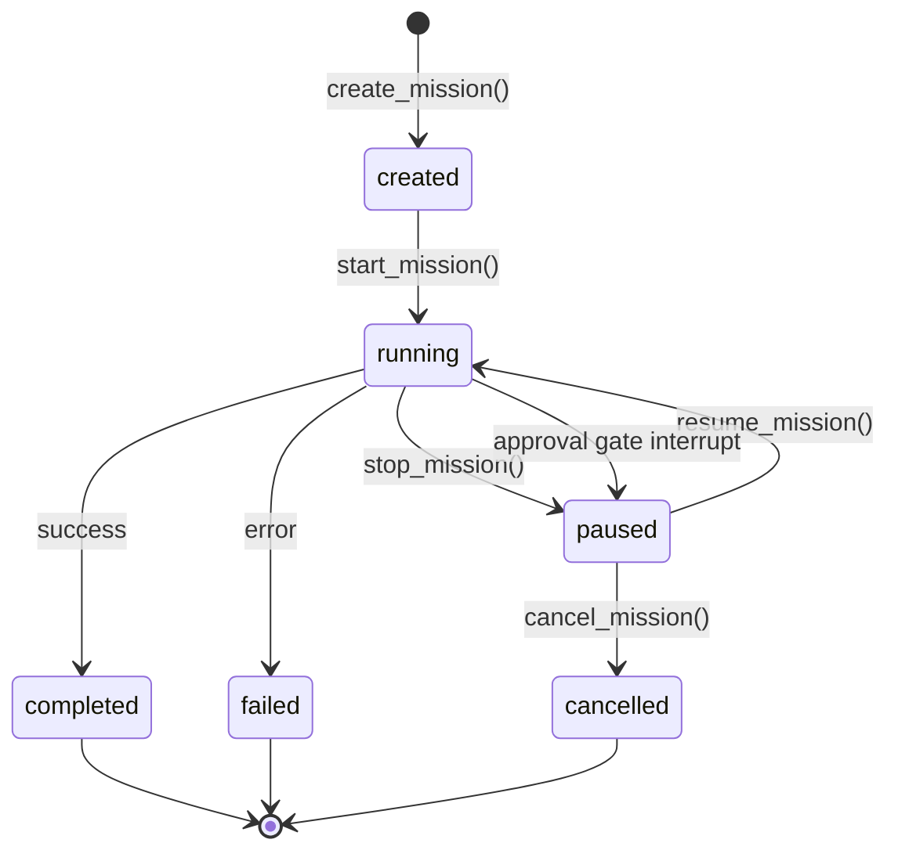
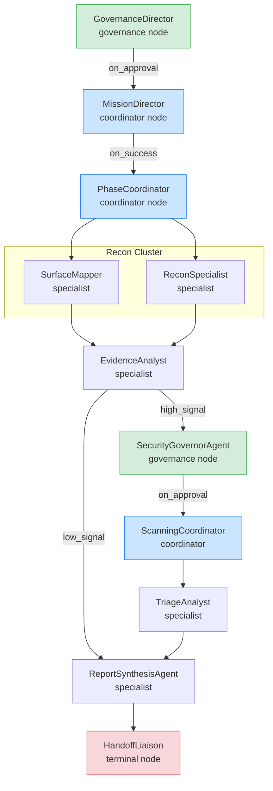
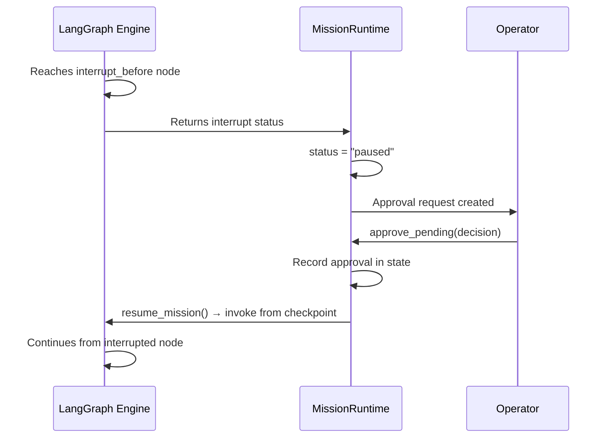

# Mission Runtime

> LangGraph-powered execution engine for governed, checkpointed, resumable mission workflows.

This document describes Kai's mission execution runtime — the LangGraph-based engine that compiles mission topologies into executable graphs with typed state, accumulative reducers, checkpointing, interrupt-based approval gates, and simulation-ready execution modes.

---

## 1. K1GraphState

**Source**: `apps/backend/src/core/praison_state.py`

`K1GraphState` is a `TypedDict` with `total=False` (all fields optional). Nodes only return fields they update.

### 1.1 State Categories

#### Mission Identity (scalars)
| Field | Type | Description |
|-------|------|-------------|
| `mission_id` | `str` | Unique execution ID |
| `workflow_id` | `str` | Parent workflow |
| `program_id` | `str` | Bug bounty program |
| `mission_name` | `str` | Human-readable name |

#### Execution Mode
| Value | Behavior |
|-------|----------|
| `live` | Full production execution |
| `graph_only` | Topology validation, stub nodes, zero live calls |
| `tool_mock` | Agents run with fixture tool results |
| `replay` | Historical checkpoint replay |

#### Execution State (scalars)
| Field | Type | Description |
|-------|------|-------------|
| `phase` | `str` | Current phase (governance, recon, scanning, ...) |
| `active_cluster_id` | `str` | Currently executing cluster |
| `active_node` | `str` | Current node_id |
| `progress` | `float` | 0.0 to 1.0 estimated progress |

#### Accumulated Collections (reducer = `operator.add`)

These fields use `Annotated[list, operator.add]` — each node's output list is **appended**, not replaced.

| Field | Content |
|-------|---------|
| `messages` | Conversation history between agents |
| `artifacts` | Generated files and structured data |
| `contract_ids` | Delegation contract IDs |
| `escalations` | Escalation event strings |
| `violations` | Contract violation records |
| `node_history` | `{node_id, entered_at, completed_at, status}` |
| `artifact_ids` | Artifact ID references |
| `findings` | Structured vulnerability/exposure data |
| `policy_events` | Governance decision records |
| `events` | Execution events for telemetry |
| `approvals_required` | `{approval_id, node_id, reason}` |
| `approvals_resolved` | `{approval_id, decision, resolved_by}` |
| `adaptive_plan_patches_applied` | Accepted strategy patches |
| `adaptive_plan_patches_rejected` | Rejected strategy patches |
| `errors` | Accumulated error records |
| `strategy_profiles_used` | `{node_id, tool_profile_id, prompt_profile_id}` |
| `knowledge_lessons_generated` | Lessons produced during execution |

#### Routing Signals (scalars)
| Field | Type | Description |
|-------|------|-------------|
| `last_agent` | `str` | Most recently completed agent |
| `last_artifact_type` | `str` | Drives conditional edge routing |
| `governance_decision` | `str` | `approved` / `blocked` / empty |

#### Completion Signals
| Field | Type | Description |
|-------|------|-------------|
| `phase_complete` | `bool` | Coordinator signals phase done |
| `completed` | `bool` | HandoffLiaison signals mission end |
| `error` | `str` | Non-empty on node failure |
| `final_report_id` | `str` | Artifact ID of final report |

### 1.2 State Functions

```python
make_initial_state(workflow_id, program_id, ...)  # Build zeroed initial state
merge_state(base, update)                          # Canonical merge: lists extend, scalars replace
state_snapshot(state)                              # Serializable snapshot (collections → counts)
```

`ACCUMULATIVE_FIELDS` is a `frozenset` listing all fields with `operator.add` reducers.

---

## 2. MissionRuntime

**Source**: `apps/backend/src/core/praison_mission_runtime.py`

Top-level lifecycle manager bridging PraisonAI authority, LangGraph execution, event telemetry, and adaptive execution.

### 2.1 Mission Lifecycle



### 2.2 Lifecycle Methods

| Method | Purpose | Returns |
|--------|---------|---------|
| `create_mission()` | Build topology, compile graph, prepare initial state | `MissionHandle` |
| `start_mission()` | Execute graph, emit lifecycle events | Final state dict |
| `resume_mission()` | Resume from checkpoint after approval/stop | Final state dict |
| `stop_mission()` | Graceful pause with checkpoint | Current state |
| `cancel_mission()` | Permanent termination (cannot resume) | Final state |
| `approve_pending()` | Resolve approval, auto-resume if paused | `MissionStatus` |
| `get_status()` | Current status snapshot | `MissionStatus` |
| `get_state()` | Full current state dict | `dict` |
| `inspect_state()` | Detailed debugging view | `dict` |
| `list_missions()` | All tracked missions | `list[MissionStatus]` |

### 2.3 MissionHandle

```python
@dataclass
class MissionHandle:
    mission_id: str
    workflow_id: str
    program_id: str
    graph_spec: MissionGraphSpec       # DAG topology
    compiled_graph: Any                # LangGraph CompiledGraph or None
    initial_state: K1GraphState
    scaffold_spec: dict                # For API inspection
    node_callables: dict[str, Callable]
    execution_mode: str
    created_at: str                    # ISO 8601

    @property
    def is_executable(self) -> bool:   # True if LangGraph compiled
```

### 2.4 MissionStatus

```python
@dataclass(frozen=True)
class MissionStatus:
    mission_id: str
    workflow_id: str
    program_id: str
    state: str           # created | running | paused | completed | failed
    execution_mode: str
    phase: str
    active_node: str
    progress: float
    error: str
    snapshot: dict
```

---

## 3. Mission Topology

**Source**: `apps/backend/src/core/praison_topology.py`

### 3.1 Standard Bug Bounty DAG



### 3.2 Node Types

| Type | Purpose | Examples |
|------|---------|---------|
| `governance` | Approval gates, policy enforcement | GovernanceDirector, SecurityGovernorAgent |
| `coordinator` | Phase orchestration, delegation | MissionDirector, PhaseCoordinator |
| `specialist` | Deep analysis, tool execution | SurfaceMapper, ReconSpecialist, EvidenceAnalyst |
| `terminal` | Mission completion, handoff | HandoffLiaison |

---

## 4. Graph Compilation

**Source**: `apps/backend/src/core/praison_langgraph_builder.py`

`PraisonLangGraphBuilder` compiles a `MissionGraphSpec` into a LangGraph `StateGraph`:

1. Creates `StateGraph(K1GraphState)` with typed reducers
2. Adds nodes from spec with wrapped callables
3. Adds edges (standard and conditional)
4. Configures interrupt_before / interrupt_after nodes
5. Compiles with checkpointer

### 4.1 Checkpointing

| Checkpointer | Persistence | Use Case |
|--------------|-------------|----------|
| `PostgresSaver` | Persistent across restarts | Production |
| `MemorySaver` | In-memory (lost on restart) | Development, testing |

Automatic fallback: if PostgreSQL checkpointer fails, falls back to MemorySaver.

### 4.2 Scaffold Spec

The builder produces a scaffold spec for API inspection:
```python
{
    "nodes": [...],                  # Node definitions
    "edges": [...],                  # Edge definitions
    "interrupt_before": [...],       # Nodes with pre-execution interrupt
    "interrupt_after": [...],        # Nodes with post-execution interrupt
}
```

---

## 5. Execution Paths

### 5.1 LangGraph Path (Production)

```
compiled_graph.invoke(initial_state, {"configurable": {"thread_id": mission_id}})
```

LangGraph handles:
- Node execution in topological order
- State merge via annotated reducers
- Checkpoint creation at each step
- Interrupt handling at configured nodes

### 5.2 Fallback Path (graph_only / no LangGraph)

```
for node_id in topological_order:
    update = executor(state)
    state = merge_state(state, update)
```

Used when:
- `execution_mode == "graph_only"` (topology validation)
- LangGraph package not installed
- Testing without full graph compilation

---

## 6. Node Executors

**Source**: `apps/backend/src/core/praison_node_executors.py`

### 6.1 Standard Executor Types

| Executor | Purpose | Key Behavior |
|----------|---------|-------------|
| `governance_admission` | Mission entry gate | Sets `governance_decision` |
| `mission_director` | Phase sequencing | Director-class orchestration |
| `phase_coordinator` | Specialist delegation | Coordinator-class orchestration |
| `specialist_cluster` | Parallel specialist work | Bounded cluster execution |
| `evidence_analysis` | Output synthesis | Artifact analysis |
| `governance_review` | Approval gate | Sets approval status |
| `report_synthesis` | Report generation | Produces `final_report_id` |
| `handoff_liaison` | Mission completion | Sets `completed=True` |

### 6.2 Executor Wrapper

Every executor wraps its callable with:
1. `node_entered_event` emission
2. Execution mode check (graph_only → stub)
3. Callable invocation
4. State update construction
5. `node_completed_event` emission
6. Error handling with `errors` accumulation

---

## 7. Interrupts and Resume

### 7.1 Interrupt Configuration

Nodes can be configured with:
- `interrupt_before=True` → pause BEFORE node execution (governance pre-checks)
- `interrupt_after=True` → pause AFTER node execution (output review)

Set based on `review_policy` in agent definition.

### 7.2 Approval Gate Flow



### 7.3 Resume Semantics

- `stop_mission(reason)` → status="paused", can resume later
- `cancel_mission(reason)` → status="cancelled", terminal (cannot resume)
- `resume_mission(approval_data)` → clears pause error, re-invokes graph from checkpoint

---

## 8. Cluster / Subgraph Execution

**Source**: `apps/backend/src/core/praison_cluster_runtime.py`

### ClusterSpec

```python
@dataclass
class ClusterSpec:
    cluster_id: str
    cluster_name: str
    phase: str               # "recon", "scanning", etc.
    coordinator_id: str      # Director agent for this cluster
    specialist_ids: list[str] # Worker agents
    entry_node: str
    exit_node: str
    parallel_execution: bool = True
```

Clusters group related specialist agents into subgraphs. Each cluster has:
- A coordinator entry point
- One or more specialists
- An exit node that aggregates results

Cluster status tracked via `cluster_status` dict in state.

---

## 9. Strategy-Aware Execution

### 9.1 ExecutionStrategy

```python
@dataclass(frozen=True)
class ExecutionStrategy:
    strategy_id: str
    tool_candidates: tuple[str, ...]      # Approved tools
    tool_order: tuple[str, ...]           # Execution ordering
    allowed_parameter_profiles: tuple[ToolProfile, ...]
    allowed_prompt_profiles: tuple[PromptProfile, ...]
    retry_policy: dict
    parallelism: int
    approved_branches: tuple[str, ...]
```

### 9.2 Profile Selection Tracking

Node executors track which profiles were used:
```python
strategy_profiles_used: [{
    "node_id": "ReconSpecialist",
    "tool_profile_id": "tp_balanced_recon",
    "prompt_profile_id": "pp_thorough_analysis",
}]
```

### 9.3 Learning Integration

After mission completion:
1. `StrategyLearner.process_outcome()` scores the execution
2. Profile metrics updated via `ProfileTracker`
3. Knowledge lessons produced if score ≥ 0.6
4. Future missions receive profile recommendations

---

## 10. Event Emission

**Source**: `apps/backend/src/core/praison_execution_events.py`

### 10.1 Event Types

| Event | Trigger |
|-------|---------|
| `mission_started` | Mission execution begins |
| `mission_completed` | Mission finishes (success or failure) |
| `node_entered` | Node execution begins |
| `node_completed` | Node execution succeeds |
| `node_failed` | Node execution errors |
| `contract_created` | Delegation contract created |
| `approval_requested` | HIL approval needed |
| `approval_resolved` | HIL decision made |
| `phase_transition` | Phase change |
| `plan_patch_applied` | Strategy patch accepted |
| `strategy_selected` | Profile recommendation applied |
| `knowledge_lesson_created` | Learning lesson produced |

### 10.2 MissionEvent Structure

```python
@dataclass(frozen=True)
class MissionEvent:
    event_id: str        # UUID
    event_type: str
    timestamp: str       # ISO 8601
    mission_id: str
    workflow_id: str
    program_id: str
    node_id: str
    agent_id: str
    phase: str
    detail: dict[str, Any]
```

### 10.3 EventBus

Protocol-based event bus that supports:
- Multiple subscribers (WebSocket, JSONL, LangSmith)
- Simulation-aware event routing
- Full correlation context on every event
- Thread-safe emission

---

## 11. Runtime Metrics

The `runtime_metrics` field (last-write-wins scalar) aggregates:
- Duration
- Tool invocations
- LLM token usage
- Findings count
- Escalation count

Available via `inspect_state()` and `state_snapshot()` for operator dashboards.
