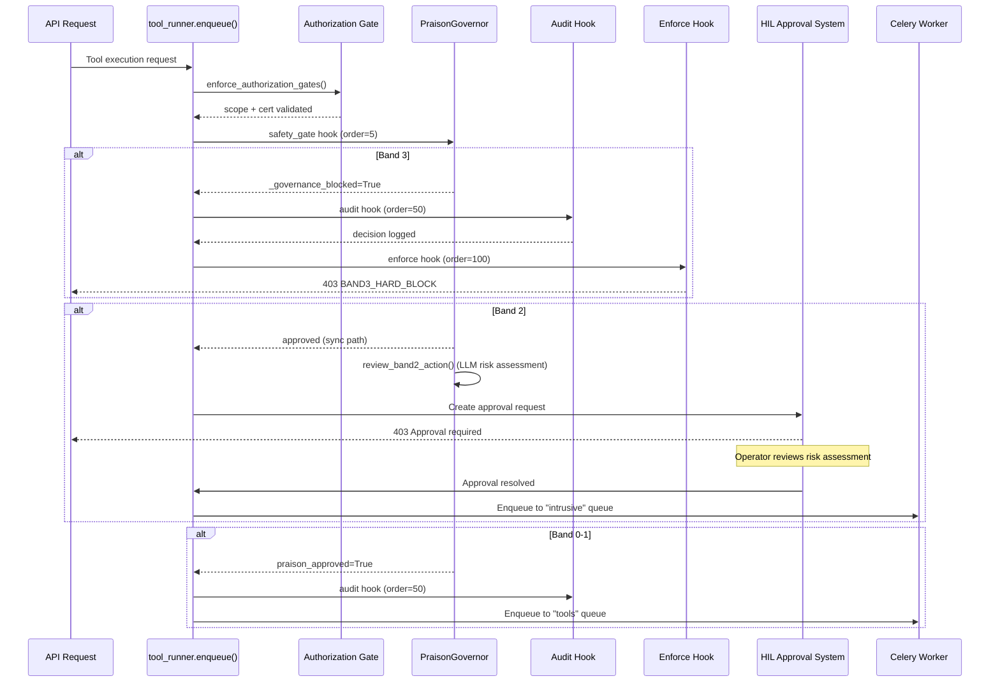
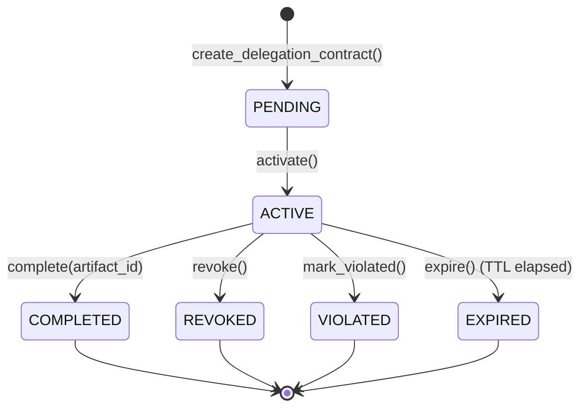
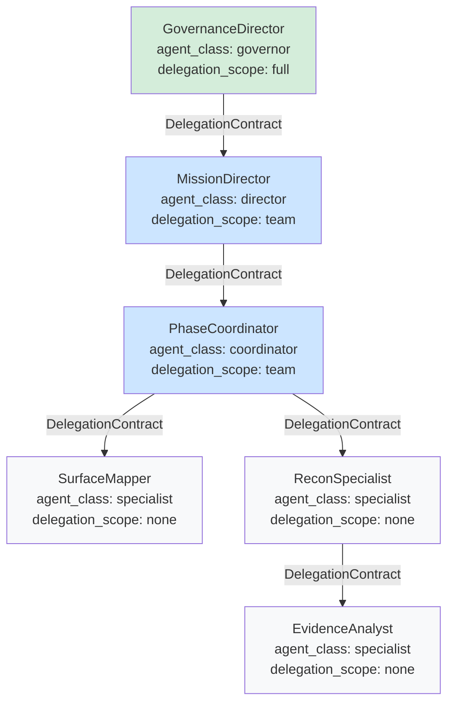
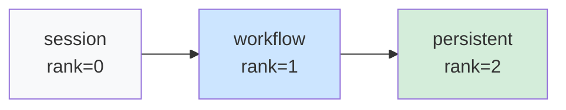

# Security Architecture

> Governance-first, defense-in-depth security model for autonomous mission orchestration.

This document describes Kai's multi-layered security architecture. Every tool invocation, agent spawn, memory write, external call, and phase handoff passes through governance before execution.

---

## 1. Governance Model Overview

Kai implements defense-in-depth governance through five enforcement layers, evaluated in priority order:

```
Request → PraisonGovernor (sync, sub-ms) → Scope Guardrails → Authorization Gate → Scope Resolver → KAI Orchestrator
```

| Layer | File | Enforcement Type | Failure Mode |
|-------|------|-----------------|--------------|
| PraisonGovernor | `praison_governor.py` | Tool band + campaign context validation | Fail-open (advisory) |
| Scope Guardrails | `scope_guardrails.py` | Denylist-first target validation | **Fail-secure (hard block)** |
| Authorization Gate | `authorization_gate.py` | Certificate + scope + method validation | **Fail-secure (hard block)** |
| Scope Resolver | `scope_resolver.py` | Workflow-specific scope evaluation | **Fail-secure (hard block)** |
| KAI Orchestrator | `kai_orchestrator.py` | ScopeGuardian + PGP signed intents | **Fail-secure (hard block)** |

PraisonGovernor is an advisory layer. Scope guardrails and authorization gate are the authoritative hard blockers.

---

## 2. Tool Risk Bands

Every tool in Kai is classified into one of four risk bands. The effective band is `max(ToolRiskTier, AutonomyTier)`.

| Band | Classification | Behavior | Examples |
|------|---------------|----------|----------|
| **Band 0** | Passive / Safe | Always autonomous | DNS lookup, WHOIS, certificate transparency |
| **Band 1** | Low-risk active | Autonomous within scope | Port scanning, HTTP header analysis, subdomain enumeration |
| **Band 2** | Intrusive | Requires HIL approval | Vulnerability scanning, active probing, fuzzing |
| **Band 3** | Exploit-like | **Always blocked** | Exploitation tools, legally ambiguous actions |

**Queue routing**: Band 0-1 tools are dispatched to the `tools` Celery queue. Band 2 tools are dispatched to the `intrusive` queue. Band 3 tools are blocked before queuing.

---

## 3. Approval / Human-in-the-Loop Flow

### 3.1 Hook Execution Ordering

The governance hook chain executes in strict priority order. This ordering ensures the audit log always captures the true governance outcome.

```
order=5    praison_safety_gate_hook    → Evaluates, sets _governance_blocked flag
order=50   audit_hook                  → Writes decision to audit log
order=100  enforce_safety_gate_hook    → Raises PraisonGovernanceError if blocked
```

### 3.2 Governance Sequence



### 3.3 Worker Re-validation

The Celery worker re-validates authorization at execution time:
1. Fetches credentials from Vault
2. Re-checks scope policy (detects policy drift via hash comparison)
3. Acquires OPSEC ticket (rate limit + concurrency control)
4. Filters parameters (strips sensitive keys)
5. Executes tool

---

## 4. Delegation Contract Model

Every agent-to-agent handoff must carry a `DelegationContract`. This is the enforcement mechanism for hierarchical coherence.

### 4.1 Contract Lifecycle



### 4.2 Contract Properties

- **Immutability**: `DelegationContract` is a frozen dataclass. State transitions produce NEW instances via `dataclasses.replace()`.
- **Empty-list semantics**: `allowed_tools=()` means NO tools permitted (not permit-all).
- **Bidirectional trust**: The delegator's `allowed_peer_targets` is enforced at contract creation time.
- **List coercion**: All list fields are coerced to tuples in `__post_init__`.

### 4.3 Contract Violations

| Violation | Meaning |
|-----------|---------|
| `SCOPE_EXCEEDED` | Delegate accessed resource outside contract scope |
| `TOOL_NOT_ALLOWED` | Delegate used tool not in contract allowlist |
| `HANDOFF_UNAUTHORIZED` | Delegate attempted unauthorized sub-delegation |
| `MEMORY_SCOPE_BREACH` | Delegate wrote to memory scope above its declared level |
| `EXTERNAL_CALL_UNAUTHORIZED` | Delegate made external call without authorization |

### 4.4 Delegation Hierarchy



**Class authority rules**:
- `governor` → can delegate to any class
- `director` → can delegate to coordinator, specialist
- `coordinator` → can delegate to specialist
- `specialist` → `delegation_scope=none` (cannot delegate)

---

## 5. Agent Lifecycle Governance

PraisonGovernor validates all agent lifecycle events through registered hooks:

### 5.1 validate_agent_spawn()

- Governance agents require full campaign context (`workflow_id` + `program_id`)
- All spawns within active hunts require `workflow_id`
- Fires `agent_spawn` hook before instantiation

### 5.2 validate_agent_handoff()

- Requires active `workflow_id`
- Handoff data size capped at `max_memory_write_bytes` (default: 1 MB)
- Fires `agent_handoff` hook

### 5.3 validate_memory_write()

Memory scope hierarchy is strictly enforced:



An agent with `memory_scope=session` **cannot** write to `workflow` or `persistent` scope. Persistent writes require an active `workflow_id`.

### 5.4 validate_external_call()

External network calls require:
- Agent's `risk_profile` in `external_call_allowed_profiles` list
- Active `workflow_id`
- Non-empty `target_url`

---

## 6. Phase-Bounded Autonomy

### 6.1 Allowed Adaptive Changes

Agents can adapt within bounded envelopes:

| Change Type | Description |
|------------|-------------|
| `reorder_tools` | Reorder tools within approved set |
| `select_tool_candidate` | Choose among approved tool candidates |
| `select_prompt_profile` | Choose among approved prompt templates |
| `select_parameter_profile` | Choose parameter variant |
| `reprioritize_work` | Same-phase work reordering |
| `adjust_retry` | Retry policy within bounds |
| `adjust_schedule` | Timing within bounded limits |
| `activate_branch` | Pre-approved alternate branch |

### 6.2 Forbidden Changes (Always Rejected)

| Change Type | Reason |
|------------|--------|
| `graph_rewrite` | Arbitrary topology changes bypass governance |
| `scope_expansion` | Adding targets outside approved set |
| `approval_bypass` | Circumventing required approvals |
| `cross_phase_mutation` | Modifying other phases |
| `unapproved_tool` | Tools not in strategy |
| `self_modification` | LLM self-modification |

**Deny-by-default**: Unknown change types are rejected.

---

## 7. Sandbox Restrictions (DeepAgents)

### 7.1 Backend Policies

| Policy | Storage | Cleanup | Use Case |
|--------|---------|---------|----------|
| `EPHEMERAL` | In-memory dict | Immediate | Default, always safe |
| `SCRATCH` | Filesystem (temp) | Auto-cleanup on TTL | Working storage |
| `DURABLE` | Persistent filesystem | No auto-cleanup | Requires approval |

### 7.2 Production Safety Defaults

| Setting | Default | Purpose |
|---------|---------|---------|
| `K1_DEEPAGENT_ALLOW_HOST_FS` | `false` | Blocks host filesystem access |
| `K1_DEEPAGENT_ALLOW_SHELL` | `false` | Blocks shell execution |
| `K1_DEEPAGENT_ALLOW_DURABLE` | `true` (requires explicit) | Controls persistent storage |
| `K1_DEEPAGENT_DEV_MODE` | `false` | Production mode active |

### 7.3 Path Safety

All backend file operations enforce:
- Path traversal prevention (`..` rejected)
- Absolute path rejection
- Null byte rejection
- Control character rejection
- Prefix validation after normalization

---

## 8. Simulation Safety Barriers

### 8.1 Mode Safety Invariants

| Mode | Live Models | Live Tools | Live Sandbox | Provenance |
|------|------------|------------|--------------|------------|
| `live` | Yes | Yes | Yes | Standard |
| `graph_only` | **ZERO** | **ZERO** | **ZERO** | `_simulation=True` |
| `tool_mock` | Configurable | **ZERO** (fixtures) | **ZERO** | `_simulation=True` |
| `replay` | **ZERO** | **ZERO** | **ZERO** | `_replay=True` |

### 8.2 Safety Enforcement

- `is_live_tool_blocked(config)` returns `True` for all non-live modes
- `is_live_sandbox_blocked(config)` enforced by `hard_block_live_sandbox` flag
- `assert_simulation_safe(config)` validates invariants at startup
- **No execution mode can accidentally escalate to live tool execution**

### 8.3 Provenance Markers

All simulation artifacts carry:
- `_simulation=True`
- `_simulation_mode=<mode>`
- `_scenario_pack=<pack>` (if applicable)
- `_comparison_label=<label>` (for A/B runs)
- Fixture provenance with `fixture_id`, `fixture_type`, `profile`

---

## 9. Redaction Policy (LangSmith)

### 9.1 Redaction Modes

| Mode | Secrets | Credentials | PII | Target IPs | Payloads |
|------|---------|-------------|-----|-----------|----------|
| `strict` (default) | Redacted | Redacted | Redacted | Redacted | Truncated 10KB |
| `moderate` | Redacted | Redacted | Allowed | Allowed | Truncated 50KB |
| `none` | Allowed | Allowed | Allowed | Allowed | Full |

### 9.2 Patterns Redacted

- API keys, tokens, passwords (40+ key patterns)
- Bearer tokens, AWS keys, JWT tokens
- PGP blocks, private keys
- IP addresses and email addresses (strict mode)
- Large payloads include SHA-256 hash for audit correlation

### 9.3 Configuration

```bash
K1_LANGSMITH_ENABLED=false       # Master switch (default: disabled)
K1_LANGSMITH_REDACT_MODE=strict  # Default: maximum redaction
K1_LANGSMITH_SAMPLE_RATE=1.0     # 0.0 = no traces, 1.0 = all
```

---

## 10. Secrets Handling

### 10.1 Vault Integration

- Primary: HashiCorp Vault (`VAULT_ADDR`, `VAULT_TOKEN`)
- Mount point: `secret` (KV v2)
- Namespace: Optional (`VAULT_NAMESPACE`)
- Prefix: `kai` (`VAULT_SECRET_PREFIX`)

### 10.2 Worker Credential Flow

1. Worker receives tool task from Celery queue
2. Fetches credentials from Vault at `secret/tools/{tool_id}`
3. Falls back to `params.vault_path` if primary path empty
4. **Fatal error** if tool has `api_keys_required=True` and no credentials found
5. Warning logged for optional credential tools

### 10.3 Fallback Policy

```bash
K1_SECRET_BACKEND=vault          # "vault" (production) or "env" (development)
K1_ALLOW_ENV_SECRETS=false       # Environment variable fallback requires explicit opt-in
```

---

## 11. No-Bypass Guarantees

| Protection | Default | Override |
|-----------|---------|---------|
| Test auth gate bypass | **Disabled** | `K1_RELAX_AUTH_GATES_FOR_TESTS=true` |
| Unsigned certificates | **Rejected** | `K1_ALLOW_UNSIGNED_CERTIFICATES=true` |
| Band 3 tools | **Always blocked** | No override available |
| Bootstrap auth in production | **Forbidden** | Cannot override in `ENVIRONMENT=production` |
| CORS wildcards | **Rejected** | No override available |

---

## 12. Middleware Stack

Applied to every HTTP request in this order (inside-out):

```
Request → SecurityHeaders → CorrelationId → CSRF → RateLimit → CORS → Route Handler
```

| Middleware | Purpose | Key Headers |
|-----------|---------|-------------|
| `CORSMiddleware` | Origin whitelist (no wildcards) | `Access-Control-Allow-Origin` |
| `RateLimitMiddleware` | IP-based sliding window | `X-RateLimit-Limit`, `Retry-After` |
| `CSRFProtectionMiddleware` | Token validation (Bearer bypass) | `X-CSRF-Token` |
| `CorrelationIdMiddleware` | Request tracing | `X-Request-ID` |
| `SecurityHeadersMiddleware` | HTTP hardening | HSTS, CSP, X-Frame-Options |

### Security Headers Applied

| Header | Value |
|--------|-------|
| `X-Frame-Options` | `DENY` |
| `X-Content-Type-Options` | `nosniff` |
| `Strict-Transport-Security` | `max-age=31536000; includeSubDomains; preload` |
| `Content-Security-Policy` | `default-src 'self'; script-src 'self'; ...` |
| `Referrer-Policy` | `strict-no-referrer` |
| `Permissions-Policy` | Disables geolocation, microphone, camera, payment, USB |

---

## 13. PGP Certificate Chain

### 13.1 Permission Slips (Tier 3)

Tier 3 operations require PGP-signed permission slips stored in vault:

```json
{
  "authorized_targets": ["target.example.com"],
  "allowed_operations": ["nuclei_critical"],
  "issued_at": "2026-03-01T00:00:00Z",
  "expires_at": "2026-03-31T00:00:00Z",
  "issued_by": "admin@kai.security",
  "justification": "Authorized penetration test",
  "scope_restrictions": []
}
```

Signature verification uses pgpy (preferred) or python-gnupg (fallback). Admin public key loaded from `config/security/admin_pubkey.asc`.

### 13.2 Authorization Certificates

Certificate signature: `SHA-256(JSON-canonical-payload | signing_key)` where payload includes sorted methods for deterministic signing.

---

## 14. OPSEC Policy Engine

Rate limiting and concurrency control per tool method:

| Enforcement | Default |
|------------|---------|
| Max requests/minute | Per method policy |
| Max concurrent | Per method policy |
| Max executions/hour | Per method policy (budget cap) |

Ticket acquisition blocks if any limit exceeded. All events logged to `artifacts/telemetry/opsec_policy.jsonl`.

---

## 15. Audit Trail

### 15.1 Sources

| Audit Source | Format | Path |
|-------------|--------|------|
| Scope decisions | JSONL | `output/logs/scope_decisions.jsonl` |
| Tool executions | JSONL | `artifacts/telemetry/tool_runs.jsonl` |
| Hook lifecycle | JSONL | `artifacts/hooks/audit.jsonl` |
| Authorization ledger | JSONL | `artifacts/auth/authorization_ledger.jsonl` |
| OPSEC policy | JSONL | `artifacts/telemetry/opsec_policy.jsonl` |
| Mission events | JSONL | `artifacts/telemetry/mission_events.jsonl` |
| Knowledge lessons | JSONL | `artifacts/knowledge/lessons.jsonl` |

### 15.2 Hash Chain Integrity

The `KaiAuditLogger` maintains a blockchain-style SHA-256 hash chain across audit entries. Each entry's hash includes the previous entry's hash, enabling tamper detection. Genesis hash: 64 zeros.

---

## 16. Key Security Environment Variables

| Variable | Default | Purpose |
|----------|---------|---------|
| `K1_RELAX_AUTH_GATES_FOR_TESTS` | `false` | Test-mode bypass |
| `K1_ALLOW_UNSIGNED_CERTIFICATES` | `false` | Unsigned cert acceptance |
| `K1_SECRET_BACKEND` | `vault` | Secret storage backend |
| `K1_ALLOW_ENV_SECRETS` | `false` | Env fallback for secrets |
| `K1_AUTH_CERT_SIGNING_KEY` | (required) | Certificate signing key |
| `K1_DEEPAGENT_ALLOW_HOST_FS` | `false` | Host FS access for specialists |
| `K1_DEEPAGENT_ALLOW_SHELL` | `false` | Shell access for specialists |
| `K1_LANGSMITH_REDACT_MODE` | `strict` | Trace redaction level |
| `K1_LANGSMITH_ENABLED` | `false` | LangSmith master switch |
| `JWT_SECRET_KEY` | (required) | JWT signing secret |
| `VAULT_ADDR` | (required) | Vault server URL |
| `VAULT_TOKEN` | (required) | Vault auth token |
