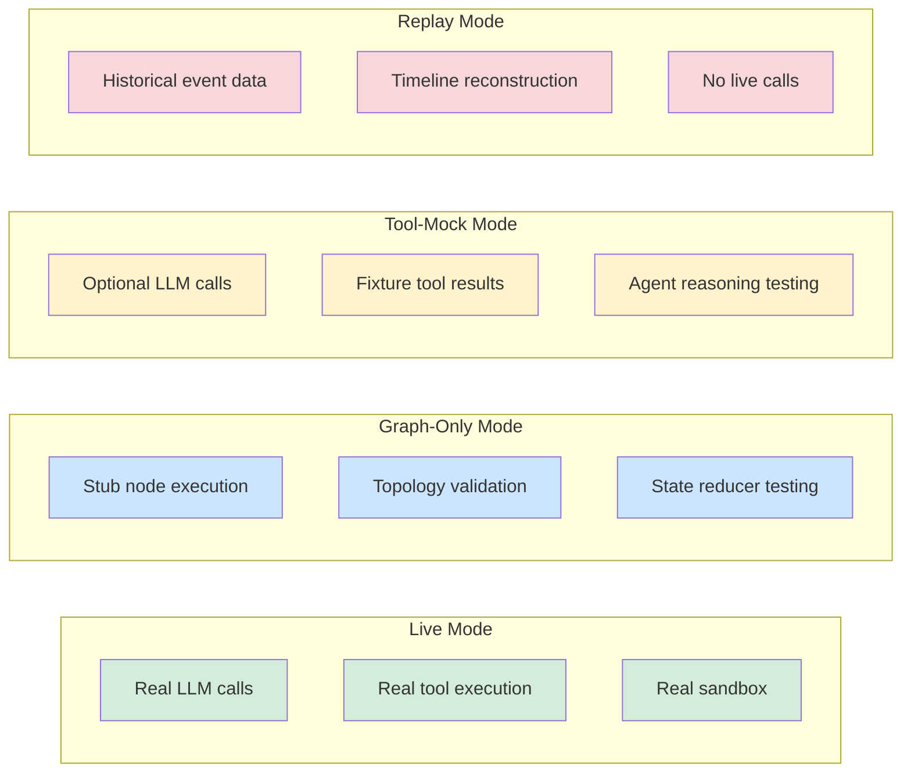
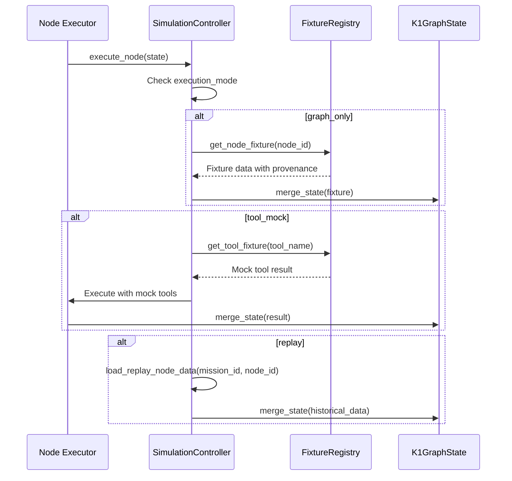
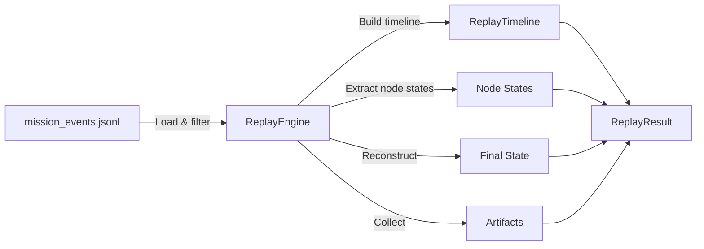

# Simulation Mode

> Cross-cutting safe execution overlay for testing, training, and strategy comparison.

Simulation Mode operates WITHIN the existing PraisonAI → LangGraph → LangChain → DeepAgents stack by substituting specific execution behaviors while preserving governance, state management, event emission, and topology fidelity. It is NOT a second runtime.

---

## 1. Execution Modes

### 1.1 Mode Comparison

| Property | `live` | `graph_only` | `tool_mock` | `replay` |
|----------|--------|-------------|-------------|----------|
| Live model calls | Yes | **ZERO** | Configurable | **ZERO** |
| Live tool calls | Yes | **ZERO** | **ZERO** (fixtures) | **ZERO** |
| Live sandbox | Yes | **ZERO** | **ZERO** | **ZERO** |
| Governance active | Yes | Yes | Yes | Yes |
| State accumulation | Full | Full (stubs) | Full | Full (historical) |
| Event emission | Full | Full | Full | Full |
| Artifacts marked | Standard | `_simulation=True` | `_simulation=True` | `_replay=True` |

### 1.2 Mode Behaviors



---

## 2. Configuration

**Source**: `apps/backend/src/core/praison_simulation_config.py`

### 2.1 SimulationConfig

```python
@dataclass(frozen=True)
class SimulationConfig:
    mode: SimulationMode                     # LIVE, GRAPH_ONLY, TOOL_MOCK, REPLAY
    fixture_profile: str = "default"         # Named fixture set
    fixture_strictness: FixtureStrictness = "lenient"
    deterministic_seed: int | None = None    # Repeatable random selections
    allow_model_reasoning_in_tool_mock: bool = False
    replay_mission_id: str = ""              # Source mission for replay
    replay_from_events: bool = True
    replay_from_checkpoints: bool = False
    event_verbosity: EventVerbosity = "full"
    artifact_policy: ArtifactPolicy = "full"
    strategy_comparison_mode: bool = False
    comparison_label: str = ""               # A/B arm label
    scenario_pack: str = ""                  # Named scenario
    hard_block_live_tools: bool = True       # Extra safety
    hard_block_live_sandbox: bool = True
    simulation_tags: tuple[str, ...] = ()    # Custom LangSmith tags
```

### 2.2 Factory Helpers

```python
make_graph_only_config(fixture_profile="default", scenario_pack="")
make_tool_mock_config(fixture_profile="default", allow_model_reasoning=False)
make_replay_config(replay_mission_id="mission-123")
load_simulation_config_from_env()  # from K1_SIMULATION_* env vars
```

### 2.3 Environment Variables

| Variable | Default | Purpose |
|----------|---------|---------|
| `K1_SIMULATION_MODE` | `live` | Execution mode |
| `K1_SIMULATION_FIXTURE_PROFILE` | `default` | Fixture profile name |
| `K1_SIMULATION_FAIL_ON_MISSING_FIXTURE` | `false` | Strict fixture mode |
| `K1_SIMULATION_REPLAY_MISSION_ID` | (empty) | Source mission for replay |
| `K1_SIMULATION_SCENARIO_PACK` | (empty) | Scenario pack name |

---

## 3. Fixture System

**Source**: `apps/backend/src/core/praison_simulation_fixtures.py`

### 3.1 FixtureRegistry

Central registry providing deterministic test data keyed by node/tool/specialist type.

```python
registry = FixtureRegistry(
    profile="default",
    scenario_pack="high_signal",
    seed=42,
    strictness="lenient",
)

node_fixture = registry.get_node_fixture("GovernanceDirector")
tool_fixture = registry.get_tool_fixture("nmap")
specialist_fixture = registry.get_specialist_fixture("evidence_analyst")
```

### 3.2 Fixture Flow



### 3.3 Fixture Provenance

Every fixture value carries provenance metadata:

```python
@dataclass(frozen=True)
class FixtureProvenance:
    fixture_id: str           # Unique ID
    fixture_type: str         # node_output, tool_result, specialist_output, etc.
    profile: str              # Fixture profile name
    scenario_pack: str        # Scenario (if applicable)
    node_id: str
    tool_name: str
    specialist_type: str
    deterministic_seed: int | None
```

### 3.4 Node Fixtures

| Node | Key Output |
|------|-----------|
| `GovernanceDirector` | `governance_decision: approved/blocked` |
| `MissionDirector` | `phase: "recon"` |
| `PhaseCoordinator` | `phase: <parameterized>` |
| `SpecialistCluster` | `artifacts, findings, cluster_status` |
| `EvidenceAnalysis` | `findings (severity-dependent on scenario)` |
| `GovernanceReview` | `governance_decision, approvals_required` |
| `ReportSynthesis` | `final_report_id, artifacts` |
| `HandoffLiaison` | `completed: True, progress: 1.0` |

### 3.5 Tool Fixtures

Tool-specific generators for common security tools:

| Tool | Mock Output |
|------|-------------|
| `nmap` | Port scan results (more ports in high_signal scenario) |
| `subfinder` | Subdomain discovery (more results in noisy_false_positive) |
| `nuclei` | Vulnerability findings (critical in high_signal) |
| `httpx` | HTTP probing results |

### 3.6 Scenario Packs

Pre-defined scenario combinations for testing specific behaviors:

| Scenario | Description |
|----------|------------|
| `default` | Standard passive recon with low-signal results |
| `high_signal` | Discovers high/critical severity vulnerabilities |
| `noisy_false_positive` | Many results but mostly info/low — tests signal filtering |
| `approval_heavy` | Multiple approval gates triggered |
| `blocked_mission` | Mission blocked at governance admission |
| `exploit_heavy` | Exploit assessment phase dominates |
| `report_heavy` | Large report synthesis with many findings |
| `blocked_review` | Governance review blocks findings |
| `rejected_patch` | Adaptive plan patch is rejected |

---

## 4. Replay Engine

**Source**: `apps/backend/src/core/praison_replay.py`

### 4.1 Replay Sources (Priority Order)

1. **EventBus JSONL records** — always available (`artifacts/telemetry/mission_events.jsonl`)
2. **LangGraph checkpoint data** — when PostgreSQL checkpointer is available
3. **Artifact lineage** — from artifacts directory
4. **LangSmith trace data** — when LangSmith is available

### 4.2 Replay Timeline



### 4.3 ReplayResult

```python
@dataclass
class ReplayResult:
    replay_id: str                              # Unique replay session ID
    source_mission_id: str
    timeline: list[ReplayTimelineEntry]         # Sorted events
    node_states: dict[str, dict]                # Per-node output
    final_state: dict                           # Reconstructed mission state
    artifacts: list[dict]                       # Collected artifacts
    replay_started_at: str                      # ISO 8601
    replay_completed_at: str
    source_type: str                            # "events" | "checkpoints"
    error: str
```

### 4.4 Replay Guarantees

- **Never** re-executes live tools
- **Never** re-invokes live models
- Preserves original mission lineage and correlation IDs
- Marks all replayed outputs with `_replay=True`
- Preserves historical timestamps, adds new replay metadata

---

## 5. Simulation Controller

**Source**: `apps/backend/src/core/praison_simulation.py`

### 5.1 SimulationRunner

High-level orchestrator for simulation execution:

```python
runner = SimulationRunner(config=make_tool_mock_config())

# Single simulation run
result = runner.run_simulation(
    workflow_id="wf-001",
    program_id="prog-001",
    mission_name="Strategy Test Alpha",
)

# A/B comparison
results = runner.run_comparison(
    workflow_id="wf-001",
    program_id="prog-001",
    configs=[
        ("baseline", make_tool_mock_config(fixture_profile="default")),
        ("aggressive", make_tool_mock_config(fixture_profile="high_signal")),
    ],
)
```

### 5.2 Safety Barriers

**These are CRITICAL and non-negotiable.**

```python
def is_live_tool_blocked(config, tool_name) -> bool:
    """Returns True for ALL non-live modes. No exceptions."""

def is_live_sandbox_blocked(config) -> bool:
    """Returns True when hard_block_live_sandbox is set."""

def assert_simulation_safe(config) -> None:
    """Validates simulation config safety at startup.
    Raises RuntimeError if graph_only allows live tools/models."""
```

**No execution mode can accidentally escalate to live tool execution.**

---

## 6. Simulation Event Taxonomy

Extended event types emitted during simulation:

| Event Type | Trigger |
|-----------|---------|
| `simulation_started` | Simulation run begins |
| `simulation_completed` | Simulation run finishes |
| `simulation_failed` | Simulation run errors |
| `replay_started` | Replay reconstruction begins |
| `replay_completed` | Replay reconstruction finishes |
| `fixture_applied` | Fixture data injected into node |
| `mock_tool_result_emitted` | Mock tool result used |
| `replay_event_emitted` | Historical event replayed |
| `simulation_branch_taken` | Conditional edge taken in simulation |
| `simulation_approval_generated` | Fixture approval decision created |
| `simulation_safety_block` | Live execution blocked by safety barrier |

---

## 7. LangSmith Integration

Simulation runs are tagged for LangSmith traces:

### Tags
- `simulation`
- `sim_mode:graph_only` / `sim_mode:tool_mock` / `sim_mode:replay`
- `fixture:<profile>` (if non-default)
- `scenario:<pack>` (if present)
- `comparison:<label>` (for A/B runs)

### Metadata
All `SimulationConfig.to_metadata()` fields plus `kai_is_simulation=True`.

This enables:
- Side-by-side comparison of simulation vs live traces
- Regression detection when strategy changes
- Training data curation from simulation runs

---

## 8. Use Cases

### 8.1 Before Live Missions
Run `graph_only` to validate topology changes before deploying to production.

### 8.2 Strategy Testing
Run `tool_mock` to compare different tool/prompt profiles with deterministic fixture data. Use `run_comparison()` for A/B analysis.

### 8.3 After Failures
Run `replay` to reconstruct a failed mission timeline and understand failure points.

### 8.4 Agent Training
Use `tool_mock` with deterministic seeds for iterative refinement of agent prompts with consistent fixture data.

### 8.5 CI/CD Validation
Run `graph_only` in CI pipelines to catch topology regressions before merge.

---

## 9. Limitations

| Limitation | Impact |
|-----------|--------|
| Replay cannot capture non-deterministic LLM behavior exactly | Historical reasoning may not match current model |
| graph_only does not validate LLM-dependent routing logic | Conditional edges based on LLM output not tested |
| tool_mock fixtures may diverge from real tool output formats | Integration issues possible |
| Simulation cannot test network-dependent failure modes | Timeout, connectivity, DNS failures not simulated |
| Replay requires historical EventBus JSONL data | Missing telemetry = incomplete replay |
